***

# Good Coding Practice for Scientists

Sanjay Manohar

MA MB BChir PhD MRCP MBPsS AFHEA MAcadMEd

Oxford Biology Primer Series, Tools and Techniques

## Contents

Contents

[Good Coding Practice for Scientists 1](#good-coding-practice-for-scientists)

***

[Contents 2](#_heading=h.30j0zll)

***

[Chapter 1: Introduction 9](#chapter-1-introduction)

***

[1.1. Aims of this book 9](#aims-of-this-book)

***

[1.2. What makes coding so powerful? 10](#what-makes-coding-so-powerful)

***

[1.3. Classifying programming languages 11](#what-language-to-choose)

***

[Functional vs Imperative: 11](#functional-vs-imperative)

***

[Strongly-typed vs. weakly-typed languages 12](#strongly-typed-vs-weakly-typed-languages)

***

[Interpreted vs Compiled languages 12](#interpreted-vs-compiled-languages)

***

[High-level vs Low-level languages 13](#high-level-vs-low-level-languages)

***

[General-purpose vs Domain-specific languages (DSLs) 13](#general-purpose-vs-domain-specific-languages-dsls)

***

[Zero vs one-based indexing 13](#zero-vs-one-based-indexing)

***

[1.4. What language to choose 14](#chapter-summary)

***

[Chapter summary 15](#_heading=h.lnxbz9)

***

[Chapter 2: Best Practices 15](#chapter-2-best-practices)

***

[2.1. What is Good Coding Practice? 15](#21-what-is-good-coding-practice)

***

[2.2. Why should I bother to write good code? 15](#22-why-should-i-bother-to-write-good-code)

***

[Software carpentry 16](#software-carpentry)

***

[2.3. Open Code, Licenses and Publishing Code 16](#23-version-control)

***

[2.4. Version control 17](#_heading=h.3j2qqm3)

***

[Diff 18](#diff)

***

[2.5. Publishing Code 19](#24-publishing-code)

***

[Code security 20](#code-security)

***

[2.6. The Software Development Process 21](#25-open-code-licenses-and-publishing-code)

***

[Chapter summary 21](#_heading=h.3whwml4)

***

[Chapter 3: Preparing to code 21](#chapter-3-preparing-to-code)

***

[3.1. Are you sitting comfortably? 22](#31-are-you-sitting-comfortably)

***

[Adjust your seat 22](#adjust-your-seat)

***

[Keyboard and mouse 22](#keyboard-and-mouse)

***

[Screen position and visibility 22](#screen-position-and-visibility)

***

[Posture 23](#posture)

***

[3.2. Your coding environment 23](#32-your-coding-environment)

***

[Using an IDE 23](#using-an-ide)

***

[Fonts 26](#fonts)

***

[Monospaced fonts 26](#monospaced-fonts)

***

[Font size 26](#font-size)

***

[Hazards of IDEs 26](#hazards-of-ides)

***

[Know where to find help 27](#know-where-to-find-help)

***

[3.3. The Neuroscience of Legibility 27](#33-the-neuroscience-of-legibility)

***

[Screen orientation 27](#screen-orientation)

***

[Spacing 29](#spacing)

***

[Crowding 30](#_heading=h.1v1yuxt)

***

[Tidy code = Tidy mind 31](#tidy-code--tidy-mind)

***

[Black on white, or white on black? 32](#black-on-white-or-white-on-black)

***

[Syntax highlighting 32](#syntax-highlighting)

***

[Organise your files 33](#organise-your-files)

***

[Keeping files a sensible order 33](#keeping-files-in-a-sensible-order)

***

[Theory of mind 34](#theory-of-mind)

***

[Chapter Summary 35](#chapter-summary-2)

***

[Chapter 4: Comments 35](#chapter-4-comments-and-documentation)

***

[4.1. Anatomy of a comment 35](#41-anatomy-of-a-comment)

***

[4.2. Commenting a variable declaration 37](#42-commenting-a-variable-declaration)

***

[4.3. Commenting a function 38](#43-commenting-a-function)

***

[Function inputs 38](#function-inputs)

***

[Function Outputs 39](#function-outputs)

***

[Error conditions 39](#error-conditions)

***

[Header 40](#header)

***

[Functions that take functions 40](#functions-that-take-functions)

***

[4.4. Iffing out 41](#44-iffing-out)

***

[Chapter Summary 41](#chapter-summary-3)

***

[Chapter 5: Choosing a nice name 42](#chapter-5-choosing-names)

***

[5.1. Naming conventions 42](#_heading=h.3cqmetx)

***

[Avoid spaces and minus signs in file names 43](#_heading=h.1rvwp1q)

***

[Naming functions 43](#naming-functions)

***

[5.2. Names are greedy (Huffman coding) 43](#52-names-are-greedy-huffman-coding)

***

[5.3. Long and short names 43](#53-long-and-short-names)

***

[The Readability-Writeability trade-off 45](#the-readability-writeability-trade-off)

***

[5.4. Variable types 45](#54-variable-types)

***

[Naming booleans 45](#naming-booleans)

***

[Naming arrays 45](#naming-arrays)

***

[5.5. Enumerations 46](#55-enumerations)

***

[Chapter summary 47](#chapter-summary-4)

***

[Chapter 6: Conceptualisation 47](#chapter-6-conceptualisation)

***

[6.1. Spotting conceptual errors 47](#61-abstract-vs-explicit-code)

***

[Your code contains “clear” 47](#your-code-contains-clear)

***

[You use global variables 48](#you-use-global-variables)

***

[You use an “eval” statement 48](#you-use-an-eval-statement-pythonmatlab)

***

[Your variable names contain numbers 49](#your-variable-names-contain-numbers)

***

[You needed to copy and paste code 50](#you-needed-to-copy-and-paste-code)

***

[Your functions have a lot of parameters 50](#_heading=h.3vac5uf)

***

[You don’t cover all the cases 50](#you-dont-cover-all-the-cases)

***

[6.2. Abstract](#63-externalisation) [*vs*](#63-externalisation)[. Explicit code 50](#63-externalisation)

***

[Spotting similarities 51](#spotting-similarities)

***

[Pseudocode: transcending language 53](#pseudocode-transcending-language)

***

[6.3. Externalisation 54](#_heading=h.48pi1tg)

***

[Numeric constants 54](#numeric-constants)

***

[String constants 55](#string-constants)

***

[Benefits of externalisation 55](#benefits-of-externalisation)

***

[6.4. Spotting algorithmic similarity 56](#64-spotting-algorithmic-similarity)

***

[Chapter Summary 57](#chapter-summary-5)

***

[Chapter 7: Functions 57](#chapter-7-functions)

***

[7.1. Why bother using functions? 57](#71-why-bother-using-functions)

***

[When to functionise? 58](#when-to-functionise)

***

[When not to functionise? 58](#when-not-to-functionise)

***

[7.2. The Doctrine of Referential Transparency 59](#72-the-doctrine-of-referential-transparency)

***

[Violation of referential transparency 59](#_heading=h.3ep43zb)

***

[Never change directory in a function 60](#never-change-directory-in-a-function)

***

[Writing a function is signing a contract 61](#writing-a-function-is-signing-a-contract)

***

[7.3. Namespaces and pollution 62](#73-namespaces-and-pollution)

***

[The global workspace: Emergency use only! 62](#the-global-workspace-emergency-use-only)

***

[Creating namespaces to avoid pollution 63](#creating-namespaces-to-avoid-pollution)

***

[Caution when loading variables from a file 64](#caution-when-loading-variables-from-a-file)

***

[7.4. Stack frames 64](#74-stack-frames)

***

[Stack frames help to isolate tasks 64](#stack-frames-help-to-isolate-tasks)

***

[What are stack frames? 65](#what-are-stack-frames)

***

[Nested scopes and closures [Advanced Topic] 68](#_heading=h.45jfvxd)

***

[Function arguments from lists 70](#function-arguments-from-lists)

***

[7.5. Debugging with a stack 71](#75-debugging-with-a-stack)

***

[If you can’t use the debugger 72](#if-you-cant-use-the-debugger)

***

[7.6. Returning values 72](#77-building-an-application-programming-interface)

***

[7.7. Building an Application Programming Interface 72](#_heading=h.4iylrwe)

***

[Why hide implementation? Isn’t code supposed to be open? 73](#why-hide-implementation-isnt-code-supposed-to-be-open)

***

[7.8. Refactoring 73](#78-refactoring)

***

[Functions and versions 75](#_heading=h.3x8tuzt)

***

[Introducing parameters 77](#introducing-parameters)

***

[7.9. Ordering code 79](#79-ordering-code)

***

[Chapter summary 80](#chapter-summary-6)

***

[Chapter 8: Data 80](#chapter-8-data)

***

[8.1. What is data? 81](#81-what-is-data)

***

[How to separate code from data? 81](#how-to-separate-code-from-data)

***

[8.2. How do computers see numbers? 82](#82-natural-representations-of-quantities)

***

[Integers 82](#integers)

***

[Double precision formats 83](#double-precision-formats)

***

[Infinity and beyond 84](#infinity-and-beyond)

***

[NaN and her family 84](#nan-and-her-family)

***

[Null and Void (Advanced Topic) 85](#empty-null-and-void-advanced-topic)

***

[How precise are my numbers 88](#how-precise-are-my-numbers)

***

[Complex numbers [Advanced topic] 88](#_heading=h.2hio093)

***

[8.2. Natural representations of quantities 89](#_heading=h.wnyagw)

***

[8.3. Graphical output 90](#84-structures-fields-and-reflection)

***

[8.4. Structures, Fields and Reflection 91](#_heading=h.1vsw3ci)

***

[Dictionaries and dynamic fields 92](#dictionaries-and-dynamic-fields)

***

[Overusing structures 93](#overusing-structures)

***

[Passing by value 93](#passing-by-value)

***

[Looping over variables 94](#looping-over-variables)

***

[8.5. Should I use Long or Short (wide) Form? 94](#85-should-i-use-long-or-short-wide-form)

***

[Converting to long form 96](#structuring-long-form-data)

***

[Converting to short form 97](#converting-to-short-form)

***

[8.6. Recursion [advanced topic] 97](#88-graphical-output)

***

[9. Efficiency 99](#9-efficiency)

***

[9.1. Making code run faster 99](#91-making-code-run-faster-and-use-less-memory)

***

[Check for duplication 99](#run-a-profiler)

***

[Remove any graphical or text output 100](#remove-any-graphical-or-text-output)

***

[Discard intermediates 100](#discard-intermediates)

***

[Preallocate memory for arrays 101](#preallocate-memory-for-arrays)

***

[Vectorisation 101](#vectorisation)

***

[Harness built-ins 101](#harness-built-ins)

***

[Boolean indexing 101](#boolean-indexing)

***

[Parallelise for loops 102](#parallelise-for-loops)

***

[Harness a GPU (Graphics processing unit) 102](#harness-a-gpu-graphics-processing-unit)

***

[Run a Profiler 102](#consider-sparse-arrays)

***

[Consider sparse arrays 104](#_heading=h.1smtxgf)

***

[Operate on small data chunks 105](#operate-on-small-data-chunks)

***

[9.2. Vectorisation 105](#92-vectorisation)

***

[Matrix multiplication 107](#matrix-multiplication)

***

[Boolean masking 108](#boolean-masking)

***

[Singleton Expansion (‘Broadcasting’) 108](#singleton-expansion-broadcasting)

***

[Applying functions to arrays: Mappings 110](#applying-functions-to-arrays-mappings)

***

[9.3. Lambda functions 110](#93-lambda-functions)

***

[9.4. Object-oriented programming 111](#_heading=h.1kc7wiv)

***

[9.5. Event-driven programming 113](#96-user-interfaces)

***

[9.6. User interfaces 114](#97-your-hardware)

***

[How to build a UI 114](#how-to-build-a-ui)

***

[Is a UI really needed? 115](#is-a-ui-really-needed)

***

[Making a long operation more friendly 115](#making-a-long-operation-more-friendly)

***

[Chapter 10: Errors 115](#chapter-10-errors)

***

[10.1. When Errors are a Good Thing! 115](#101-when-errors-are-a-good-thing)

***

[10.2. Anatomy of an Error 117](#102-anatomy-of-an-error)

***

[Understanding error messages 117](#understanding-error-messages)

***

[The Stack trace 118](#the-stack-trace)

***

[Difficult-to-debug situations where you think an error should be thrown, but it is not: 119](#what-if-no-error-is-thrown)

***

[Assertion 119](#assertion)

***

[Generate warnings 120](#generate-warnings)

***

[10.3. Error handlers 120](#103-error-handlers)

***

[Throwing and catching 120](#throwing-and-catching)

***

[Case study 121](#case-study)

***

[10.4. The short, self-contained code example (SSCE) 122](#104-the-short-self-contained-code-example-sscce)

***

[10.5. Spotting some obvious errors 122](#105-spotting-some-obvious-errors)

***

[10.6. Code review 124](#106-code-review)

***

[10.7. Heed the developer tools 125](#107-heed-the-developer-tools)

***

[Heed the Warnings! 125](#heed-the-warnings)

***

[Heed the Lint! 125](#_heading=h.415t9al)

***

[10.8. Strong and Weak Typing 126](#108-strong-and-weak-typing)

***

[Numerical casting 126](#numerical-casting)

***

[Boolean casting 127](#boolean-casting)

***

[10.10. Testing 127](#1010-testing)

***

[Creating test data – How to run a simulation 128](#creating-test-data--how-to-run-a-simulation)

***

[Unit Tests 129](#_heading=h.2tq9fhf)

***

[10.9. Provability 130](#109-provability)

***

[Chapter Summary 131](#chapter-summary-7)

***

[Reference 131](#113-interoperability-advanced-topic)

***

[Glossary 131](#glossary)

***

[Commonly confused terms 134](#commonly-confused-terms)

***

[Index 137](#index)

***

[References 137](#references)

***

[About the author 138](#about-the-author)

***

**  
  
**

## Acknowledgements

This book would not have been possible without all my students, who inspired me through their perseverance in the face of mistakes. Nor would it have been possible without my parents, who had the foresight to buy me a computer and gave me the motivation to learn. Many people contributed to this book by reading and commenting, including my brother Sunil who is also a doctor-programmer, Steve Stretton the physicist-philosopher, Mark Jenkinson who is head of neuroimaging at Oxford, Marc Thomas, Shoaib Sufi, Community Lead of the Software Sustainability Institute, Martin Frasch, Andrea Bocincova, Ash Oswal and Jeremy James. Additionally I would like to thank six anonymous reviewers for their time and detailed criticism. All these people contributed insights, perspectives, and anecdotes that are woven into the book.

# Chapter 1: Introduction

## Aims of this book

Do you write code as part of your work?

Did you pick up coding while “on the job”, without formal training?

If you answer yes to these two questions, then this book is for you. This book is aimed at undergraduates, postgraduates, and doctoral students across the sciences, as well as postdoctoral researchers, and data scientists. It should be relevant to anyone who needs to write computer code in order to achieve a scientific goal, including data analysis, statistics, coding tasks and data collection code, tools for others to use, or web applications.

**Note: the book will not teach coding, and will assume that the reader is moderately fluent in at least one programming language.**

**Poor code is often the weakest link in science**. Many causes contribute to poor code:

-   Many scientists write scripts as part of their work, yet have had only brief 2-week courses in programming. Often much of their training is from colleagues, or immediate seniors, who also never received any formal training.
-   Experiments and analyses are often essentially one-man efforts
-   Many labs have large volumes of legacy code, where the original author may not even be in science anymore.
-   Publication pressure leads to short deadlines and limited local training in coding.

These factors lead to **many problems** such as:

-   single-use code that needs to be re-written to be useful again,
-   convoluted data pipelines which are hard to debug,
-   poorly documented scripts that are error-prone to use,
-   unpublishable code, and in the worst-case scenario,
-   scientific errors and retraction of publications.

Improving the quality of code facilitates open science, and fosters code re-use. This book will aim to improve coding practice in science and will promote code-sharing by encouraging readability, generalisability, and fool-proof coding styles. Ultimately, I hope that this will contribute to the increased reproducibility of scientific research. The book’s specific aims will be to:

-   foster critical self-appraisal through interactive learning and ongoing self-assessment
-   engender a passion for good code by aesthetic “training”
-   help readers understand *why* certain styles are better than others
-   engage readers with a visual-led and example-driven approach

I will not aim to teach coding: you should already have experience with at least one language.

This book will deal primarily with code **style**. This means that some of the book is opinion and taste, rather than fact. So how can we teach style? Appreciating style requires cultivation of the palate. My aim is to build in you a sense of taste for good code – an appreciation for elegant, tidy and readable code. To achieve this, you will need to know the tools and tricks, and also know when to use which trick. Many alternative ways of achieving good code will be explored, and the advantages and disadvantages of each approach will be highlighted. You might prefer one style over another, but I will try to make it clear that each situation may require a different approach.

I will lead you to investigate the factors that contribute to well-written programs, focusing on style, clarity, technique, and robustness. You will see through examples that naïve styles of programming are much more bug-prone. As a scientific programmer, you will discover how to move from writing a series of one-use scripts, to writing well-planned, transparent, re-usable code.

The book will cover some of the ideas and techniques used in professional software development, to the extent that they are relevant for the day-to-day scientific coder. Rather than delivering facts, the book aims to develop **intuitions**. As such, the book will be “dip in, dip out” and will not require a linear read from beginning to end. Although topics towards the end of the book will get increasingly complex, each sub-section will be a self-contained unit.

**Other books**: While there are a number of fantastic coding practice books addressed at programmers, most of these are for C/C++/Java programmers, and have a focus on database, web and business logic programming (though there are a couple of great Python resources out there). Many concepts took inspiration from classical texts by Uncle Bob (Robert Martin 2000, 2009, 2011) and others. This book focuses only on Matlab, Python and R, and is directed towards scientists collecting and analysing data. As such, I will assume little about your background knowledge of computer science.

**Chapters**:

Fig.1.1: Structure of this book.

To cover the essentials of computer science, an introductory chapter covers classifying programming languages, functional thinking, and process models of software development. There will also be basic information on practicalities of version control and publication. Chapter 2 gives some of the reasoning behind good coding practices, and how this has been driven by increased code publishing and open-sourcing. Chapter 3 will help you create a better coding environment. In Chapters 4 to 7, we cover four core components of good code: comments, variable names, conceptualisation and functions. Writing useful comments (chapter 4) and choosing sensible variable names (chapter 5) are the visible veneer of your code, and are more matters of housekeeping. However, conceptualisation (chapter 6) and functions (chapter 7) lie at the heart of any good program. In particular, chapter 6 lays out key principles of abstraction and externalisation, and chapter 7 showcases these principles using functions. Chapter 8 is devoted to planning the structure of your data, and Chapter 9 gives some methods to make code shorter and faster. Chapter 10 aims to help you spot and fix errors.

The book will aim to be *language agnostic* to the extent to which this is possible. Examples will be presented both in Matlab/Octave and Python, and where relevant, in R, but most of the techniques apply across all programming languages. My side-goal is to show parallels between languages, and make you a more versatile coder.

## What makes coding so powerful?

Computers are one of the greatest enabling innovations of our generation. They allow many repetitive tasks to be automated. Being able to codify a task requires you to understand that task intimately. The task needs to be conceptually broken down into its smallest, ‘abstract’ components. Take for example making a cup of tea. You can describe the task at many levels, depending on what primitive operations you are permitted to use.

\<image should appear as first column of the following table\>

| **Talking to a friend**             | “Make me a tea please, one sugar no milk”                                                                                                                                                                                                                                 |                                                                                           |
|-------------------------------------|---------------------------------------------------------------------------------------------------------------------------------------------------------------------------------------------------------------------------------------------------------------------------|-------------------------------------------------------------------------------------------|
| **Talking to a child**              | “Turn the kettle on, get a mug out, get a teabag from the third cupboard, put it in the mug, and when the water is boiled, pour it in carefully.”                                                                                                                         | Assumes good grasp of language, pragmatics, and small-scale sequences                     |
| **High-level programming language** | “Press button on side of kettle. Open third cupboard. Locate and open box labelled “teabags”. Take one bag. Close the box and then the cupboard. Put in mug. Wait until kettle light goes off. Pick up kettle. Pour water in mug until mug is 85% full. Put kettle down.  | Assumes physical-visual coordination, some action language semantics (like “pour x in y”) |
| **Low-level programming language**  | “Locate kettle visually. Locate red button on kettle. Move right hand towards it, with finger outstretched, until you feel the button. Increase pressure on button until you feel the button click. Remove finger from button – etc.… ”                                   | Assumes visual localisation ability, simple motor control and sensory feedback.           |
| **Machine code**                    | “Take data from eye. Scan each region of the image for a pattern that matches a kettle. When found, move eye towards kettle. Check if each pixel of new image is red etc…”                                                                                                | Few assumptions                                                                           |

\<caption\> Figure 1.1: Different ways to give instructions, with high-level instructions at the top, and low-level instructions at the bottom \</caption\>

Although your program specifies the instructions at a given level, the instructions are all eventually translated into machine code, the lowest level. These are the instructions that the microprocessor chip understands. Believe it or not, real machine code actually operates at an even *lower* level than the analogy here. It is truly hard to imagine what a complex series of computational steps is being executed when you do something trivial. For example, when you open a message on your phone, your phone executes around a billion machine-code instructions! It takes several thousand just to download a single **character** from the internet. But you might program the command at a high level, so all this might correspond to just one or two lines of code.

The power of programming is that you can create this structure – from the lowest level up to the highest – so that the computer can take care of all the intricate low-level steps, while you care only about the top level instructions. Good coding lets you build an efficient language to describe your common tasks.

## What language to choose

Choosing a language is tricky, controversial, and full of opinion. Consider the following factors when choosing:

**Will I find it easy?** If you know a language already, and it can do the job, then you should stick with that language. Learning curves are steepest at the start, and some languages have a different conceptual structure that can be hard to pick up. For example, moving from python to C is hard because of declaring and typing variables, and using pointers safely. In contrast, moving from C to python is much easier – since many Python concepts are found in C.

**Is it suited to the task?** Some languages have features that are suited for specific purposes. For example, if you are doing many linear operations, Matlab has built-in matrix shortcuts for this.

**Can I use existing code?** Many common scientific tasks have already been coded, and increasingly, this code is openly available. This might simply be in the form of downloadable scripts from other people; or, someone may have taken the trouble to put the code in a “**library**”: a self-contained module that you can slot into your own code. Search the internet to see if anything already exists for the job – for example, there are great Python libraries for machine learning, and there are a great many Matlab libraries for signal processing; some statistical methods only have R code available. So, your tasks may determine what language you need. Open source libraries are likely to have fewer bugs and run faster than anything you can write without substantial time and effort.

All languages have libraries to support data format conversion, visualisation, statistics, and machine learning, which you can search for online. Check out what libraries are currently popular – these are in constant flux.

**What are my colleagues using?** Science is a team job. If you use the same language as colleagues, you can get advice, give advice, and share code. Also consider people in your field outside your team: you may eventually want to share your code more widely.

If in doubt, talk to people in your field. They may have experience with libraries, and your nuanced needs, that influence choice of language.

There is a trade-off between **open-source** vs. closed-source languages. Python and R are open source, whereas Matlab is proprietary. Octave is an open-source language that aims to be interoperable with Matlab, i.e. much Matlab code runs in Octave with only minor changes.

| **Open Source**                                                                                                                                                                         | **Closed Source / Proprietary**                                                    |
|-----------------------------------------------------------------------------------------------------------------------------------------------------------------------------------------|------------------------------------------------------------------------------------|
| e.g. Python, R, Octave                                                                                                                                                                  | e.g. Matlab                                                                        |
| Free to run code, but users need to be familiar with installing the language and libraries.                                                                                             | Expensive license needed to edit code – often costing several hundred pounds       |
| Community **libraries** may have incompatibilities and rely on different versions of **dependencies**                                                                                   | Curated libraries guaranteed to be interoperable, and released for each version.   |
| Not all libraries are optimised for all platforms                                                                                                                                       | Libraries professionally optimised                                                 |
| Most languages share their underlying fast linear algebra libraries (called “BLAS” and ”LAPACK”) – so the execution speed for these most-critical operations is surprisingly all on par |                                                                                    |
| Large communities for programming support                                                                                                                                               | Technical support from company and community                                       |
| Downloadable code packages may contain bugs or not all uses cases covered                                                                                                               | Packages designed for general use, with options to tune to your specific use case. |
| Python and Matlab both allow you to package executable versions of code that don’t need installation / license to run                                                                   |                                                                                    |
| In theory, can be compiled to run on any operating system                                                                                                                               | Runs on Mac Windows and Linux (Debian/Ubuntu, RHEL, SUSE)                          |

\<caption\> Table 1.1: Comparison of open source and closed source code\</caption\>

Matlab has the benefit of being curated, so all provided libraries are interoperable, professionally optimised for the platforms, and support is available. However, you need an expensive license to run the code, often costing several hundred pounds. In contrast, code written in open source languages can be run by anyone.

Many scientists switch between languages depending on the need case. Language interoperability may also be a consideration in many scientific environments.

### Could I use a spreadsheet?

Spreadsheets have been the cause for many coding errors and famous paper retractions (AlTarawneh & Thorne 2017). But yes, you can use a spreadsheet like Excel for most things that require programming. But there are major differences.

\<exercise\> Make a list of the pros and cons of using Excel.

| Pros                                                                                                                                                     | Cons                                                                                                                    |
|----------------------------------------------------------------------------------------------------------------------------------------------------------|-------------------------------------------------------------------------------------------------------------------------|
| For 2D tables, spreadsheets display all the data in an easy-to-read form                                                                                 | 3D data is very tricky, and more dimensions are basically impossible                                                    |
| Data problems visible at a glance, such as zeros or NaNs, repeated values, empty columns, misaligned rows, or major scaling errors or negative numbers.  | It’s easy to miss a problem when scanning through a large table                                                         |
| Easy to move data around, combining and splitting arrays                                                                                                 | Manipulating the data is error prone, with no errors messages or warnings                                               |
| Cell highlights when using a formula, so you can see what value is being used, or even where a value is used (Trace dependents)                          | Formulas not shown by default, and when they are, they are hard to read                                                 |
| Auto-summation and pivot tables allow quick visual summaries of data                                                                                     | You can’t easily summarise complex data. It’s not always transparent what the auto-operations do e.g. with missing data |
| Conditional formatting to quickly scan data                                                                                                              | Easy to miss hidden columns, hidden formulas                                                                            |
| Possible to operate on arrays or matrices                                                                                                                | Loops and whole-array operations are tricky. You could use Visual Basic but that adds another layer of complexity       |
| Easy one-click charts                                                                                                                                    | Limited control over the output                                                                                         |
| All comments are data - so you can easily use them in chart labels etc.                                                                                  | Poor separation between data and code – for example it’s easy to paste numbers over a formula.                          |
| If you feel more comfortable with spreadsheets, it can be faster with fewer errors, for small datasets.                                                  | Slow and error-prone if you have large quantities of data                                                               |

\<caption\> Table 1.2: Pros and cons of spreadsheets \</caption\>

\</exercise\>

Using spreadsheets for data can be useful. You get an immediate view of the numbers. You can use scroll bars to look around. with a pleasant interface. Moreover, it is critical to inspect the raw values. However, you lose the power of programming

-   you can’t replicate your actions, or automate things;
-   you can’t audit your actions, to see what exactly you did.

Learn the alternatives to spreadsheets. They are useful for some things:

-   Spreadsheets are excellent for data entry. They can mix text and numeric data in a column, which is sometimes essential, although this isn’t that helpful for later quantitative analysis.
-   There are ways to do quite powerful things in a spreadsheet. For example Excel has multi-cell array formulae which can perform matrix-like operations. These are entered with Ctrl+Shift+Enter, and allow results to spill into neighbouring cells.
-   Excel Tables now allow structured referencing, e.g. my_table[@ [colA:colC]] which accesses a sub-matrix of a named table, a bit like slice indexing in your language.

But if your data has more than 2 dimensions (e.g. a 3-factor design), or has more than a thousand datapoints, you will likely benefit from abandoning spreadsheets. Statistical analyses done in spreadsheets tend to be shallow and miss many safety checks and diagnostics found in R / Matlab or dedicated statistics software. Moreover they usually indicate that the data has been looked at on a superficial level.

Good practices for spreadsheets are similar to good coding. Break down formulas into manageable chunks. Give names to each cell or range – either use text in another “label” cell, or better still, use named ranges. Take care when copying and pasting formulas -- which is necessary in spreadsheets. For every reference, add \$ signs wherever the value is not part of an array. For example, = \$A2 + \$C\$1.

\<ref\> https://retractionwatch.com/2021/02/08/why-good-phd-students-are-worth-gold-a-grad-student-finds-an-error/\</ref\>

## Classifying programming languages

There are hundreds of programming languages. Remarkably, every language can produce exactly the same set of algorithms (Turing 1936). In theory, this means that they are all equally powerful. What, then, makes them different?

Depending on what you want to do, the same program in different languages might have dramatically different lengths. For example, in a scripting language for a word processor (e.g. Visual Basic for Microsoft Word), you can check the spelling of this book in a single-line command. Doing this in Matlab would involve a lot of work. Conversely, you can multiply two matrices in a single instruction in Matlab, but this might take six lines of code in Basic.

In this book we will provide examples for Matlab, Python and R. These will be colour-coded:

% Matlab code

\# Python code

\# R code

and code where the language isn’t important

the code, bold font will refer to **keywords**, built-in or library functions. In the main text, italic refers to a **technical term**, and green indicates a term listed in the **glossary**. In Python I will assume we have imported the numpy library, with the convention import numpy as np.

### Functional vs Imperative:

Imperative languages focus on instructions to change things. They are usually **procedural** – focusing on blocks of instructions executed in sequence. Functional languages, in contrast, emphasise processing inputs to produce outputs.

| Imperative                                                                                                                                            | Functional                                                                                                                         |
|-------------------------------------------------------------------------------------------------------------------------------------------------------|------------------------------------------------------------------------------------------------------------------------------------|
| a = 2 **\# set a variable’s value** a_squared = a\*a **print**(a_squared)  **% load variable X from file** load datafile  plot X **% plot the data**  | **\#** **define a function** squared(x) = x\*x  **print**(squared(2)) **\#** **invoke it**  **plot**(   load( "datafile", 'X' )  ) |

Here, imperative languages focus on the instructions the computer will follow, whereas the functional language encourages us to think about the flow of information.

In Matlab, functions can be called in an imperative style. Many Python functions return nothing, encouraging imperative programming. At the other extreme are **functional programming** languages, such as ML, Lisp and Haskell. In those languages, everything is a function, and information “flows through” functions. In the example above, “print 2\*2” is treated as passing 2 into a squaring function, and then passing on the result of this to a printing function. The functions try to be as pure as possible: we will discuss why in chapter 7.

In shell scripts (e.g. bash on Linux), you can also adopt a functional programming style using pipes, where input from one command is sent to another using the symbol \|.

The syntax of R is conducive to a more functional style of programming. You can manipulate expressions, formulas and calls as though they were objects. You can even use a pipe operator from package dplyr: e.g. 0 %\>% cos 1.

**Object-oriented programming** is an alternative style to functional programming. Each piece of data has a defined set of functions that can operate on it, known as ‘methods’. Data can be ‘encapsulated’ in an object, that knows its own type or ‘class’, that determines which functions can be used. For example, a table object might have a function to sort its rows. This book doesn’t have enough space to cover this, but a brief overview is in \<link\> chapter 9.4.

### Strongly-typed vs. weakly-typed languages

Variables in a strongly-typed language aren’t automatically converted from one type to another. For example, text and numbers are considered as incompatible:

class(1) 'double'

class('1') 'char'

type(1) \<type 'int'\>

type('1') \<type 'str'\>

class(1) "numeric"

class('1') "character"

This generally means that you cannot combine them with simple operators:

'1' + 1

50

'1' + 1

Unsupported operand type for +

'1' + 1

Non-numeric argument to binary operator

Python and R use strong typing here, and disallow conversion of the text into a number. However, Matlab allows text to be treated as numbers – in this case '1' has a value of 49 in **ASCII**, giving the strange answer 50. However most languages use weak typing for **booleans** (logical true or false values). Although they are represented as their own type,

class(true) 'logical'

type(True) \<type 'bool'\>

class(TRUE) 'logical'

booleans can be silently **promoted** to **integers**, so you can do this:

1 + true 1+True 1+TRUE

2 2 2

The Boolean true values have been converted to the integer 1. False values would be converted to 0. This is an example of weak typing. Sometimes this is called **implicit casting**: the boolean is cast to an integer type.

\<box\> Programming languages are case-sensitive, unlike filenames in Windows. This means that you have to capitalise keywords like True exactly right. Similarly, x and X always represent different variables. Consider this when naming variables! \</box\>

Weak typing allows you to write some things in short form – for example you can use a **boolean** as an index. Imagine you have a boolean variable isRight, indicating if an event was on the left or right side, and you want to translate this into a **string**. Instead of writing

if isRight

side = 'L'

else

side = 'R'

end

side = 'R' if isRight else 'L'

side = if(isRight) 'R' else 'L’

you could use an array and index into this by implicitly **cast**ing the boolean to an integer:

side = {‘L’,’R’}

side{ isRight + 1 }

side = [ ‘L’, ‘R’ ]

side[ isRight ]

side = c(‘L’, ‘R’)

side[[ isRight + 1 ]]

However, weak typing allows mistakes that are hard to debug – for example if you put the **character** '1' in a variable and try to do arithmetic.

**Static vs dynamic typing**: In interpreted languages like Python, Matlab and R, types are only inferred at the time a program is run (runtime or **dynamic typing**). Stricter languages like C and Java won’t allow you to run a program unless variables are of the right type (compile-time or **static typing**). Scientists often deal with dynamically-typed languages, which make it easier to prototype working code, but at a cost. There are many families of code error which the computer cannot warn you about. As we discuss in chapter 10, this can be dangerous.

### Interpreted vs Compiled languages

Traditionally, when you type in a program, you type in words and symbols as text. This has to be converted into a machine code, where your text is turned into a sequence of simple low-level instructions, and each instruction is mapped to a number. If this conversion is done before running anything, the code is said to be ‘compiled’ to machine code. If, on the other hand, this conversion is done ‘on the fly’, line-by-line, during execution, the code is said to be ‘interpreted’.

Historically, compiled code ran much faster. These days, a number of techniques exist which make interpreted code run pretty fast. Compilation might occur just before parts of a program are executed – known as “just-in-time” compilation. Both Matlab and Python are interpreted, but both can compile code to a ‘native executable’ file, sometimes called a **binary file**.

Why do scientists often use interpreted languages?

-   You can interrupt analysis to examine data, and change code to fix problems;
-   You can program interactively at a console. This is termed a **read-eval-print loop** (REPL) as the interpreter reads what you type, evaluates it, then prints the result;

***

-   Quickly changing and running the program is simpler, as you don’t need to compile, which can be slow;
-   Debugging can be easier.

Consequently code development time is an order of magnitude faster. But:

-   Interpreted code runs slower. For some tasks, this may be negligible, but for others it could mean a tenfold slowdown. Speed-critical tasks may require you to use a compiled language like C/C++. It might also be necessary when controlling certain peripheral devices.
-   Errors may not be detected until you get to the line with the problem. While simple problems like “syntax errors” can be spotted before running the program, many critical issues cannot. Compiling before running allows a much wider range of problems to be flagged up before running.

\<key point\> For you as a scientist, your code is your lab, and running programs is like doing experiments. Scientific code cannot be designed in advance: it evolves. \</key point\>

### High-level vs Low-level languages

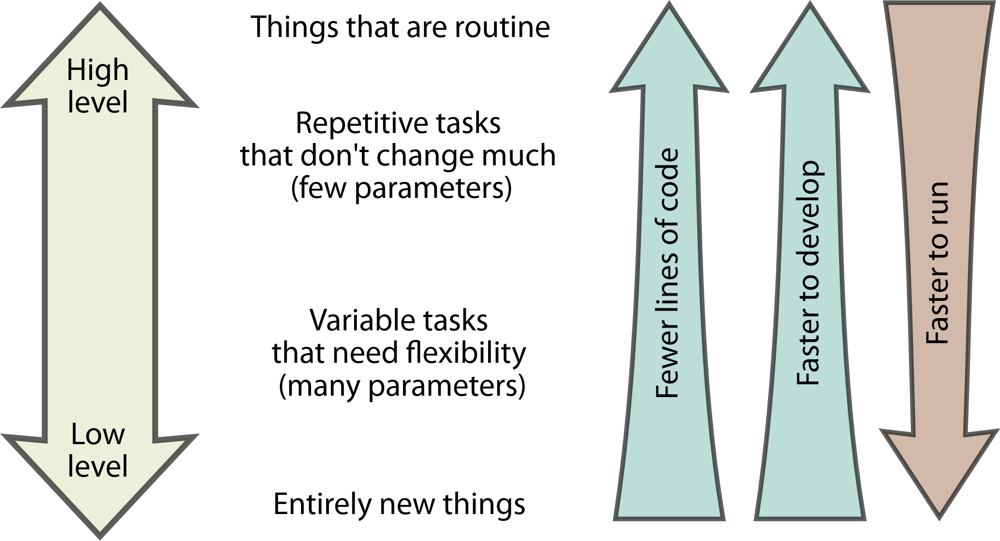

\<caption\> Figure 1.2: The level of a language confers benefits and drawbacks \</caption\>

As mentioned in the previous section, some languages allow you to achieve many things in one step. One command might translate into a vast sequence of lower-level instructions. For scientific code, it is usually better to communicate using the highest-level language possible: a language that abstracts away from the internal representation, so that you can focus on the logic. High-level languages tend to be more domain-specific, and can deal with more complex data structures.

### General-purpose vs Domain-specific languages (DSLs)

Python is a true general-purpose language. It can be used for commercial software development, for graphics, or just for quick short scripts within a word processor. It can run on servers, in a lab, or at home. Matlab and R, in contrast, are specifically designed for scientific use. Matlab is optimised for matrix manipulation, and rapid computation with large arrays. R is designed with statistical modelling in mind.

Some applications have languages that are specifically designed for them. For example, there are business languages. Hypertext markup language (HTML) was created specifically for designing web pages, and is domain-specific, whereas its parent XML (Extensible markup language) is general-purpose. XML has ‘schemas’ that enable more specific languages to be defined, such as Scalable vector graphics (SVG) which defines instructions for drawing line art.

### Array formats

One other way that languages differ, is in how they treat arrays of numbers. Subscripts, the integers that specify which item in an array, may begin with zero (**zero-based indexing**, Python) or one (Matlab, R). Arrays of numbers are passed to functions as a copy (**pass-by-value**), or as a link. And multidimensional subscripts like [row, column] map differently onto the “flat” one-dimensional sequence of memory locations.

## Chapter summary

Programming allows you to get things done quickly and reliably. It’s pretty unlikely that your computer will make a mistake. Most errors come from translating your thoughts into a computer programming language. There are many types of programming language, suited to different problems. For science, a high-level language with native parallel array operations is ideal (Matlab, Python + numpy, or R).

Discussion Questions: Ask around people in your department or group. How many use programming? And of them, what proportion are using each language?

# Chapter 2: Best Practices

For one simple task, there are a hundred ways to write a piece of code that accomplishes it. All these pieces of code may work. They may even behave identically in all situations, i.e. represent exactly the same algorithm. But they may look and read completely differently. Best practice is about how to choose the best version.

In this chapter I will demonstrate

-   why I care so much about good practice
-   that there are plenty of resources around to help
-   that open code is vital for science
-   why you should learn to use a version control system
-   that there is a workflow for developing code

## 2.1. What is Good Coding Practice?

Professional programmers are coached to program well. The principles of good coding were established in the 1970s (Kernighan et al. 1974), and were aimed at programmers writing in lower level languages, whose code needed to be read by other programmers. The overarching aims include:

-   **Error-free code**: In practice this means ensuring that a program’s behaviour is specified accurately for every possible situation
-   **Team coding**: Often dozens of developers will be coding one software product. Coders may come and go from a particular project.
-   **Maintainability**: If a new version of the language or libraries is released, or as new scientific knowledge emerges, you may need to update your code to keep it functional.
-   **Maintaining security**: Commercial code needs to ensure data privacy, and resist hacker attacks
-   **Making code run faster**: If a program runs continuously with high throughput, efficiency can make a big difference to consumers.
-   **Economising on memory**: When multiple tasks occur simultaneously, it becomes important to manage which information to hold on to, and kept in memory (**RAM**), rather than being kept on disk.
-   **Robustness to different computer systems**: Commercial software must often be usable on many different computer setups, and is often platform-independent
-   **Flexibility and future-proofing**: The consumer may want additional functions, or to handle new situations.

Some but not all of these considerations may apply to scientific code.

The first point, error-free code, is worth a little expansion: Code can be wrong in two ways.

1.  If the computer detects there is something wrong, an **error** might occur. Your code might generate a message, or blank output, or the computer might crash. This might occur only in very specific circumstances. But in these cases, you know about the problem when it occurs, and you can do something about it.
2.  The computer may run the code just fine, but the program does not do what it was supposed to. This is a silent **bug**. Your code might output incorrect numbers, mix up an analysis, or delete something it was not meant to. Again, this might happen only in very specific circumstances. And when it does happen, you may never find out about it.

If you don’t specify what behaviour you desire from your program beforehand, then it’s hard to classify the bad behaviour as a feature or a bug! For example, you might simulate a biological or physical process, and find the variables diverge to infinity. This is usually because the problem was poorly specified (bad assumptions or parameters), rather than a coding error. In this case, the divergence is a useful feature, as it informs us that our model assumptions are invalid.

## 2.2. Why should I bother to write good code?

For scientists, the main benefits of good code are

-   **Fewer errors**: which means fewer retractions and failures to replicate
-   **Quicker debugging**: scientists waste a lot of valuable time poring over red error text
-   **Easier to modify and reuse**: there is no point re-inventing the wheel
-   **Readable by others**: allows code to be verified and publishable
-   **Easy to return to**: scientists often need to revisit old experiments and data, in light of new findings

Small investments early on can make later life easier! (Wilson et al 1996)

### Software carpentry

You cannot write good code without knowing how to program. This book does not teach coding. There are many ways to learn.

-   Local coding courses may be available through your institution – introductions to coding, training in specific languages, or domain-specific courses
-   Software carpentry courses, that teach general practical techniques, and how to capitalise on available tools \<see ref 1\>
-   Free online resources on the internet, e.g. web pages and videos \<see ref 2\>
-   Online courses
-   Books specific to your programming language

\<ref 1\> <https://software-carpentry.org/> \</ref\>

***

\<ref 2\>https://www.software.ac.uk/programmes-events/carpentries/software-carpentry\</ref\>

***

Books and courses are great, but you cannot learn to program without experience – just like you can’t learn to play the piano simply by reading textbooks and listening to music. There are two kinds of experience:

1.  trying to **code from scratch** your own ideas – for example,

***

-   you might have read an interesting algorithm in a paper, and you want to implement it on your own data, or in a different language, or repurpose it.

***

-   Or perhaps you are a statistics whizz who conceives a statistical model: you might want to simulate or fit it.

***

-   Or perhaps you found the equations for a scientific model, and want to apply it to actual numbers.

***

Here, you learn to break down concepts into instructions, think logically in terms of steps and variables, and build a mapping from your scientific language to a computer language.

Adapting other people’s code – for example you may have inherited code from other people, and you want to add a new function. Or perhaps you downloaded a toolbox from the internet, and need to modify it. Reading code and working out its meaning (**reverse engineering**) is a skill, and lets you acquire new snippets of language, and recognise new **design patterns**.

\<case study\>

What is your worst nightmare? For me, retraction of a high-impact paper is one. Retractions are increasingly common results of code errors (Casadevall et al. 2014). In the above case, a small error in a script crept in. The code was inherited from another lab, and in their excitement about the results, the code wasn’t checked. Two columns of data were flipped, leading to a protein’s structure being mirrored.

Consequently, five papers, including three published in *Science* between 2003 and 2005, had to be retracted in 2006 (Miller 2006). The papers were highly cited and controversial, so if the code had been **open source**, the error would doubtless have been picked up much sooner. The authors were candid about the mistake, and continue their highly successful work.

Admitting errors is painful, stressful and depressing.

\<key point\> Science is built on community trust. For this, we need a fair, open, blame-free culture. Top scientists admire people who admit their errors. \</key point\>

\</case study\>

## 2.3. Version control

What happens when you want to change some code? Most people will change the code, then save it. But this carries a high risk of “breaking” old functionality. That is, after you have made the change, you might not be able to run the same code on old data. When possible, you should try to make your code backwards compatible. How can you get around this?

**Exercise**: You have written an analysis script, “Analysis.py”. You get a new dataset, and you need to change the script because the new data includes an additional variable. You edit the code to work with the new script. What do you do now?

-   Save over the old version.
-   Save it as “Analysis_for_new_data.py”
-   Rename the first one “Analysis01.py”, and save the new one as “Analysis02.py”
-   Add the date to the end of the file, “Analysis_2020_05”
-   Create a new folder, called “Second_dataset”, and save the file there with identical name
-   Add a line to your code “DATASET = 2”, and where you make your modifications, wrap them with “if DATASET==2:”

Each method has problems. Can you identify them?

|                                   | Pro                                                                                                                                                                                                                                                                                                                        | Con                                                                                                                                                                                                                                                             |
|-----------------------------------|----------------------------------------------------------------------------------------------------------------------------------------------------------------------------------------------------------------------------------------------------------------------------------------------------------------------------|-----------------------------------------------------------------------------------------------------------------------------------------------------------------------------------------------------------------------------------------------------------------|
| Save over old version             | You don’t need to change any scripts that call this script: they will automatically find the new version.                                                                                                                                                                                                                  | You may no longer be able to analyse the old dataset.                                                                                                                                                                                                           |
| Analysis_for_new \_data.py        | Semantic name: you can understand from the filename what it’s for                                                                                                                                                                                                                                                          | Duplicates code. If you needed to change both the new and old analysis simultaneously, you need to remember to duplicate the changes too.                                                                                                                       |
| Analysis02.py Analysis_2020_05.py | Creates a sequential order, so that changes can be seen.                                                                                                                                                                                                                                                                   | Can lead to messy, cluttered folders, and difficult to keep track of which version to use. Old scripts that call on Analysis.py need to be changed                                                                                                              |
| Second_dataset/ Analysis.py       | Moving between directories automatically selects which version of the script you want. Creates organisation in file structure.                                                                                                                                                                                             | Can be very confusing if you are relying on the PATH to find the code (in Matlab). When debugging, it is not clear which of the two files has the error, because error message may just say “Analysis.py”.                                                      |
| If DATASET==2:                    | You can switch between the datasets by changing a variable. Does not duplicate code, so subsequent changes can be applied to both datasets. You get a single script at the end, for distribution. Encourages generalisation of the code, and thinking about what aspects of your analysis are common to the two datasets.  | Not suitable for all changes. Some changes are too large and would lead to a lot of “if” statements. Runs the risk of breaking your analysis for the first dataset Code can get complicated quickly, and you may need to split the analysis in different ways.  |

There is a ready-made solution for this problem: Version Control software. There are a range of tools you can use: find out what your colleagues are using. The common ones are: Git, Subversion (SVN), and Mercurial. They have similarities and differences, and they all have a learning curve. Many online learning resources are available for beginners.

### A simple workflow

Version control programs are integrated into several coding environments, but are also available as standalone command line tools, which may have their own standalone graphical interfaces (independent of any IDE).

Most tools allow “branches”, containing different versions of your code. However, a minimal workflow might use just a single “master” branch, where you commit daily changes. As an individual scientist, you might want to

-   maintain multiple versions of your code
-   keep backup copies on disk or on cloud

***

-   synchronise edits from multiple computers

***

-   back-track at any point
-   audit progress.

For the community of scientists, they permit

-   code sharing
-   future adaptation of your code by other people for new purposes
-   code maintenance by the user community.

***

-   concurrent collaboration, synchronising edits from multiple users

### A more involved workflow

Common features are

-   Forks and branches: you can create a parallel copy of the code. This means different people can work on different parts of the code, and you can have copies with different functionality.
-   Merge: Somebody responsible can bring together changes made in different branches.
-   Cloning and Committing: These features give you the ability to edit and tweak code on a local computer, then send your edits to a central location.

\<image\>

\<caption\> Figure 2.1 **A more complex use of a version control system**. Version control systems allow operational and development versions to co-exist. Code can be changed by different people, and the edits merged. In this example, the main trunk contains fully operational code. A branch is created in the repository, for developing the new feature. Alex and Ben "check out" this branch, meaning that their computers’ files reflect the new branch. After they make changes, they can "check in" their edits back to the branch. If the edits conflict, they have to be resolved manually. Edits within this branch don't affect the trunk. Once the tests have been passed, the changes from the branch can be merged into the trunk. \</ caption\>

One major problem is that multiple versions of commonly-used code inevitably means conflicts. Some authors recommend that code should be open for extension, but closed to modification (the **open-closed principle** (Martin 2000)). This would avoid version conflicts altogether. But it’s not possible to predict use cases in advance, so branching versions remain the norm, and guidance is available (Perez-Riverol et al. 2016).

***

### Diff

You will need to get familiar with a file comparison utility, sometimes called a **diff** tool. Diff software allows two files to be compared line-for-line. This can be used with or without version control. There are graphical diff tools, which contrast two files side-by-side. These programs will try to line up matching parts of the files, and highlight the changes, with sophisticated algorithms that can spot moved sections. Some programs will also allow you to **merge** selected changes across the files.

It may be useful to know that the original console diff command (available on UNIX/Mac) can produce a text file that summarises the differences between two files, and these changes can then be applied to a file using the patch command.

## 2.4. Publishing Code

Many Universities have their own archives for code and data, and there are national archives. Additionally, some journals have begun to host resources to accompany papers. These have the advantage that

-   they are guaranteed to be operational for a long time e.g. 10 years
-   once deposited, no maintenance or subscription is needed on your part

However, this kind of deposited version is usually a **final** version. So this kind of archiving is useful for data and scripts that accompany published manuscripts, which will not be further modified as they reflect a finished product.

One alternative is to publish code (and data) in a repository that implements version control. These environments include GitHub, GitLab or Open Science Framework. You may have institutional guidelines on where and how to publish different kinds of code and data, and how to deal with versioning, linking to preprints, and the institution’s open science policies. Consider a service that provide a citable digital object identifier (DOI) for publishing research code.

What counts as a good format for publishing code? Some people prefer a downloadable unit – e.g. an archive (e.g. a zip file).

-   Archive files preserve the folder structure on your disk, which might be important for your code. It has the full directory structure all laid out. You can unpack the archive and directly run.
-   Zip archives are compressed, which means for code they can take up less than 40% as much space. But since code is small, it’s usually compressing the data that makes a big difference. If your data has a high resolution, e.g. very fast sampling rates or a large number of bits per sample, then you could achieve up to 90% compression. Some files are already compressed, such as Matlab mat / HDF5 files, TIFF or PNG files, so may not benefit further.
-   Archives also contain a **checksum**, which means that if a **byte** in the file gets changed (e.g. by a disk or network error), this is detected and you will be notified. If not for the checksum, a small change that doesn’t break your code might go unnoticed.

The flipside of this is that a single byte error in an archive file means that the whole file is corrupted, and sometimes none of the information inside is retrievable.

\<example image - zip folders TODO\>

-   Provide a **Readme file**, in the root directory. This should provide instructions on how to get it working. Explain where to unzip the files, how to install required **dependencies** (extra components required to run the program), and configure the search path if needed.
-   A **Manifest file** is a structured file (i.e. it is machine readable) that indexes your archive. It might give the type of each file, its size, and a list of dependencies for each one.

***

-   Provide a clear **entry point**: a script that can be simply loaded and run, without any extra setup
-   Provide **metadata** for any data – that is, information about how the data is structured. This should include a hierarchy of variables, naming conventions, array dimensions, column headings and units. Include the same kinds of information you would use when commenting variables in code\*. You can provide metadata simply through your code, or use a separate file e.g. XML, a table, markdown or markup, or just plain text.
-   Give a reference to a paper, where the methods are fully described. You want to be cited, don’t you? And nobody can use data or code if the methods are not explained in full detail.
-   Provide your contact details – perhaps a permanent email address as well as an institutional one.
-   Minimise namespace intrusions, which may cause **collision** problems for some users.
-   Be prepared to offer support. Depending on the popularity of the resource you publish, you might need forum or group mailing list.
-   Update your code. If bugs are found, correct them using version control, and advertise the changes to minimise people affected.

An alternative way to publish code is an **interactive notebook** or ‘live script’. Code is presented as a webpage, including interactive commands and their outputs. Notebooks contain a list of cells, each with a few lines of code, that can be stepped through. Each cell might produce some intermediate output. Cells can also contain text and equations. This allows a reader to follow through the steps of an analysis.

### Code security

This book is not intended to be a guide to information security: plenty of other guides are available for that \<ref CNIL\>. But, as part of research ethics, institutional policies and national regulation (e.g. General Data Protection Regulations (GDPR)), we all have a duty to keep data secure. I will summarise some measures here, but they should be obvious.

**Data security** should be in proportion to how sensitive the data is, so use common sense:

-   Password/passcode protected logins for all devices, including mobile phones – follow guidelines on password strength and reuse. As a programmer, you will begin to realise how easy it is for a hacker to fool a computer.
-   Always use an encrypted drive when transferring files
-   For human data
    -   anonymise data at the point of collection
    -   keep linkage key on paper in locked room, so that identifying information is not stored electronically
-   Avoid use of uncertified cloud platforms, according to your local policy
-   If you store confidential data, consider

***

-   operating-system level hard disc encryption

***

-   saving documents with password-based encryption.

***

Part of this is also keeping your computers safe

-   Avoid uncertified remote desktop software, desktop sharing, or remote login servers
-   Use appropriate firewall and antivirus
-   Caution when opening email attachments or clicking on email links
-   Never provide your password to anyone or re-use passwords. Many institutions now recommend password managers or “digital wallet”.
-   Set appropriate permissions on data directories

\<case\> The Adult Friend Finder data breach

According to CSO online and BBC reports, in 2016 hackers stole between 3.5 and 400 million usernames and passwords from the adult swingers site FriendFinder, compromising IP addresses, names, billing details, and explicit photos and messages for several casual hookup and adult content sites like stripshow.com. The files were published with a \$100,000 ransom demand.

The hack exploited a trick to get files from a server that are not directly accessible. Some web pages use **local file inclusion**, which is a way to include dependencies, like include or library. Inclusions sometimes allow a the web page URL to include a query, which specifies a filename to include in the web page. For example, you might have a URL like <http://oup.com/?module=products.php>, which includes the code for ‘products’ on the page. The vulnerability meant you could replace this with a file in the server’s root directory – like /etc/passwd for example!

For safety, the server should have **validated** the module query by removing slashes or dots, permitting only a particular set of module names, and also checking user access.

Worse still, the passwords were only encrypted with **Secure Hash Algorithm 1 (SHA-1)**, which generates a 20 byte **hash** code. When you enter a password, only its hash code is stored, and authentication then involves comparing the hashed passwords. While this was thought to be secure, by 2005 it was shown to be crackable, taking 233 tries to find a password that will generate a given hash. Although it would cost thousands of pounds in electricity, this is easily done on modern GPUs. SHA-1 is no longer accepted for web certificates. It was estimated that 99% of the leaked FriendFinder passwords were cracked within a month, and included 5000 military and government addresses. This kind of attack is common, with victims including Yahoo, Adobe, MySpace, LinkedIn, and eBay.

\<ref\> <https://www.csoonline.com/article/3132533/researcher-says-adult-friend-finder-vulnerable-to-file-inclusion-vulnerabilities.html>; <https://www.bbc.co.uk/news/technology-37974266> \</ref\>

\</case\>

Some aspects of GDPR regulations \<ref CNIL\> legally require you to:

-   Recognise personal data, and sensitive data. Importantly, if information can be used to identify people by coupling it with other data, it is personal. In fact, **pseudonymised data are considered personal data**.
-   Minimise data collection
-   Inform users in a concise, transparent, comprehensible and easily accessible communication
-   Define a data retention period
-   Follow the “legal basis” i.e. processing the data only for the appropriate purpose
-   Manage access rights to the data according to need-to-know

**Secure coding** is part of this, and if you are writing server code, you should read specific books on security especially **cybersecurity** (Graff & Wyk 2003; Howard & Leblanc 2004 ). Key topics include:

-   Checking the input to your code, at every stage. Input validation means check that numbers and text sent to your function contain only expected values. Use **assertion** to ensure your code fails when it needs to.
-   Use encapsulation with object-oriented code
-   Keep code simple and readable with commenting, naming, and functions
-   Start implementing security measures when you first plan your code
-   Set aside time for security testing at the end, and ask an expert to find security holes

\<ref CNIL\>

Commission Nationale de l’Informatique et des Libertés CNIL GDPR guide <https://github.com/LINCnil/GDPR-Developer-Guide>

\</ref\>

## 2.5. Open Code, Licenses and Publishing Code

The main open source software licenses are:

-   **Copyleft** eg GPL (Gnu General public license) which allows the code to be re-used by others in new projects, as long as the project carries the same license. Used for the Linux operating system.
-   **MIT license** – the code can be re-used for any purpose, under any license. Used for much web coding and javascript. Also requires the copyright notices to be included with any copy of the software.
-   **BSD** (named after Berkeley Software Distribution, a Linux distribution that first used the license) – the code can be re-used for any purpose, under any license, provided the copyright notices of each contribution, and disclaimers of warrantee are preserved.
-   **Creative Commons licenses**: often used for the text of academic papers, but not recommended for software. CC BY is an ‘attribution’ license, which allows re-use in any form, including commercial, as long as the author is credited. CC BY-SA is a copyleft version (ShareAlike), and CC BY-NC allows only non-commercial use.

License conventions vary by field, and change over time. So, do your own research\<ref\> and ask what your colleagues are using. If your institution or funders claim intellectual property rights, please seek legal advice locally before committing to a license.

**Ethics** of code sharing: each time you use 3rd party code, check the license, and acknowledge the code appropriately, both in comments and in accompanying publications.

\<ref\> https://choosalicense.com/\</ref\>

## 2.6. The Software Development Process

Commercial programmers work with clients who specify what their code should do. As you might imagine, this can go disastrously wrong, since:

1.  clients often have no idea how to specify an algorithm – often they have trouble even deciding exactly what the program should do in each possible case;
2.  the programmer often has no idea about the nuances of the data and logic that the client needs;
3.  the client usually has constantly changing demands which may be modified before the software is even finished.

Software development has invented many styles of project management to approach these problems. Not all of these are relevant to scientific lab-based coding, but it pays to know that they exist.

Software development is an iterative process. You start with the scientific idea, plan what steps are needed, write code, and test it. It will probably fail, which means you have to debug the code. This will often unearth problems in the code's organisation, which will require refactoring. Conceptual problems in the algorithm may require you to plan new computational steps, restarting the cycle. Development therefore proceeds in **cycles**.

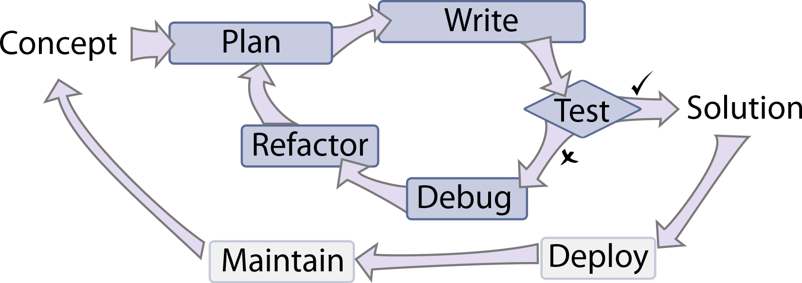

\<caption\> Figure 2.2: Starting with a very simple specification, code can be planned. The plans can then be implemented by writing code. The code can then be tested, and if it fails the test, it can be debugged and refactored. Once it passes the tests, it can be used and maintained. But usually, additional specifications are added, and the process starts again.

\</caption\>

**Agile**: Programmers aim to get working software out quickly, and then rapidly evolve the product by getting feedback and implementing small changes. This addresses the problem of constantly changing demands by only working toward one short-term goal at a time, with customer involvement and feedback after each goal. They use strategies like a daily **scrum** where team members summarise the day’s work, and work in **sprints** – a timeframe of a couple of weeks to achieve specific goals.

**Test-driven development (TDD)**: Software is built in units, each of which is self-contained and has well-defined behaviour. Even before you begin writing code for a unit, you write the **unit tests**. The suite of tests is a complementary body of code that runs and tests each little piece of the unit. It makes **assertions** about what results are expected, in each possible situation. Writing the tests first means that they will initially fail, since there is no working code! Your job is then just to make the tests pass, so progress towards a goal is easily measured by the number of failed tests remaining. **Code coverage** measures how much of your code is actually tested by the test suite, and there are tools to analyse this.

**Extreme programming (XP)**: a form of agile development in which new code is released extremely quickly – perhaps combining edits from many programmers at the end of every day. Unit tests must be written before writing any production code. **Pair programming** is common, where two coders work at a single computer – one person typing, the other reviewing. If you are interested, look these up on <http://software.ac.uk/resources/guides>.

Numerous courses exist on these techniques for software industry, which may be less useful for scientific coding.

\<further reading\> Extreme Programming Pocket Guide, O’Reilly 2003 ISBN-13: 978-0596004859

In scientific programming, a highly effective strategy to check your code is **simulation**. This means creating artificial data, which you have full control over. You will need to come up with a **forward model** of your data.

Once you have coded up a data analysis script, run it with example data that you have created. Can you obtain a null result? Can you detect a true positive?

In some domains, the motto is simulate, simulate, simulate:

\<caption\> Figure 2.3: Simulation is a central component of science \</caption\>

-   Generate data before you design an experiment. Add in measurement noise and process uncertainty, to see if your experimental design is appropriate to test your hypothesis.
-   Simulate once you have pilot data, to check your power, and to validate the forward model which you use to simulate your data.
-   Simulate again when you perform your final analysis, to see if you can actually recover the parameters you estimated.

## Chapter summary

Good code is important for you: it will reduce errors, and make your life easier. It’s also important for other people: your code will be re-usable by your team and the scientific community. Imagine coming back to your code in two years’ time, having forgotten all the details. How would you like the code to look? Imagine emailing the code to your boss. Would they be happy reading it?

As you work on and modify your code, you want your code to be accessible, re-usable and adaptable. To achieve this, you should know a range of techniques, and when to use them – and this knowhow amounts to both a skill and an aesthetic – if you like, **phronesis** (a practical virtue).

Discussion Questions: What are your favourite features of your version control system? Can you these in other aspects of your work, e.g. collaborating, writing papers, or synchronising files across computers?

Further reading: Riquelme & Gjorgjieva, 2021

# Chapter 3: Preparing to code

Writing code takes a lot of concentration. You need to maximise your vision, memory capacity, and typing speed. Coding is frustrating, and can be stressful, so let’s make your environment as comfortable as possible. Take some time to adjust things, and on its own, this will improve your coding.

In this chapter you will understand

-   how to stay comfortable while coding
-   why you should spend time setting up your coding environment
-   how to use empty space to make code more readable

There are many coding environments, but they are in constant flux, so I will discuss only the common aspects.

## 3.1. Are you sitting comfortably?

These guidelines are taken from the UK Unison Display Screen Equipment regulations.

### Adjust your seat

-   Raise the backrest to a position where supports your lumbar spine.
-   A slight forward tilt to the seat is recommended.
-   The height of the seat should be such that your arms comfortably rest on the desk, ideally forearms horizontal or with a slight downwards slope when your shoulders are relaxed.
-   If the height is not comfortable, you can raise the desk with bricks or books.
-   If your feet do not rest flat on the floor, consider a footrest.

    

***

Figure 3.1: How to sit comfortably

***

### Keyboard and mouse

-   The keyboard should be sufficiently far from the edge of the desk, so that there is room to rest your wrists, but sufficiently close that when typing, your upper arms hang vertically.
-   Avoid resting your wrists on the edge of the desk – raise the height of your seat to avoid this.
-   Ensure your mouse speed is set high enough, so that you don’t need to move your hands wildly, but low enough that you can still click precisely between letters.

### Screen position and visibility

-   Your screen(s) should be directly in front of you.
-   If the screen is horizontal the top edge should be approximately level with your eyes; for vertical screens, eyes should be about three-quarters of the way up.
-   The screen should be approximately at arm’s length when you are sitting comfortably back in your chair.
-   Take an eye test, get the right glasses, and keep them clean!
-   If possible, use a matte screen. If your screen is reflective, try an anti-glare filter.
-   Close blinds and point the screen away from light sources and windows.
-   Make sure the screen is clean.
-   Adjust the display contrast and brightness on the monitor itself to maximise the visibility of your code.

### Posture

-   No posture is ideal if maintained for long periods. Take frequent breaks away from the screen – break up your day with meetings, calls or actual breaks.
-   Adjust your chair during the day.
-   Avoid slouching forwards, keep shoulders above hips, and don’t stretch when using the keyboard.
-   **Seek help from your department / employer** if you experience any problems with your equipment.

\<ref\> Adapted from Unison UK’s Display Screen Equipment Guide

## 3.2. Your coding environment

Code is written in text editors. For most scientific computing, you will want to write your code in a specialised editor that is designed for your language. At the simplest, you might use a command-line text editor with programming plugins (like vim or emacs). But for interpreted languages, you may improve your productivity with something more sophisticated.

The most sophisticated code editors are known as **Integrated Development Environments** (IDE). Matlab has an IDE built in, but for Python and R, you may need to download a separate program. As of writing, Spyder is common for scientific Python, and Rstudio for R. I won’t touch on specific IDEs, as they are in constant flux.

### Using an IDE

A typical scientific IDE contains four components:

1.  A console, to type commands directly into an interpreter, which are executed immediately
2.  An editor, to view source code files
3.  A file panel, to browse your computer’s directories and load files
4.  A workspace or variables view, which variables in the current **stack frame**.

\<caption\> Fig.3.2: Auto-completion using the \<tab\> key displays a list of known names of fields, variables or functions within the relevant namespace. \</caption\>

How will an IDE help you?

| Auto-completion         | After you type a few letters, the IDE will show you options to complete the word. It is usually context-sensitive.                         |
|-------------------------|--------------------------------------------------------------------------------------------------------------------------------------------|
| Parameter help          | When you type “(“ to call a function, e.g. “sin(“, then information is shown about what you can put in the brackets.                       |
| Syntax highlighting     | Recognised keywords in the language are highlighted. Comments, definitions and loops appear in colour.                                     |
| Selected word highlight | When you click or select a variable name, all the occurrences of that variable are immediately highlighted. This is incredibly useful.     |
| Working variables       | A table showing the variables currently in the workspace                                                                                   |
| Bracket matching        | Click on an open-bracket to see the matching close-bracket (or vice versa)                                                                 |
| Code folding            | In the margin, you can collapse chunks of code, like functions or blocks                                                                   |
| Debugging               | Visually add breakpoints, step through code and into functions, hover over code to see variable values, window showing current variables.  |
| Smart indenting         | When you press return after typing “for …”, the spaces are added before the next line, to indicate the next lines are inside the loop.     |
| Auto-format             | You can select a chunk of code, press a key to automatically fix indentation. e.g. \<TAB\> in Matlab if emacs-style indents are enabled.   |
| Command History         | Keep track of all the commands you have typed, auditing your progress and errors.                                                          |

Look through your IDE’s options to see how to enable and invoke these features.

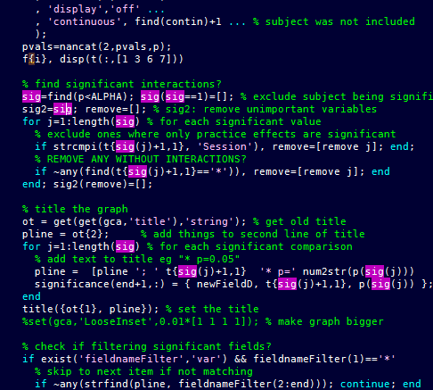

\<caption\> Figure 3.3: IDEs have an option to “highlight current word”- making it easy to see where a variable is created and changed. \</caption\>

Good coders don’t need a mouse: moving your hand between the mouse and keyboard costs valuable thinking time, and distracts you from what you are coding. Some say it also contributes to wrist strain. You must know your shortcut keys. The most important ones are:

-   Move cursor to console, Move cursor to file editor (matlab \<ctrl\>+0, \<shift\>+\<ctrl\>+0; spyder \<shift\>+\<ctrl\>+I, \<shift\>+\<ctrl\>+E; Rstudio \<ctrl\>+2, \<ctrl\>+1)
-   Cut, copy, paste
-   Go to beginning of line \<home\>, End of line \<end\>, start/end of document (e.g. \<ctrl\>+\<home\>)
-   Move forward by one word, backward by one word (e.g. \<ctrl\>+\<right\>)
-   Select while moving (usually hold \<shift\>, e.g. \<shift\>+\<ctrl\>+\<right\>)
-   Quick-run a line of code (variously F9, \<shift\>+F7, \<ctrl\>+R)
-   Quick-run a block of code (\<ctrl\>+\<enter\>)
-   Auto-complete (e.g. \<ctrl\>+\<space\>)
-   Jump to function definition (e.g. \<ctrl\>+D, F2)

***

If you do not know the specific keys for your system, look them up and practice them. You should be able to **configure these keys** in the options or preferences menu. If you are using a laptop, practise hitting \<home\> and \<end\>, which might require you to hold down a ‘function’ key; alternatively assign them to another combination, such as \<ctrl\>+ something. Learn to **touch type**: you can find other guides to this, but in brief, keep your index fingers over ‘F’ and ‘J’ keys (marked with bumps), and use your right little finger for \<shift\>.

A useful technique is to learn one new shortcut every few days (once all the other ones you’ve already learnt have become automatic).

One useful feature of IDEs is the ability to ‘drill down’ into variables by clicking in a ‘workspace’ window. You can display elements within your variables – like fields of a structure, or elements of arrays. However, do get used to doing this in the console, by typing the variable names, and using auto-complete. You will soon cherish the speed gained from **avoiding the mouse** (and touchpad).

You can save all the loaded data in your session using save / shelve / dill / save.image / save.session.

### Fonts

Exercise: Can you read these characters? Which font do you prefer, and why?

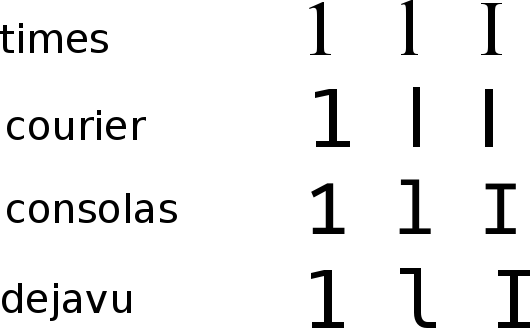

\<Caption\>Fig.3.4: Which font do you prefer? \</caption\>

### Monospaced fonts

There are two types of font: proportionally spaced and monospaced. Proportional spacing means that the letter “i” takes up very little width on the line, whereas the letter “m” takes up much more. This is great for reading, because the vertical lines in the text are all similar distances apart. However, it is never used for code. Alignment is crucial in visualising code, and to get good alignment, all characters must take up the same space. Interestingly, the digits 0 to 9 are monospaced in all fonts, because alignment is crucial for numbers too.

\<caption\>Figure 3.5 Proportional font (left) and monospaced font used for programming (middle). Numbers are monospaced in most fonts (right).\</caption\>

### Font size

Some people like to see lots of code on screen at once, and use small point sizes. The critical test is, how easy is it to distinguish a comma from a full stop? A colon from a semicolon? These are the commonest errors.

### Hazards of IDEs

Most IDEs have a data viewer like a spreadsheet. Using this graphical interface can be useful but comes with hazards, as discussed above. IDEs encourage mouse-click-based data analysis, which ultimately takes away your control.

Instead, learn to use the command line and scripts to manipulate the data. To view the data, type the name of the variable containing the array or table – rather than clicking on the variable with the mouse. To check its size, just use size / shape / dim. To get a statistic, use mean, min or max, or summary. To visualise the distribution of values, use histograms, cumulative densities ecdf / plot.ecdf, and scatter plots. To get a list of possible values, use unique. Consider showing a table as a heat map, using imagesc / imshow / heatmap. Overlay several plots, using different colours to compare them, and consider a plotting library like gramm / seaborn / ggplot. For multi-dimensional data look at the correlations with corrplot / seaborn.pairplot / pairs. When flicking through data, these are the commonest things you’ll want to do.

\<key point\> Digging into the data is one of the great joys of science. This is how you discover new things. Have the tools under your fingers. \</key point\>

Crucially, you can instantly automate or vectorise these operations, so that you can plot overlaid distributions of several conditions at once, visualise all possible pairwise correlations with an array of plots, or in a single command request summary statistics per session and condition.

\<key point\>

Get used to quickly checking through data with **console** commands. Typing commands lets you track edits in the command history – you can spot errors in retrospect, and you can repeat commands easily using the cursor keys.

\</key point\>

### Know where to find help

For all languages, help is close at hand.

1.  From the interactive console, the help() command gives you most of what you need.
2.  Most IDEs also provide built-in documentation viewers: e.g. Matlab doc command, Spyder help window (check out ctrl+I and the ‘automatic help’ that opens the docs when you type a function) and the R Studio help tab, using the “?” prefix.
3.  To see what information is hiding “inside” a variable, you could try methods(x), dir(x), attributes(x). In most IDEs you can type x. (x\$) and press tab to see the list of completions.

***

3.  Many functions are written in the language itself. This means you can peek into them, by displaying their **source code,** which might contain helpful comments. You can call edit in Matlab, or just type the function name in R. In Python, your IDE will have shortcuts for finding the source .py file, or you can use inspect.getsource().
4.  Search online to find the documentation for the packages you are using. The maintainer’s website may have example code. Ask a clear question an coding forum.
5.  Ask someone! Try **pair programming**, or speak to a colleague. General coding forums can be invaluable for solving problems, but to get the right answers, you must ask your question well.

## 3.3. The Neuroscience of Legibility

### Screen orientation

Do you ever find that when you read to the end of a line, you have to concentrate to find the beginning of the next line? Do you ever begin the same line twice, or skip a line? Line breaks are much harder to navigate when lines are longer. This is because the rapid eye movements you make to scan back, called **saccades**, obey a version of Fitts’ law (Harris & Wolpert 2006). Larger eye movements are less precise, and may not land exactly on target.

Newspapers have solved this problem with multiple columns. Each column might only be a few words wide. Common guidelines are less than 50 characters, or 8 words. You will never find an A4/letter-size book printed margin to margin – the column will be about 15 words wide. In these days of widescreen monitors, this is even more of a problem.

\<caption\> Fig.3.6: Example of newspaper columns. This well-tested style of print is optimised for the human eye and brain. Note the narrow columns with 3 to 7 words. Indentation helps pick out paragraphs. \</caption\>

To optimise code legibility, it is usually preferable to keep lines short. An 80-character limit is traditional because old terminals had such low resolution. However it remains a useful guide, for the reasons above. Many modern editors can put a vertical line here as a marker, or offer to automatically wrap comments at 80 characters. Some people prefer a longer limit, e.g. 120 characters.

One solution is to rotate your monitor to vertical orientation. This is extremely useful if your scripts are long: you can see more of the script without scrolling.

\<exercise\> Are there any disadvantages to the 80-character width limit?

I can’t think of any. \</exercise\>

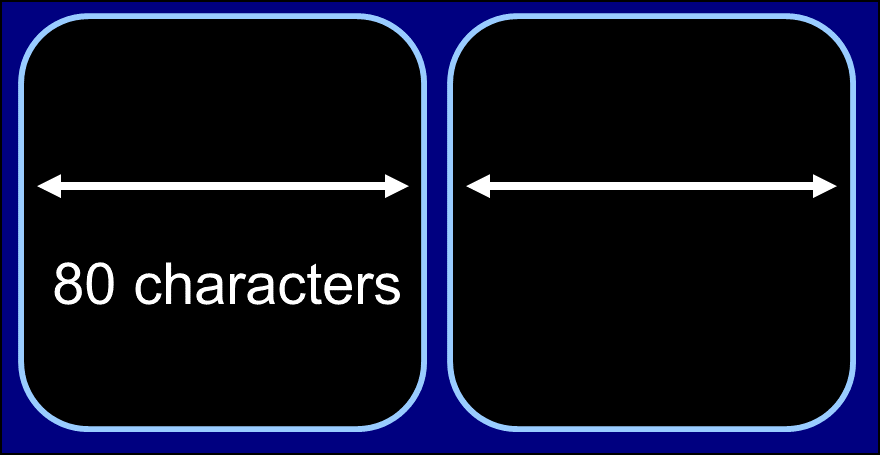 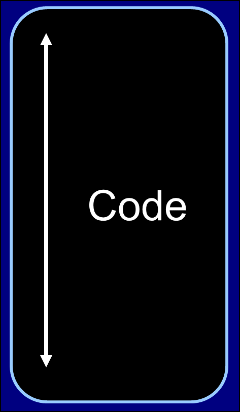

\<caption\> Fig 3.7: splitting the editor, or using vertical monitor orientation, to maximise your screen space. Seeing a lot of code at a glance is vital.

Another useful option is to split the editor, so that you are viewing two columns of code at once. This makes it easier to switch between different functions, or even between two locations in one long file. This is great when you have multiple files that call upon each other.

When might long lines be better? When it makes parallels in your code clearer. For example, look at this code and see if you can figure out what it does:

output_horz( sample, sensor ) = input_horz( sample, sensor ) / sensor_gain( time, sensor )\^2

\+ horz_offset( time )

output_vert( sample, sensor ) = input_vert( sample, sensor ) / sensor_gain( time, sensor )\^2

\+ vert_offset( time )

It is performing two calculations, for a pair of horizontal and vertical inputs. The two statements look similar, but in what way? Perhaps it would be clearer written like this:

output_horz( sample, sensor ) = input_horz( sample, sensor ) / sensor_gain( time, sensor )\^2 + horz_offset( time )

output_vert( sample, sensor ) = input_vert( sample, sensor ) / sensor_gain( time, sensor )\^2 + vert_offset( time )

because it is easier to see the similarities and differences between the lines.

\<key point\> The rule is: know when to break a rule! \</key point\>

All the rules in this book are guidelines: use your judgement to work out whether they apply.

**Two screens** are always better than one. You could use one to keep the console and variables, another to put the editor. If you are working with data, you could have one screen for plotting. If you are referring to documentation, you might open a web browser or doc pages on a separate screen. Some people use three screens.

### Spacing

Many computer languages ignore spaces, so you can usually add space liberally in your code. Leaving a little space around something is a great way to make it stand out. Code should be like a picture: try and portray the structure of your code graphically, by adding space and aligning things.

As you may be able to see, this code adds up some data. But can you improve it? Here is one suggestion:

Points to note:

-   The uses of the variable “data” are aligned, so they can immediately be compared. Any spelling error in the variable name can be immediately spotted. The variable looks visually more like a vector.
-   The coefficients have been spelled out, introducing the ‘invisible’ 1 that multiplies the first term. This makes it very clear that the various data elements are being scaled in different ways. It also makes the code easier to modify if needed. The code could potentially be vectorised.

The three characters space, tab and newline (“carriage returns” and “line feeds”) are all considered **white space**. In most code, whitespace is ignored. Python is fussy about newlines and spaces at the start of lines. Newlines can be inserted liberally if you are inside an expression enclosed by brackets. Matlab requires you to specify the magic “...” if you want to break a line.

To include tabs in your output, code them as "\\t". To output newlines, use "\\n", which generates **carriage return** and/or **line feed** characters, depending on whether you are on Windows or not.

Where should I place spaces within a line of code? There are no strict rules. But here are some guidelines that are commonly followed:

-   Placing spaces around an assignment operator (=, \<-) makes it easy to spot what variable is being changed on each line. Compare:   
    x=x+(vel+dv)\*(t0+t)   
    vs   
    x = x+(vel+dv)\*(t0+t)  
    This is because people often scan through code to find where x was last changed – for example when debugging.
-   Placing spaces around things that count as additive terms helps when you have multiple terms on a line. Compare  
    x = x + (vel+dv)\*(t0+t)  
    Here it becomes clear that x is being adjusted or incremented by one product.
-   Spaces can help separate factors within a term, when each term is itself a compound:  
    x = x + (vel+dv) \* (t0+t)  
    Here the spaces help to clarify the **operator precedence** (i.e. that first the velocities are added, and the times are added, and finally these two are multiplied.
-   Don’t use spaces before a bracket that represents a function call:  
    x = x + sin(t0 + t)
-   As with natural English, avoid spaces before colons and commas:  
    def my_function(x, y):

In general, add space until it becomes easy for someone to guess what your code does, with their eyes half closed.

\<exercise\> What are the arguments against spacing?

Some coders argue that it wastes time, and code gets out of alignment quickly, which can be confusing. It means the spacing doesn’t follow uniform rules, and the invaluable auto-format commands will disrupt it. \</exercise\>

### Crowding

Focus your eyes on each circle on the left. Can you read the T on the right?

\<caption\>Fig.3.8: visual crowding: look at the circle on the left of each row, and try to see the letter ‘T’ on the right. Adjust the page so you can see the first one clearly. Now look down at the second one. The T should disappear into a jumble of lines. Now look at the bottom one: you should now be able to identify the T, because of the spacing.

This phenomenon is known as crowding (Whitney & Levi 2011). The closer letters are together, the harder they are to individuate, when in peripheral vision. There is no problem when you focus your eyes on them. And there is no problem if there are no flankers (“L”s). If you have several text elements, adding spacing can really improve legibility when scanning a document.

**Styles guides** provide rules on how to space out code. For example **PEP 8** (van Rossum, Warsaw & Coghlan 2001) is a style guide for Python written by the creator of Python. This guide stipulates that consistency within your code is the most important thing. The rules in it are well worth reading. But it goes on to say, “know when to be inconsistent -- sometimes style guide recommendations just aren't applicable. When in doubt, use your best judgment. Look at other examples and decide what looks best.”

Some style guides recommend adding spaces inside brackets. Spaces are not recommended between closely associated items, for example between a function name and its open-bracket.

returnValue = processingFunction( inputData, parameters )

Spaces are commonly added after commas, and between terms in formulae, both before and after binary operators (like “+” and “\*”). In particular, you can use space to accentuate the natural grouping of operations, emphasising the operator precedence:

currentValue=currentValue+count\*increment;

currentValue = currentValue + count \* increment;

\<box\> A ‘term’ means a group of items that are multiplied together, but two things that are added together are different terms. Logically, it makes sense to separate the terms in a formula with spaces.

### Tidy code = Tidy mind

Some people advocate neat, aligned code. It often allows mistakes to be spotted quickly. For example, it is much easier to spot differences between two similarly-structured lines that are aligned. It also demonstrates that you have spotted that the two lines are similarly-structured, and could thus potentially be **refactored** into a function.

\<caption\> Fig.3.9: The judicious use of alignment and lines can make some code much easier to read.

Benefits: it becomes immediately obvious that the colours are all triplets of integers from 0 to 255. You can even see which colour channels have the same values. It is easier to read the comments. The ‘banners’ and lines drawn are readable from a distance, and make it easy to scroll to important sections in a longer script.

Problems: The code becomes longer, so more scrolling is needed. Beware of ‘gaudy’ or garish code – banners and lines are only useful markers if they are used sparingly. Otherwise they run the danger of cluttering (Martin 2011).

### Black on white, or white on black?

Should you use a dark or light colour scheme for programming? The debate is long and complex (Buchner & Baumgartner 2007), but here are a few points.

-   If you have **refractive error** (i.e. you wear glasses or have astigmatism), you can see better when your pupil is small. That is, a bright background will give better legibility in a dark room. In daylight, it probably makes little difference.
-   However, if you suffer from **glare** (i.e. if you see haze around lights, for example if you have a cataract, corneal scars or vitreous floaters), bright light will scatter in the eye, and so a dark background will give better legibility.
-   Some people believe that a dim background may reduce eye strain.
-   If you are looking away and back from the computer screen, the pupil has to adapt to the change in brightness. It is possible this may contribute to eye strain. So, some people prefer to **match** the brightness of the screen background to their surroundings. That means dark background in a dark room, and bright in a bright room.

Everybody’s eyes are different – we each see colours differently because we have different pigments, with varying time constants, and we each have unique optical imperfections. So try out some different colour schemes and find what works.

### Syntax highlighting

Colours are critical to noticing problems in code.

\<exercise\> Can you spot the errors?

begin = 1

end = 5

length = end – begin

abc = 1

def = 5

len = abc – def

In Matlab, then end is a reserved keyword, so this will give an immediate error; length is a built-in function and it will be **shadowed**. Similarly in Python, def is a reserved keyword and len is a built-in function. Syntax highlighting will show you the keywords in colour, but overwriting built-in functions is something you just have to be always alert to.

It is safety-critical to have syntax highlighting turned on. But do spend some time adjusting the colours to your liking. Make comments stand out! You may find your IDE puts comments in low-contrast colours. Depending on your coding style, comments might be more important than the code, so colour them appropriately.

Standard: Comments emphasised:

\<caption\> Fig.3.10:If comments are important, make them more visible. \</caption\>

Remember, though, that the only thing at actually matters is the code – the comments might be all wrong!

### Organise your files

Think carefully about your folder / directory structure in advance.

-   Will the data be easy to find?
-   Where will the analysis scripts go? Data-specific code should be stored near the data, whereas more generic or abstract code can be further away.
-   Will the files be easy to loop over? Keep similar files in a single folder, or in an identical folder structure, so that you can simply insert a number into a pattern. Think about writing the loop before you create the data folders.

e.g. By first writing the loop below, the best format for the data folders becomes clear

subjects = [1,2,3,4, 6,7];

pattern = ‘data/expt1/sub%02g/data.mat’

**for** s = 1:**length**(subjects)

file = **sprintf**(pattern, subject(s));

data{s} = **load**(file,’data’);

**end**

data = [ **load_csv**(“data/expt1/sub%02g/data.csv” % s) **for** s **in** subjects ]

### Keeping files in a sensible order

-   Most file systems can show a “lexicographic” ordering of the files – that’s basically alphabetic, but where 0 comes before 1 etc. So files named with numbers in them will be sorted in a strange way. The solution is zero padding:

\<caption\> Fig.3.11: Left: files created by just placing the number after a prefix are vulnerable to mis-sorting (middle). Right: Zero-padding requires foresight but makes a big difference.\</caption\>

You can use format strings (like the example) to automatically insert zeros. Look at the format string help to understand how the '%02g' placeholder works.

If you use dates in a file name, you may encounter a similar problem: If you want dates to sort sensibly, they have to be written correctly. Year must come first, then month, then date, then time – e.g. YYYY-MM-DD-TTTT format. This may sound backwards, but in general, names should carry the ‘**most-significant bits**’ of a quantity first. Tens before units; Years before months.

### Theory of mind

As a programmer, you need to think about how others will read your code. How do you do this? Around the age of 6 we develop the ability to understand what other people might think. It seems that the brain forms an **internal model** of how minds work, allowing us to represent and simulate how our actions might influence someone else’s beliefs. This faculty is termed theory of mind. It is what allows us to imagine someone else reading our code.

Theory of mind lets us put ourselves in other people’s shoes. It is the skill that makes us tactful, good politicians, and likeable communicators: skills which, perhaps unjustly, are not associated with the stereotypical computer programmer! However, good coders can anticipate what a reader will think, and will write code accordingly.

Theory of mind is not the same as being considerate. For example, I occasionally read comments like “you may not understand this bit”, or “not clear why this works, but it does”. These clearly show the author has thought about what people will think, but has opted not to help them.

Know your audience – this is the first rule of communication. Who is going to read your code? If you are publishing your code, and/or making it open source, you need to think about who will use it. Will a fellow scientist need to adapt it? Might a professional programmer want to integrate it into a library or interface? Will a critical reviewer decide to check it? Or perhaps your student has to run it blindly following simple instructions. Your coding style might be different in each of these cases.

## Chapter Summary

Ensure your environment is optimised. Adjust your screen and keyboard. Maximise your windows and choose the right font and font size. Know your keyboard shortcuts and avoid the mouse. Spend some time to configure your IDE and optimise your directory structure.

When you code, think about the code’s visual appeal – spacing, layout and organisation. Can you make the meaning of the code visible from a distance?

Above all, stay relaxed when coding. You will get stuck. But work on different things, or come back after a cup of tea. Enjoy the power of looping through millions of numbers in seconds.

Discussion Questions: What are the differences in your setup, when you prepare to write a document, vs write code? Or when you read papers? Can you apply any ideas from this chapter to other aspects of your daily work?

# Chapter 4: Comments and documentation

Some people think of comments as a way to stop a line of code from running. But comments are also the only part of the code where you can add informal and contextual information. Comments are usually the first thing people look at – if only because they are humanly readable. Use comments to maximise the **signal-to-noise ratio** in your code (Martin 2011). Make them useful!

You will learn

-   What to put in a comment
-   How to document code

## 4.1. Anatomy of a comment

\<exercise\> What information should you include in the comments for a function? Make a list.

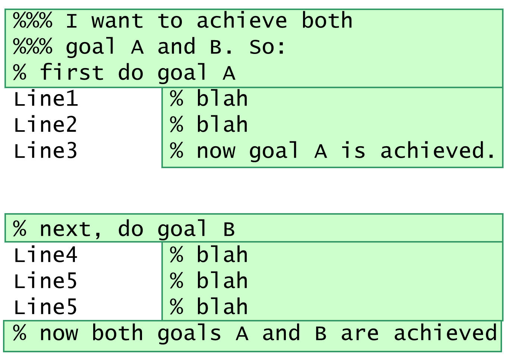

\<caption\> This style of commenting code gives a prose-like commentary on the structure, purpose, and individual steps. \</caption\>

Comment styles are a matter of taste, convention, discipline – and depend on how you name your variables and functions. Which of these two styles do you prefer? List the pros and cons of each style.

\<caption\> Two very different ways of commenting a function declaration. In both cases, there seems to be enough information to use the function. Which do you prefer, and why? \</caption\>

As a rule, the less obvious something is, the more comment it needs. However, too much commenting poses its own problems\*.

**Disadvantages of commenting**: Comments can draw the reader’s attention away from what *really* matters: the code! Imagine trying to find a bug. You read the comments, which seem to make perfect sense. They encourage you to read the code in the same way it was written – making the same assumptions, and potentially failing to spot the error.

-   Comments often simply repeat what the code says – they are redundant
-   When you **refactor**, you need to change both the code and the comment. Not only does this double the workload, but also runs the risk of having the comment being out of date for the code (e.g. a comment explaining the parameters might be incorrect for the new parameters in a function).
-   To make each function’s comments self-contained, some comment text may need to be duplicated across multiple functions that call each other. Repetition is generally bad.
-   Some coders suggest that having the same header comment at the top of every file (e.g. package name, license etc) is bad news. What if you needed to change the license? While find and replace is

\<caption\> Fig.4.1: Some styles of coding require more comments than others. Just look at the colour distribution in this example of commercially produced code in Java. Yellow indicates comments. Sometimes there are 5 lines of comments for three words of code! The comments are used to create the documentation web pages for the library. \</caption\>

## 4.2. Commenting a variable declaration

\<exercise\>

The first time you encounter a variable, what information would you like to have about it? Make a list of what you would include when commenting a variable declaration.

…

Sometimes things are clear enough from the variable’s declaration itself:

number_of_sessions_per_experiment = 3;

But for many other variables, you may want to specify

-   Its type – and if it’s an array, the expected dimensions (shape, size). If multidimensional, what does each dimension represent?
-   Units; is it a physical quantity? Seconds or milliseconds?
-   Expected range: what is the minimum and maximum permissible value? Can it go out of range?

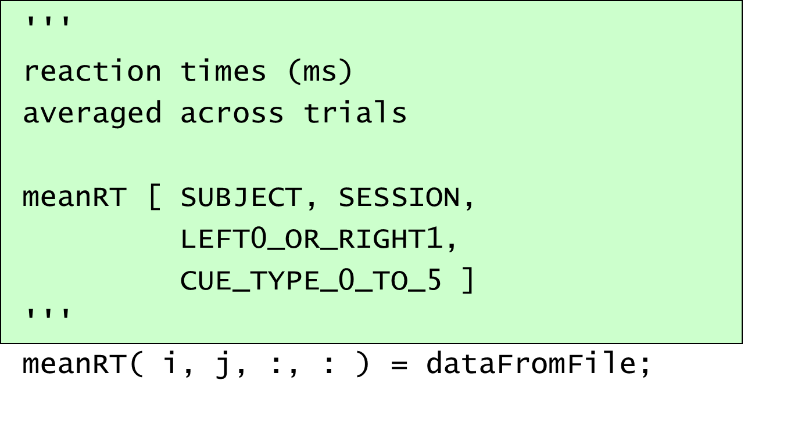

Remember that you can use block / multiline comments (%{ and %}, or """ which also creates documentation).

## 4.3. Commenting a function

Functions are the tools that other people will use. Commenting them clearly is of utmost importance.

At a minimum, you should document the inputs, outputs, and error conditions.

### Function inputs

You should write something brief about each parameter to the function. Mention

-   Its type, units and range, just like a variable declaration. This time, it has to be very clear what is an acceptable range of values.
-   For an array, additionally: how many dimensions, what do each of the dimensions mean, and how large should each of the dimensions be.
-   Special cases – what would it signify if the value supplied was negative? Or if it was NaN? Note that it is bad practice to use numeric values as indicators. It might not be clear what a value of 1 or 2 means. Consider using a **flag** or **enum** instead.
-   If it’s a structure, what fields should it contain?
-   If a filename is provided as a parameter, what type of file should it be, and what does it need to contain?
-   Are any parameters optional? If so, what are their default values if the parameter is omitted?

### Function Outputs

Specify what each return value from the function means. Mention

-   Type, dimensions, units, range as above.
-   Is anything written to the screen, to a file, or are any graphs plotted? Mention this in the comments.

### Error conditions

Mention when the function will fail, and how it will signify failure. For example, will it return a particular value such as NaN? Or will the function throw an error (this is usually better than ignoring abnormal inputs)?

Within code itself, you may want to comment individual lines.

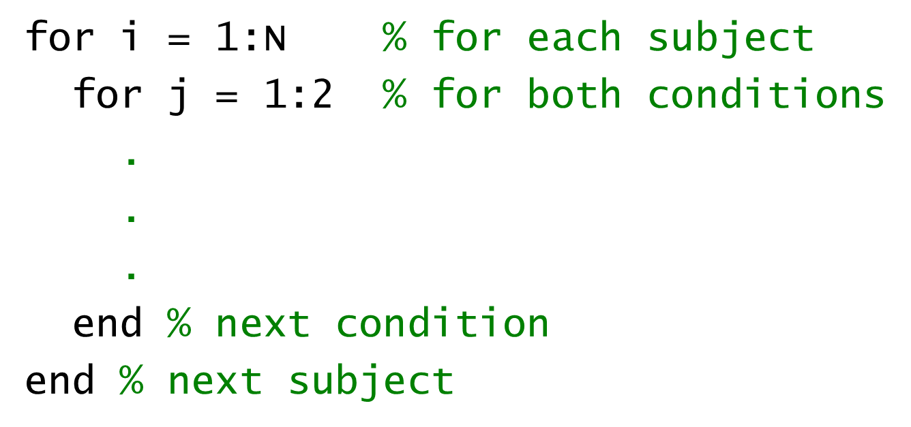

for(i in 1:N){ **\# for each subject**

for(j in 1:2){ **\# for both conditions**

**...**

} **\# next condition**

} **\# next subject**

Note here that the units of i are specified, and the end of the block is commented. Sometimes, the end of a block may be far from the start of the block, and there might be many blocks being closed – some loops, some ifs, and so on. In that situation, these end-of-block comments are useful. But: it might also be a sign that you need to split your code into smaller functions.

### Header

People often include the author, a copyright message, and sometimes a revision history.

Revision or version information might include date and initials of people who have made major changes to the function.

You might highlight disclaimers, situations where the code should not be used. Some people also keep a “ToDo” list at the top of their script, e.g. to keep track of missing functionality.

If you anticipate that your function may be slow, for example a parameter search, or lengthy pre-processing, document this. Say approximately how long it takes to run:

**% function b_hat = find_optimal \_bias( samples )**

**% this function can take about 30 minutes to return**

**% eg with 200 samples on a 4GHz CPU.**

Consider adding a **verbose** option that displays information at each step, showing progress. Similarly, if your function creates very large variables, e.g. calculating kronecker tensor or outer products, or performs dimensionality expansion, then explain this:

**% note that this function creates a large array in memory**

**% with length(samples)\^2 elements. You can expect 1GB RAM**

**% usage with 1e4 samples.**

These are especially important if either execution time or memory requirements are of the order of O(*n*2) or higher. Somebody might test their code by calling your function with a small test dataset, and feel pleased, but then be disappointed when the full dataset causes problems.

In other words, try to avoid nasty surprises for people with small computers.

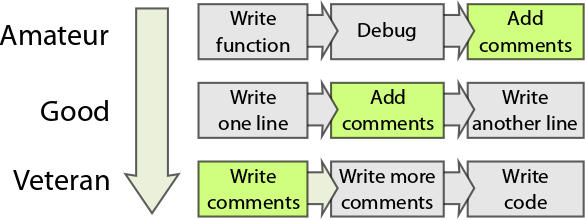

\<caption\>Fig. 4.2: An amateur coder writes, debugs, then finally adds comments. In contrast, a veteran programmer begins by writing some comments, elaborates them, before diving into coding. \</caption\>

### Functions that take functions

Some functions require another function as a parameter. Usually, these are notoriously badly documented.

Common examples include optimisation routines, which take a ‘cost’ or ‘objective’ function as a parameter. fminsearch( @sin, 0 ), minimize( sin, 0 ), optim( 0, sin ).

Other examples include **callbacks**, (see Event-driven programming) where a routine might take some time to finish, but needs to provide some output: you might provide your own function to be called once the routine finishes.

In all these situations, you must **document the parameter just like you would document another function**! In other words, include a full specification of its input values, and output values. Include error conditions, and any things that it must or must not do (its contract). Additionally, specify how its input values will be calculated, how many times the function is likely to be called, and how its return value (if any) will be used.

### Documentation comments

The first comment before or after a function definition is special. It can be automatically extracted to provide documentation about the function.

| In Matlab, the first line of comment in the function generally echoes the declaration, followed by detail.   | In Python, “doc strings” at the start of a function are enclosed in triple-quotes e.g. """. The string follows conventions that allow them to be rendered into HTML pages. These documentation comments are actually stored as properties of the function object (__doc__).  Conventions include PyDoc or Google Docstrings, which can be rendered by the package Sphinx.  | In R, comments beginning \#' before a function definition can be compiled into a LaTeX-like Rdoc file (using the package roxygen) or used directly (with package docstring). The comments use tags like @param, @examples and @return.   |
|--------------------------------------------------------------------------------------------------------------|----------------------------------------------------------------------------------------------------------------------------------------------------------------------------------------------------------------------------------------------------------------------------------------------------------------------------------------------------------------------------|------------------------------------------------------------------------------------------------------------------------------------------------------------------------------------------------------------------------------------------|

In all cases, the documentation can be displayed by calling the help() function, or through the **IDE**’s help browser. Some languages allow a degree of **markdown** where you can control the formatting of the documentation, such as bullets, emphasis and hyperlinks.

**""" Reads data from experiment files into a data frame**

**:param filenames: a list of strings. Files should contain...**

**:returns: a pandas object with columns from \`\`filenames\`\`... """**

**\#\#' @title  Reads data from experiment files into a data frame**

**\#\#' @param  filenames a list of strings. Files should contain ...**

**\#\#' @return a data frame with columns from \\code{filenames}, and ...**

\<key point\> Some comments constitute documentation, giving easy access to a function’s usage.

With a well-documented function, there is no need to look at the code. \</key point\>

### Vignettes

Aim to give a short concise example of how to use a function, in the documentation. It may be as simple as fleshing out the declaration with explanation and context. You may need more than one vignette, if there are different modes of use.

## 4.4. Iffing out

Historically comments were used to ‘comment out’ code – that is, to temporarily stop a line of code from executing. However this is not great practice:

-   Over time, many lines may become commented out, each at different phases, and for different reasons. This threatens to become a chaotic minefield. It won’t be clear if any of the commented lines are supposed to ever be reinstated. Accumulation of redundant code is dangerous.
-   Previously commented lines don’t get tested as the code changes, and so may not work when they are next uncommented
-   Syntax highlighting isn’t shown for commented code, and your editor won’t be able to mark warnings, run **lint**, or perform semantic analysis on that code
-   The reason for commenting out code is often not specified. This leaves the reader wondering what the code originally did, why it was left, and whether it might be needed again.
-   If the commented section contains a block comment (e.g. %{ / %} or """) then you will run into grave problems if you try to block-comment this. You cannot nest comments!

Instead, consider switching the code off by an if statement. This is sometimes called ‘iffing out’. If code is unlikely to be needed again, **delete it**. On the other hand, if it might be needed again, put an option flag in the if, so you can switch it back in when needed:

verbose = False

if verbose:

print(x)

\<exercise\> Iffing out is not always the right solution. What are the disadvantages?

-   If you temporarily need to disable a single line of code, for example in debugging, you can just comment the line out.
-   Because iffed-out lines are syntax-highlighted as normal, it is not obvious that the code is out-of-action. Code that is currently broken and needs fixing could be commented as a way of highlighting that it is non-functional.
-   A valid time to comment out code might be if it serves as a “how to use” instruction – e.g. as a usage example at the top of a function.

\<case study\>

NYSE

Knight Capital Group was one of the world’s leading financial services and stock traders. In 2012, a software bug brought the firm down \<refs\>. They had a function which bought high and sold low – this sounds an odd thing to do! But this code was only used to create a simulated environment to test their other code. It was kept switched off by iffing out, with a flag something like this

if TEST_MODE:

buy_high_sell_low()

An update was released in which this old testing code was deleted, and the name of this test flag was re-used for another variable. Unfortunately, the file containing the deleted function was not deployed on one of their eight servers. So, this testing code re-activated on one server.

The result was that when the new code was deployed, the buy_high_sell_low code was triggered every time a transaction was made. Worse still, this code was executed hundreds of times because it did not count correctly how many transactions were required.

It was noticed by the New York Stock Exchange within 4 minutes, but Knight had not implemented a kill switch, so the crazy purchasing continued for 20 minutes more. High Frequency Trading algorithms from other trading firms immediately exploited this. Knight’s computers made 4 million transactions in that time, sending stock prices into chaos. The transactions were worth \$6bn, and may have cost the firm about \$460m.

\<key points\> Delete defunct code, avoid re-using global variables

This kind of error may be prevented by **DevOps** – as set of practices spanning software development and operations. DevOps aims to keep software reliable while it is changed, by specified pipelines for coding, review, testing, releasing, configuration and monitoring. \</key points\>

\<ref\><https://www.henricodolfing.com/2019/06/project-failure-case-study-knight-capital.html>

https://www.bugsnag.com/blog/bug-day-460m-loss \</ref\>

\</case study\>

## Chapter Summary

Think carefully about your comments. For the top of the code: can a user pick up your code and immediately know exactly how to use it? Consider using “doc strings”. For the interior: can someone else coming to edit your code fully understand how it works? Imagine yourself in these two situations, and put anything you would like to know in a comment. Alternatives to commenting include more meaningful variable names (see next chapter) or splitting code into meaningful functions (see chapter 7).

Discussion Questions: There are many places you could comment – at a function declaration, and at each time the function is used; where a variable is declared, initialised, used, and reported. How do you decide what to write at each of these places? Does a need for comments always reflect poor variable naming?

# Chapter 5: Choosing names

The great luxury we have with computer languages – which we don’t have in human natural languages – is the ability to rapidly define new words. A lot of your code will use words that you come up with yourself. It will pay to choose them well. After this chapter, you should know

-   What makes a good name for a function or variable
-   What factors might affect your choice of name

## 5.1. Naming conventions

Everybody has their own naming conventions. But knowing the variety of possibilities will let you make an informed choice. In every computer language, variables cannot include spaces; but often you will want to use more than one word as the label. So how will you separate words in the variable name? Also, given that humans have relatively poor memory, how will we remind ourselves of what a variable does?

\<caption\> Some common naming conventions \</caption\>

Capitalisation is often used for things that are less likely to change. For example, types or classes might have an initial capital, and **constant**s (values with long scope) may be fully capitalised. You might choose one format for functions, another for variables, and yet another for structures.

\<caption\> A common naming scheme. Try to distinguish constant values from variable values.

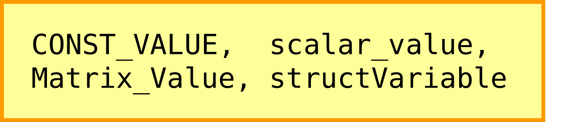

Delimiters and capitalisation within a variable name can vastly improve legibility of code.

In “Hungarian notation”, programmers prefix each variable with a decoration indicating its type. For example, ‘i’ for integers, ‘d’ for **double**-precision numbers ‘ai’ for arrays of integers, ‘s’ for structures, ‘m’ for matrices. It helps prevent using a variable inappropriately, and also avoids **collisions** (where two variables inadvertently have the same name at the same time). But when writing, sometimes you don’t remember the type, so in this case locating the variable is slower.

In R, you can use dot ‘.’ within a name, whereas in Python and Matlab the dot means look for a “member” of a **structure** or object; so instead use underscore \_. R also permits you to use any character in a variable name -- even operators and spaces -- if you refer to it using back-quote. E.g.  
 \` \`\<-1 ; \` \`+\` \` gives the answer 2, by assigning 1 to a variable whose name is a space!

**Consistency is paramount**: Choose your names consistently. Look at other peoples’ code in your field. Read any style guides available to you. For example, if you code in Python, read **PEP 8** (van Rossum et al. 2001) which aims to give highly consistent naming and code style conventions – snake_case is recommended. For R, there is excellent material in Wickham’s Advanced R \<Wickham 2019\> and tidyverse style guide, as well as Google’s style guide. There is less material for Matlab though see Richard Johnson’s excellent book (Johnson 2011); internal functions tend to camelCase.

These styles might not be substantially better than your own personally-developed style. However, they can tremendously facilitate understanding collaborative code, as you don’t have to take time to figure out each developer’s own personal style, and you don’t end up with the awful situation of a mixture of styles in a single codebase.

\<box\>

### Avoid spaces and minus signs in file names

Many operating systems permit filenames that contain spaces: these are not good filenames for scientific computing, and I would recommend avoiding them. Similarly, although you can use hyphens in filenames, avoid this when you are naming files to correspond to functions, classes or modules in your code. Files map to functions in Matlab, and to modules in Python -- and in both situations, spaces and hyphens won’t work. Hyphens are interpreted as the minus operator in code! R is immune to these issues since filenames have no special role when running code.

\</box\>

### Naming functions

Often functions can be thought of as verbs. Scientific code often adopts the “verb-object” convention for naming. Functions that don’t take parameters are often named like commands, with the verb and any objects, like readInput(), performConversions(), resetCounters(). In contrast, functions that take parameters are named like operations, with a transitive verb and any preposition. Which do you prefer: readInputFromFile(filename), readInputFrom(filename). or readInput(filename)?

Alternatively, functions can be named by their outputs, if that is their defining feature:

function y=meanAge(X)

**def** meanAge(X):

mean.age \<- **function**(X){

### Avoid confusable names

Sometimes you may want to use short names, for example i,j,k for loops. But:

-   Many programmers avoid using l. If the person reading your code is using a poor font, they might read i=i+l as i=i+1.
-   If you use complex numbers, you might want to avoid using variables i and j.
-   You might also want to be careful about having two variables called X and x, or S and s etc.
-   Programmers tend to avoid using the letter O as a variable name, for obvious reasons.

Avoid overwriting **built-in functions** in your language. Unfortunately, most languages provide a few functions with short names, but still let you re-define those names. You may unwittingly use those names for your own variables. This effectively overwrites (**shadows**) them, so later on when somebody tries to use that function, something unexpected will happen.

\<exercise\> Can you make a list of which words you can’t use as variables?

-   In Python be careful of all, any, bin, cmp, dir, file, filter, float, hash, id, input, int, iter, len, list, long, map, max, min, next, object, ord, range, set, str, sum, type, vars, zip.
-   In Matlab be careful of overwriting ans, any, all, cell, char, diff, eig, eps, fix, flag, flip, inf, home, length, lower, upper, max, min, mean, more, pause, pi, plot, prod, rand, rem, reverse, round, set, size, string, sum, years, days, hours, minutes, seconds, duration, date, now, struct, table, var.
-   R has a clever little rule that ignores non-function variable definitions if it’s clear that you intend to call a function. For example, after c\<-1; t\<-1, you will still be able to create lists with or transpose them: t( c(1,2,3) ) works fine. Still, use caution when overwriting functions, because if you then assign the function to a variable, or pass the function as a parameter, this mechanism will not know, and the function gets shadowed. The builtins include all, args, c, col, cut, diff, dim, dir, F, file, kappa, I , list, Map, max, mean, min, mode, names, next, norm, order, q, range, rank, rep, sample, scale, seq, sequence, sign, single, stop, sub, sum, t, T, table, try, units, url, var, vector. If you try and Avoid using **T** and **F**, which are initially defined as synonyms for **TRUE** and **FALSE**, but can easily get overwritten. Avoid assigning to pi.

In general, you might just check by typing the variable name in the console, and making sure you get Undefined function or variable, NameError: name is not defined, or Object not found.

R is one of few languages that allows you to actually meddle with all its keywords and built-in operators. You can simply assign to reserved words by quoting them with back-ticks: \`**if**\` \<- **function**(){}, or even "+" \<- **function**(a,b){} to destroy addition. This is of course very dangerous, so be alert.

\</exercise\>

\<case study\>

Mariner 1, launched in 1962, was designed to fly by Venus. Unfortunately the Atlas-Agena rocket carrying it veered off course just 93 seconds after lift off. The most likely cause was that the guidance code was supposed to use a variable containing the rate of change of the radius, denoted . The overbar denoted the time-smoothed rate, but this overbar was omitted. Perhaps this mean that normal variation in the velocity were treated as serious, and leading to the rocket veering off course.

Mathematical variables are often easily confusable – especially if they differ by only a suffix or vinculum. The error has been dubbed the “most expensive hyphen in history” (Arthur C Clarke, 1968) \<ref\>.

## 5.2. Names are greedy (Huffman coding)

An important principle of information theory is that you can compress information. We have all used zip files. How do they do their magic? One aspect is that our natural languages and natural data formats are highly redundant. For example, a screenshot of this page may contain a lot of white pixels, represented by long streams of ‘1’s in the datafile. Intuitively, you could take the stream ‘1,1,1,1,1,1,1,1,1,1,1,1,1,1,1,1,1,1,1,1’ and replace it by ‘(repeat '1' 20 times)’. This could shorten the file a lot.

A simple and assumption-free way of doing this is to replace commonly-occurring patterns by a single symbol. You would need a look-up table to know what symbol corresponds to what pattern. You could carry on replacing sequences with more and more symbols, but then the symbols would have to grow longer too. At some point you will reach a trade-off between sequence-length and symbol-length. Huffman coding optimises the symbols so that the **commonest sequences are replaced by the shortest symbol** (Huffman, 1952). In general, if you want to use a label a lot, make it short. If you use a label rarely, make it longer.

\<key point\> A general principle from information theory is that we can choose short names for frequent use, and longer names for rarely-used things. \</key point\>

This idea can be applied to variable names: if you use a variable several times in each line of code, use a short name! If you use it just twice in a long script, use a long name.

## 5.3. Long and short names

\<exercise\> Should variable names be long or short? List your reasons why. Are there arguments for the opposite view?\</exercise\>

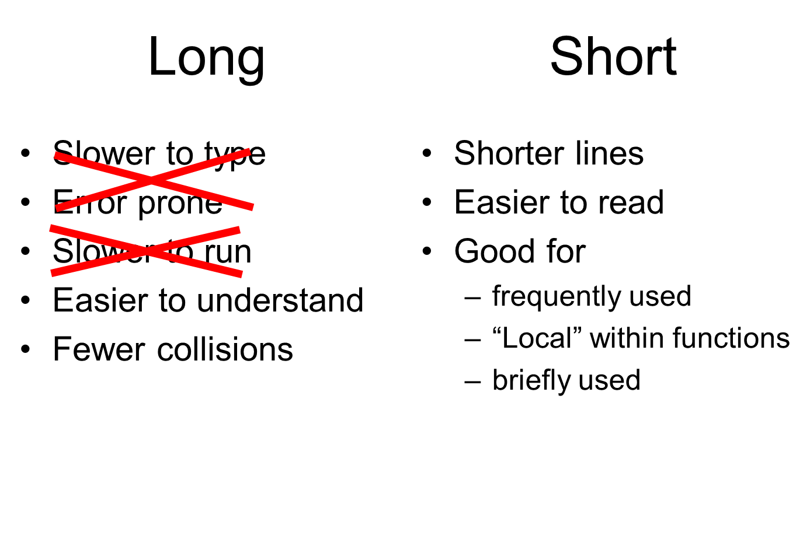

Don’t be afraid of typing! Your **IDE** should have auto-completion. To type a long variable name, simply type the first few letters and press \<TAB\>. There’s no reason why long names should slow you down here.

Your code will be **compiled** – usually just after you hit Run – into simple fast code that resembles machine code (technically: **just-in-time** compilation to **bytecode**). In this process, all the names are converted to a numerical index or address, so they can be referenced quickly. So nowadays, long names will run just as quickly as short ones.

Pay careful attention to naming ambiguity. Might you need another variable with a similar name? Have you used similar names elsewhere? Longer names are less likely to collide.

-   Similar names often give you a clue to spotting algorithmic similarity – and should prompt you to rename groups of variables as structures or arrays, or move the code into a function so that a single variable name can be used for many different data fields.

**Short names:** When variables have a short, limited scope, give them shorter names. For example, in a very short function, you can get away with single-letter variables.

-   They are less likely to collide, in a small scope
-   Your brain’s working memory capacity is less strained: you have seen the declaration recently, and there aren’t too many other variables in scope.
-   The more often a variable is used, the shorter you should make it. However, if you find yourself using a variable many times over, think: have you spotted the algorithmic similarities? For example, if you find yourself calculating a unit conversion more than twice, consider using different units to start with; if you use a similar line twice, should you use a loop?

**Long names:** In contrast, use longer names for variables with a larger scope: In other words, for variables that need to be present for a lot of code, and are used in many places. These variables are more persistent: they hang around for longer.

-   Consider putting the variable inside a structure, so its name is effectively hierarchical (e.g. analysisParameters.TOLERANCE). This is especially true in the rare situations where you need global variables.
-   Longer variable names allow you to convey more about the semantics. Use them if you might not remember exactly what the variable does.
-   In nested loops, you could avoid single-letter indices in favour of meaningful names.

***

-   Long names allow “**Self-documenting code**”

### The Readability-Writeability trade-off

When we see a variable when **reading** code, we have to remember what it does. What is its type? For an array, what are its dimensions? What does each dimension signify? What is the range of its values? What do its values signify? Long names can help with this.

-   However, when we are **writing** code, we need to recall the variable’s name. Did I call it “num_samples” or “sample_nums”? Was it “mean_length_conditions” or “condition_length_means”? Longer multi-word names take more chunks of mental space, have confusable order, and are thus harder to recall.
-   Put the bit that will come to mind first at the start the variable name. Then you can use the auto-complete to effectively search for the right variable.
-   If you have your own conventions, you can use your conventions to reconstruct how you named things. For example, you might always use the prefix ‘n’ for number, e.g. nSamples.

### The opposite of legible code (advanced topic)

There are rare cases when programmers provide runnable code, but want to prevent users from being able to read or change it. Perhaps they have a secret algorithm, or want to conceal the fact that their code is awful.

In general there is no bulletproof way to prevent people from editing your code. If you provide code that people can run, they can also change it. But one reasonably strong method is to create an executable file (sometimes colloquially termed a “binary” file). This **compiles** your text code into a dense, condensed sequence of numbers called machine code, that can be read by the **CPU**. Tragically, all variable names and function names are replaced by numeric **addresses**. For humans to read the code would require **disassembling** (sometimes termed decompiling) the numbers back to a text form, called **assembly language**. As you can imagine, this is not much easier to read or edit than the machine code, but it can be done. Some executable binaries are further protected by a **checksum** – so directly changing the file would break the seal and prevent execution. Matlab’s compiler, Cython or pyinstaller and the R package compiler can generate encoded versions of program. If you distributed only these encoded versions, your program would be no longer be **open source**.

A simpler that prevents people editing code is to replace the variable and function names with meaningless letters. This is called **obfuscation**, and is commonly used to compress and speed up interpreted JavaScript code used in browsers.

-   In general, it is tricky to change obfuscated code.
-   Obfuscated code is slightly smaller, in terms of storage space. However, source code files take up negligible amounts of space, compared to data. The space needed to store 1 second of video (about half a megabyte at 1080x768 pixels) can hold at least 10,000 lines of dense code!
-   Obfuscation undoes all your hard work of making scientifically useful code!

\<caption\> Fig.5.1: Can you work out what this code does? This is an example of deliberately obfuscated code. Real, legible code is passed through a tool that replaces all the variable names with single-letter tokens. \</caption\>

## 5.4. Variable types

All variables have a type. To find out the type of a variable, use

class(1) : ‘double’

type(0.) : \<type ‘float’\>

typeof(0) : “double”

### Naming Booleans

\<exercise\> Consider the following code:

% indicates whether the light is on

% 1 = ON, 2 = OFF

light = [1,2,2,1,1];

How might you improve this variable? \<exercise\>

Notice light is really a **boolean** variables: it has only two states. Consider using a prefix ‘is’:

This can be written using an **enumeration**. But using the ‘is’ prefix, you could write

isLightOn = [1,0,0,1,1];

This has the benefit that you can write more legible code, like if isLightOn[3]:, which is much less bug-prone! Similarly, you might also replace variables like “leftRight” by “isLeft”; that way, there is no ambiguity about which value means what.

### Naming arrays

Let’s say you have a list of data files, and you store the names in an array:

session = {‘session1’,’session2’,’session3’}

or

sessions = {‘session1’,’session2’,’session3’}

Do you prefer to call the array session or sessions?

Now let’s say you are using the session names in a loop

filename = [ session{i} ‘.mat’ ]

or

filename = [ sessions{i} ‘.mat’ ]

This time, do you prefer to call the array session or sessions?

Nobody really knows whether array names should be singular or plural. In general,

-   plural names read better when you use the array as a unit
-   Singular names read better when you use the individual elements of the array (Conway 2005).
-   Plural names also leave you in no doubt that a variable is an array, when you use it: the plural acts as a variable type tag.

Try to avoid looping over arrays where the list is plural and the index or iterator is single:

***

**for** session = 1:**length**(sessions)

***

**for** session **in** sessions:

***

**for** (session **in** sessions){

***

You then have two variables which only differ by an “s” at the end, which can lead to hard-to-spot bugs and tricky-to-follow code.

***

## 5.5. Enumerations

Many data formats use **integers** to indicate categories. For example, there might be four types of response, which have been labelled arbitrarily 1, 2, 3 and 4. This is called an enumeration. Most commonly, the codes are labelled in comments:

% response codes:

% 1: valid leftward response

% 2: valid rightward response

% 3: invalid response

% 4: no response recorded

But it is much clearer if this information is stored in variables, e.g.

Response_types = { ‘VALID_RIGHT’, ‘VALID_LEFT’,INVALID’,’NONE’ };

This allows you to go from the index to the label, using Response_types{i}. Note that traditionally, constant values are capitalised. What if you want to go the other way, i.e. from the label to the index? You could use a structure:

Response_type.VALID_RIGHT = 1

Response_type.VALID_LEFT = 2 etc.

Then you could check response codes by name, rather than needing to know the number:

**if** response == Response_type.VALID_RIGHT:

In Matlab and R, you could use both methods. However, in Python the optimal structure is called an enum, which allows you to go both ways.

**from** enum **import** Enum

**class** ResponseType(Enum):

VALID_LEFT = 1

VALID_RIGHT = 2

…

which allows you to write ResponseType.VALID_LEFT, or ResponseType(1), or ResponseType['VALID_LEFT'], which are all equal to the same item.

And a trick to do something similar in R is:

Response_type \<- **function**() { **list**(

VALID_RIGHT = "VALID_RIGHT",

VALID_LEFT = ”VALID_LEFT”,

… ) }

Response_type()\$VALID_RIGHT \# to get the number

Response_type()[[ I ]] \# to get the name

In Matlab there are tricks for achieving something similar, such as the downloadable enum() function.

\<exercise\> What are the benefits and disadvantages of enumerations?

| Pro                                                                 | Con                                     |
|---------------------------------------------------------------------|-----------------------------------------|
| Allows number to be converted to readable names in graphs or tables | More lines of code to set up the enum   |
| Saved along with data – acts as **metadata**                        | Might not be worth it if only used once |
| Allows name-based indexing, so code is more readable                |                                         |

## Chapter summary

Weigh up the pros and cons when choosing names for variables and functions. What counts as a good name depends on how often you’ll use it, how much you break up your lines of code, and who’s reading. Once your code is working, consider **refactoring** to change the variable names.

Discussion Questions: What do you think are the biggest factors that leads to people unintentionally overwriting variables? How could they be minimised?

# Chapter 6: Conceptualisation

For beginners, one of the hardest things is formulating your problem in the right way. You may be able to describe in English how to solve a problem, but to describe it in precise instructions is quite another matter. It is hard to translate a complex idea into code. To translate it into clear, simple and elegant code is even harder.

In this chapter we will set the scene for **functions**, covered in the next chapter, by exploring

-   the signs of poorly thought-out code
-   how the structure of your code should map onto its function
-   the relative benefits of making code more abstract, or general-purpose

This chapter sets up some puzzles: how can I write clean code? The question won’t be answered until chapter 7, but it is important to recognise the problem before spying the solution.

## 6.1. Abstract *vs*. Explicit code

A sign of well-conceptualised code is that the code “reads at the right level” to understand the process. If you look at the structure of the code, it should mirror all the hidden structure of the algorithm. It should also mirror the language you would use to describe the method.

### Spotting similarities

Abstraction is the human capacity to spot similarities, and harness them.

\<example\>

What is the similarity between a clock and a ruler?

Fig.5.2: “What is the similarity between a clock and a ruler?” – an example of abstract thinking.

\</example\>

Abstraction means selecting the highest-level commonality, that is maximally restrictive. In coding, you need to apply something like this to express your algorithm at the right level. It needs to be sufficiently general to accommodate your particular use cases, but specific enough that it doesn’t need a long list of constraints or parameters to do what you want.

For example, Let’s say you notice there are several ways to plot 2D arrays: imagesc/imshow, contour, contourf, surf/plotsurface. Why not combine these into a single command, plot2darray, and specify which kind of plot you need as a parameter? This would be an example of code that is “too general as it needs too much specification”. Code should not be so abstract that it needs lots of switches inside. But look no further than ggplot to find that some people actually prefer this style!

In function-based programming languages, abstraction means combining a few pieces of code – which may contain some repetitive element – into a single block of code that can be called upon multiple times. In object-oriented languages, abstraction applies this idea to data structures themselves – what do two data types have in common?

\<exercise\>

Here are several ways to write a common operation. What are the advantages of the ‘higher’ levels? And the lower levels?

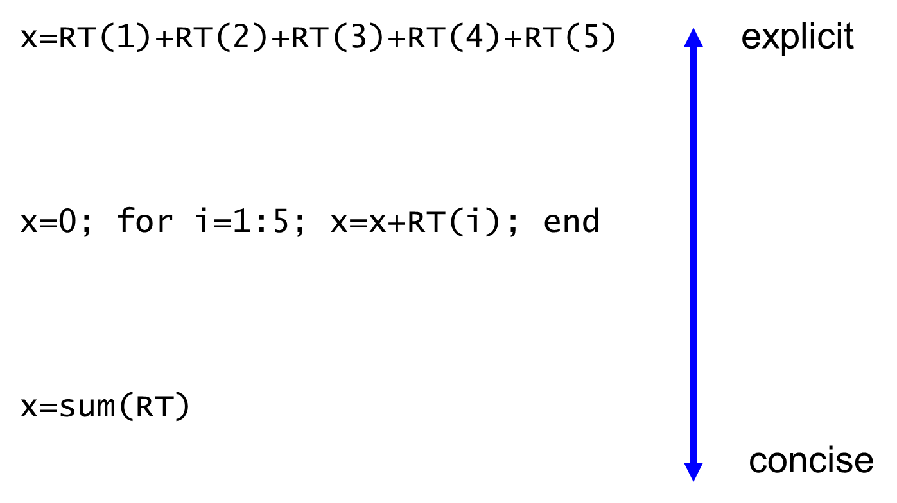

\</exercise\>

As a programmer, you have a lot of freedom. There are **many ways** to write the same thing.

-   Clearly, if the number of RTs is variable, the explicit options are not viable.
-   But equally, unless the reader already knows the type and shape of RT, and that the function sum adds numbers up, by default on dimension 1, the concise options might be more opaque. (There are a lot of functions whose meaning isn’t as obvious!)
-   It’s also not clear the options will do the same thing, for example when there are **NaN**s.
-   In some situations, the middle option has the advantage that when an error occurs, you can see which item was at fault – and if the data is not what you expected, you can step through the computation.

Often you can spot hidden structure in the algorithm. For example, you might have two long scripts, one for each experiment, which share a couple of lines at the start. They might both begin with “load the datasets, and then loop over each one”. How could the common elements be made clearer?

**function** result = analyse_expt1

all = **load**(‘expt1_data’)

num_datasets = **length**(all.datasets)

results = {}

**for** i=1:num_datasets

% lots of experiment-specific code

**if** successful

results{i} = (...)

**end**

**end**

**def** analyse_expt1():

all = **load**('expt1_data')

num_datasets = **len**(all.datasets)

results = [**None**]\*num_datasets

**for** i **in** **range**(num_datasets):

\# lots of experiment-specific code

**if** successful:

results[i] = ( ... )

Notice that the experiment-specific code has a specific job: it takes in a dataset, and results generates a result. At this level of description, it is the same job for both experiments. So, as an exercise, let’s try abstracting out the code common to both experiments:

**function** analyse_expt(expt_num)

all = **load**( [ 'expt' **str2num**(expt_num) '_data'] )

num_datasets = **length**(all.datasets)

analysis_functions = {

@analyse_dataset_exp1

@analyse_dataset_exp2

}

**for** i=1:num_datasets

results(i) = analysis_functions{expt_num}( all.datasets(i) )

**end**

**def** analyse_expt(expt_num):

all = **load**( 'expt' + expt_num + '_data' )

analysis_functions = [

analyse_dataset_exp1,

analyse_dataset_exp2

]

results = [ analysis_functions[expt_num]( dataset )

**for** dataset **in** all.datasets ]

Here the “lots of experiment specific code” lines, which operate on a single dataset, are extracted into their own function.

This is an example where the effort of abstraction doesn’t really pay off! Also note that in the original, if one dataset needs to be skipped, the result is left blank. In the refactored code, the analysis must always return a result even if there is a problem, for example None, or an empty structure with the same fields as a ‘real’ result.

In general, you will always strike a trade-off between explicit and concise code. You cannot spell everything out, even in the comments, but don’t forget that short function names can mislead, and terse expressions can be misinterpreted.

One role of abstraction is to try to make parts of your code **less dependent** on other parts of your code.

-   Rely less on variables assigned previously, for example instead of using a size variable, directly check the size of your data length, .shape, dim.
-   Write ‘local code’ – code that accesses only a small portion of your data
-   Arrange for your code to be **agnostic** to which subject or session the data came from.

**Dependency inversion**: Typically, high-level code relies on low-level code that **implements** or “fleshes out” the abstract idea. For example, you might have a function to train a neural network, that **import**s low-level functions like convolutions, loss functions, gradient estimation etc. However, a better design may be to make the low-level functions depend on the abstractions (Martin 2000): define how you want to use them, to create an **interface**, and import that interface when writing the low-level functions.

### Pseudocode: transcending language

Another role of abstraction is to write things using new **elementary operations**. If you described to a colleague what your code does, what kind of language would you use? What words would form the building blocks that describe your algorithm? Those words are the elementary operations.

Try starting with a natural language description of your solution. If the terms you used are not existing variables or functions in your programming language, then you probably need to define a set of intermediate-level functions. Your top-level code will then read like natural language. Your intermediate functions could form the basis for an **API** or a domain-specific language.

**Pseudocode** is a language used to describe an algorithm before you implement it. It has no rules, no syntax, and no vocabulary. In pseudocode, you just describe the steps as clearly as you can, in an unambiguous way. Pseudocode is usually based on a computer language that the writer and reader are both familiar with. But it might incorporate elements of English where needed. Here is an example:

**function** analyse_Expt {

( **integer**: experiment_number )

**array**: datasets = **call** load_data **with string** (

"expt" + experiment_number + "_data"

)

**for** **integer** i **from** 1 **to** **length** **of** datasets {

**call** analysis_function **with** **input** dataset

(**returns** **structure**: result)

all_results[ i ] = result

}

}

This code resembles lots of computer languages, but complies with none. By departing from the rigid rules of actual languages, observe that the meaning is clearer, and more is explicit.

Importantly, pseudocode tells you what kinds of building blocks you need. Clearly, here you need to be able to store a single dataset in a variable. Furthermore, you need a structure that holds the results of one dataset. **Natural language**, too, can give you clues about the elementary operations you need. Take this example:

“I took the average of each subject’s squared error, and compared groups using a t-test”

Here, we have an instruction for taking the average, an instruction for calculating the squared error, an instruction for doing a t-test. Those are the names of your new elementary operations, and in the next chapter we will see how to baptise them using functions.

## 6.2. Spotting conceptual errors

Glancing at code often reveals there’s an underlying problem. This is sometimes called a “**code smell**” (Fowler 1999). You can tell there is a conceptual error by the way things are written. Here we will look at some signatures of bad code.

### Your code contains “clear”

If you use clear or clear all, del or %reset, rm(list=ls()), this is a sure sign that you are doing something wrong.

Clearing variables is not necessary. In fact, **good code never clears variables**. Why? Because good code never pollutes the workspace. And good code never assumes what variables already exist. After reading Chapter 7, you will know how to achieve this, using **scope**: the scope of a variable is the region of code where that name can be used.

In some languages, like Java, scope is strictly enforced. All variables only exist within the block where they are created, and so there are no global variables. In practice, this means that variables disappear as soon as they become irrelevant.

When you write a single-use script, you might think that it would be nice to clear all the variables first. But:

-   What if someone had important data held in a variable?
-   What if someone wants to keep hold of something while running the script, for example the result of a previous run of the script? Or if they want to compare results from several datasets?
-   What if your script needs to be called as part of a larger, automated sequence of scripts? Or needs to be run several times, each time with a couple of different parameters?

How can you avoid clearing variables?

Use functions (Covered extensively in the next chapter \<link\>). Variables created in functions are automatically deleted when the function finishes. This removes the need to clear, because:

-   Internal variables are discarded after use. Users of a function do not want to know about the variable i that was used in an internal for loop. This minimises the amount of information that ends up in the workspace.
-   Users of a function can choose their own variable names for the outputs. Imagine you write a function that takes two sets of numbers, does some preprocessing, and calculates a t-statistic. In your code, you might call the result something generic like t_stat:  
    function t_stat = process(X,Y)  
     ...  
    The user who calls this function probably knows more information about where the data comes from, and so might want to call it something more specific, like group_mean_t:  
    group_mean_t = process( grp_mean{1}, grp_mean{2} )  
    The user could also call the function more than once, and store the results in an array:  
    all_t_stats(i) = process(x_means{i}, y_means{i})  
    This automatic translation between “internal” (**local**) names and “external” names grants the function sovereignty over its internal affairs.
-   Intermediate results are efficiently discarded, which saves memory. Occasionally intermediate results are useful – you can make an option to return those from the function. You might need to view intermediate results when debugging. For this, use the debug stack (\<see “Debugging with a stack”\>).

### You use global variables

Similar to the problem with clear, it is rarely necessary to use global variables – variables that are created at the top level of your script, and are used within functions without being sent as a parameter. If you find you are using global variables, you may not have organised the variables well. Consider

-   Using a structure to group variables that are needed together e.g.   
    time.start, time.end  
    time['start'], time['end']  
    time\$start, time\$end  
    the start and end times are then combined into one variable, time.
-   Checking whether each function really needs to know about global details
-   Sending all required values to the function explicitly as input and output parameters

Why are global variables bad? There are similar concerns as for “clear”. What if, later, the global values need to take different values for different conditions within your data? What if your script becomes part of a larger collection of scripts, which also need global variables, potentially with similar names?

### You use an “eval” statement (Python/Matlab)

If you have not heard of eval – that’s great! Keep it that way, and skip to the next section. Most programmers will tell you that you should never ever use eval.

-   It is a sign of poor code
-   It is a security risk
-   It can slow down code considerably

Poor coders often use eval when they don’t know the name of something, or the name itself can change. For example if you don’t know the filename, avoid this:

**eval**( [ 'load results_s' **num2str**(sub) ] )

**eval**( “np.load( results_s“ + **str**(sub) )

This is correctly done by passing a string to the load function:

**load**( [ 'results_s' **num2str**(sub) ] )

**load**( **sprintf**( ‘results_s%g’,sub ) )

**np.load**( ‘results_s%s’ % sub )

Or if a variable name is not known:

curr_result = **eval**( [ ‘result_’ sum2str(i) ] )

This is correctly done by replacing numbered variables by an array:

curr_result = result{i}

curr_result = result[i]

Or if the name of a field is specified in a variable:

v = calc_var(i)

**eval**( [ 'results.' var{i} ' = v' ] )

This is correctly done by using dynamic field names, or an associative array:

results.(var{i}) = v

results[var[i]] = v

However there are occasions where eval is permissible. For example:

-   if the user needs to input a formula, for example in a graphical interface. You can execute the formula in eval, to turn the text into a number.
-   very sophisticated programmers may use eval to manipulate the workspace

eval in R is a different beast, and can be useful for delayed evaluation of formulae.

### Your variable names contain numbers

If you use numbers in your variable names, this almost always means that you need some kind of array or list. The only reason for calling variables data1 and data2, is if there is some similarity between them. The similarity might be superficial, but still you probably have some code *somewhere* that can operate on either of these variables. Thus

data_all = {data1, data2}

data_all = [data0, data1]

data_all = **list**( data1,data2 )

allows you to notice similarities and parallels, and thus write re-usable code.

I have never seen an example where numbers in variables is the ‘right thing’ to do. Sometimes it means you are writing code at the ‘wrong level’ of abstraction: for example, if you load data1 and data2 from different files, you should immediately dispatch the data to lower-level functions that are agnostic of the ‘number’.

If the data are really qualitatively different, then consider using something more descriptive than a number.

\<key point\> Numbers in variable names is almost always a sign of bad conceptualisation: use arrays \</key point\>

**Exception**: Zero could be acceptable in a variable name. For example, you might use x0 to denote the initial value of x.

**Exception**: A 2 could be acceptable if you want to read it as “squared”, e.g. chi2stat. Two is sometimes also used for ‘conversion to’, e.g. deg2rad for a conversion of degrees to radians.

Perhaps numbers are acceptable when the number describes the size of something? E.g. you might name a neural network layer as hidden_8x8. But what happens if you later decide to expand this layer? You’d feel obliged to rename the variable everywhere. It would be better to name the variable according to its role, eg hidden_narrow_layer.

\<key point\> Name variables according to their semantic roles. \</key point\>

Consider this similar example of bad variable name choice:

RT = **load**(‘subjectA.mat’)

MeanA = **mean**(RT)

RT = **load**(‘subjectB.mat’)

MeanB = **mean**(RT)

RT = **load**(‘subjectC.mat’)

MeanC = **mean**(RT)

RT = **np**.**load**(‘subjectA.npy’)

MeanA = **np**.**mean**(RT)

RT = **np**.**load**(‘subjectB.npy’)

MeanB = **np**.**mean**(RT)

RT = **np**.**load**(‘subjectC.npy’)

MeanC = **np**.**mean**(RT)

Using letters (meanA, meanB etc.) is also a sign of conceptual error. Clearly an array is needed. I have even once encountered roman numerals session_i, session_ii, session_iii – which unsurprisingly, is also a sign of poor conceptualisation, as well as ruining the visual alignment.

Exercise: Let’s say you had to do some operations with data from both the left and right side. What would you do if there was a lot of code that had to be duplicated like this, for left and right?

( left_angle, left_radius ) = to_polar( left_x, left_y )

(right_angle, right_radius) = to_polar( right_x, right_y)

In some ways, right and left are behaving here like numbers – or at least, like the indices of an array. You may want to iterate or parallelise over them. This would become obvious if you had a long chunk of code operating on the left\_ variables, and another on right\_ variables. You might use an array or list:

LEFT = 1

RIGHT = 2

for s=1:2

[angle(s), radius(s)] = to_polar( x(s), y(s) )

end

Side = enum(‘LEFT’,’RIGHT’)

for s in Side:

angle[s], radius[s] = to_polar(x[s], y[s])

or

angle,radius = zip(\*( to_polar(xi,yi) for (xi,yi) in zip(x,y) ))

This also opens up the option of matrix or n-dimensional arrays for packaging values more neatly.

In general, ‘compound’ variable names (e.g. A_X, A_Y, B_X, B_Y) are a hint that you might benefit from arrays or matrices. On the other hand, if there is not much duplication, the original version might be clearer to read – use your judgement!

### You needed to copy and paste code

Cut and paste is acceptable. Copy is not. If two pieces of code are doing roughly the same thing, they should be written once, and called up when needed. You might want a for loop, a vectorised array operation (see Vectorisation), or to wrap the code in a function (see Functions).

\<key point\>“Every time code is repeated, there is a fairy somewhere that falls down dead", *attr.* Peter Pan.\</key point\>

The ban on copying applies even to the smallest sections of code. Are short phrases of a couple of terms repeated? Again you are probably missing the structural parallel. If you write

x = x + vx\*dt

y = y + vy\*dt

then the slight copy-like nature of these lines should put you on edge. Should you treat [x,y] as a vector, or a complex number? Or consider these two layers of a neural network:

self.fc1 = nn.Linear(in_features=12\*4\*4, out_features=120)

self.fc2 = nn.Linear(in_features=120, out_features=60)

Again this should make you feel uneasy. Should you keep the sizes in an array, [12\*4\*4, 120, 60 ], and create the layers in a loop? And replace the numbered fields fc1, fc2 with an array fc[i]? Probably not, but this is how you should be thinking.

\<key point\> Symmetries in your problem should be reflected in symmetries in your code. \<key point\>

\<bigger picture\> Don’t repeat yourself!

A common tenet in software engineering is “don’t repeat yourself” (DRY). Most commonly this applies to lines of code that share the same structure, with a few bits changed. One solution is to replace the differences between the copies with a variable, and run the code with different values of the variable.

DRY can also apply to data, where the same information is duplicated in several records. Examples would be if:

-   Every subject has fields for both date of birth, and age. What if they mismatch?
-   Data channels are always in a fixed order, and you include channel number with each sample. This could double your data size.

DRY even applies to documentation (see 4.1 commenting).

\</bigger picture\>

The main reason for this, is so that your code reflects the concepts of the problem you are solving. But other reasons (covered throughout the book) include the ability to change things just in one place, ability to vectorise, ease of debugging because errors in copies are hard to notice, and to reduce code length and improve legibility.

### Your functions have a lot of parameters

As your code grows, you may find your functions need more and more inputs. Perhaps you need three data arrays, the sampling rate, the number of conditions, plus a threshold parameter, a **flag** indicating whether to perform statistics, a flag whether to plot graphs, and a scaling parameter.

Think carefully whether you need to

-   split the code into smaller functions – e.g. for plotting, for statistics
-   put the data arrays and their **metadata** (like sampling rate) together in one structure – the structure can then be passed to the function as a unit. (see avoiding globals, above)

How big should a function be? People say that a function “does one thing”. What it does should be self-explanatory from the name. Chapter 7 will expand on this.

### You don’t cover all the cases

\<exercise\> This code discards data samples before time 50. What are the problems with this code?

discard = 50; **% discard samples before time = 50 seconds**

start_index = find( data.sampleTime == discard ); **% get t=50 index**

y = data.samples( start_index:end );

discard = 50

start_index = np.where( data.sampleTime == discard )

y = data.samples[ start_index: ] **\# slice off the beginning**

discard \<- 50

start_index \<- which( data\$sampleTime == discard )

y \<- data\$samples[ -(1:start_index) ] **\# exclude up to t=50**

\</exercise\>

What if the sample numbers stop before 50? Or if sample time 50 is missing? last_discard will be empty, and the last line will fail.

Similarly if the data lists are empty.

What if there are multiple trials with number 50? Is it clear what will happen?

Also, searching for an index is slow, so consider logical indexing:

y = data.samples( data.sampleTime \>= discard )

y = data.samples[ data.sampleTime \>= discard ]

y\<- data\$samples[ data\$sampleTime \>= discard ]

In this version, we will still have problems in a situation where data.sampleTime and data.samples are the same length. Unfortunately, if there are fewer times than samples, MATLAB and R silently do unexpected things without an error. R duplicates the times to fill the gap, whereas MATLAB uses only the first samples.

\<key point\>

-   Think through every possible situation.
-   Look for conceptual parallels, and minimise duplication.
-   Actively think: Which bits of code need to know about which variables?
-   EVAL is **EVIL**

\</key point\>

\<case study\>

Heathrow Terminal 5

The opening of Heathrow Terminal 5 in 2008 needed one of the world’s largest baggage tracking systems. The software was immensely complicated, and had to handle any combination of possibilities. However, it was not prepared for every scenario \<ref\>.

Some staff couldn’t log into the computer, and had to load some of the bags manually. Check in stands used wireless LAN with poor connections, so some information could not be entered. So, the servers had incomplete information about some of the bags. It seems the software might not have coped with these unexpected situations.

But worse still, there was a filter to block test messages -- used during software testing -- from being actioned. Unfortunately, this also blocked messages from other airlines, and so baggage transfers to British Airways were rejected.

Finally, some of the information from baggage handling was not transferred to the baggage reconciliation system. This meant that the system flagged bags as not being security screened, and the bags missed their connections.

It took months for software engineers to figure out what factors led to each problem, because these kinds of error only arise when dealing with real-life data. Together, these issues overwhelmed airlines, who were unable to accept checked baggage for 3 days. More embarrassingly, 23,000 bags were misplaced and 500 flights being cancelled. Together this may have cost £16m, not to mention the humiliation!

\<ref\>https://www.computerweekly.com/news/2240086013/British-Airways-reveals-what-went-wrong-with-Terminal-5\</ref\>

## 6.3. Externalisation

Is anything in your code not really code – is it a parameter, or even data?

### Numeric constants

Some numbers that you use frequently might not change during the course of an analysis. For example, the resolution of a camera or screen, the number of subjects in an experiment, or your significance threshold (like α = 0.05). These are **constants**, and are often typed directly into the code.

Have you typed a number more than once in your code? This usually means you should be using a variable instead of the raw number. Numbers typed directly in your code are called **literals**, and by definition remain constant. However:

-   They might not remain constant in every situation
-   If they need changing, they might need changing in more than one place. This is time-consuming and error prone – it’s easy to miss one instance.
-   Usually the number has a meaning. Writing a literal instead of a variable obscures the meaning. But note that this makes the maths more explicit, so the reader doesn’t need to look up the value.

Consequently, you may want to externalise the constants. In the first instance, use a descriptive variable instead, and move the variable’s definition up to the start of your function or block (but not outside the function). The variable could even be given as an argument to your function (see section 7).

\<exercise\>

A student has put the width in pixels, 600, all over the place in his code.

…

x[0] = 600/2

…

if x[0] \< 600 \| x[1] \> 600

You tell him to replace it with a constant variable. When you came back the next day, you see:

global SIX_HUNDRED

SIX_HUNDRED = 600

…

x[0] = SIX_HUNDRED/2

…

What might you say to help the student?

\</exercise\>

Consider how you will store your constants. How will you name them? Will you keep them all in a separate structure, or together with the data? This depends on how you will pass them to functions, and whether you might need to change them.

Although we often store a constant in a variable, scientific languages don’t support declaring variables to be fixed as constants. You can always change a variable’s value. Only **literals** are constant.

\<exercise\> Spot what’s wrong with this code:

**% for each subject**

**for** i=1:10

x = readData(i)

**% calculate subject mean**

meanSubj(i,:) = **mean**(x)

**end**

**% calculate standard error**

stdError = **std**(meanSubj)/**sqrt**(10)

**\# for each subject**

**for** i **in** **range**(10):

x = readData(i)

**\# calculate subject mean**

meanSubj[:,i] = x.**mean**(**axis**=-1)

**\# calculate standard error**

stdError = **np.std**(meanSubj)/**sqrt**(10)

\</exercise\>

The number 10 has been used twice. It should be replaced by a “constant variable” defined or calculated at the top of the code. Also you will notice it is good practice to initialise meanSubj, even if only because in a script, you don’t want it to overwrite another array, and also you would like to be warned if mean(x) produces a different size than expected on the first iteration.

### String constants

Strings in quotes are called string literals, and are also constants. They include file names, keys for matching to data (See enumerations ch5.5), or even output messages. Think about whether these strings should be kept separately from the code, e.g. at the top of the code in an array.

\<bigger picture\> Professional coders internationalise their software by externalising all text that the end-user will see. The strings are stored in a separate file – for example as a **map** (dictionary) of key-value pairs. When you want to show a message to the user, you specify the key, which is then looked up in the file.

print(MESSAGES.WELCOME) MESSAGES={

WELCOME: “Bienvenido”

... }

This file can be replaced for different countries’ languages.

\</bigger picture\>

For keywords, a straightforward solution is to define an **enumeration**. One option is to define these strings in a separate, shared file, sometimes called a **header file** or an **include**. This keeps them easily visible, easily changeable, and in a place where they can be shared with other programs. Often, headers become part of the contract you make with people who use your code: they can include them in their code too, and use constants you define.

**Filing system paths** should in general be avoided in your code:

load(‘C:\\Users\\manohar\\Documents\\Matlab\\Experiment1\\data.mat’) % BAD

np.load(‘\~/experiment1/data.npy’) \# bad

Relative paths (i.e. paths starting with the current directory, eg './data') are not as bad as absolute paths, so are acceptable if your code relies on a complex directory tree.

As an absolute minimum, the path strings should be specified in the first couple of lines of code. Better practice is to take paths:

-   as arguments to your function. The paths are then explicitly provided by the user of the code.
-   from command-line arguments if appropriate (Python sys.argv[])
-   from an external configuration file – i.e. treat paths as data.

I personally avoid asking the user for information at the console (input(), input(), readline()), because it prevents automation.

**Internationalisation** (sometimes abbreviated to i18n) includes methods of extracting strings from code, and placing them in an external text file. This means that if you want the code to run in another language, rather than changing each string in the code, you just link to a different text file.

### Replacing multiple ifs

Externalising options as strings can lead to serial if statements. Imagine that some of your data (e.g. probabilities between 0 and 1) need an arcsine transform, whereas other data (e.g. durations, being strictly positive) require log-transformation. Do you ever write code like this:

if strcmp( options.transform, 'arcsine')

y=asin(sqrt(y))

else if strcmp( options.transform, 'log')

y = log(y)

end

If so, there are many ways to make this less cumbersome. You could use “switch” selectors:

switch options.transform

case 'arcsine': asin(sqrt(y))

case 'log': log(y)

end

y = {

'arcsine': np.asin(np.sqrt(y))

'log': np.log(y)

}[ options.transform ]

switch( options.transform, "arcsine"=asin(sqrt(y)), "log"=log(y) )

Here, the python code actually computes both transforms. The R version does not because parameters are passed as a **promise**, and evaluated when needed. A better Python version uses lambda functions:

y = {

'arcsine': lambda x: np.asin(sqrt(x)),

'log': np.log

}[ options.transform ] (y)

Here, the elements of a dictionary, e.g. {…}['log'], are actually functions, and they can be called with parentheses e.g. {…}['log'](y), to apply the transform.

Object-oriented programming offers two other options. Using **function overriding,** different classes of object each have a function with the same name, like transform(), but the code executed is different for objects of each class. Alternatively, **function overloading** allows the same function name to call different code, depending on the type of data provided.

### Benefits of externalisation

-   **Legibility** – what does that number **mean**? Code becomes self-documenting and **literate**.
-   **Modifiability** – change once, affects all places; no need to find all the places where the value is used.
-   **Easier customisability** – tuneable parameters are kept in a separate region of the code, which is easy to find
-   **Saved with data** – keeping constants as variables means they can be saved along with the data (for parameters of an experiment) or with the analysis results (for parameters of an analysis). This means the data is more understandable and self-documenting. It also improves accountability / auditability because saved data and results keep track of the parameters that generated them.

## 6.4. Spotting algorithmic similarity

Spotting where lines of code have parallels is an acquired skill. You might start by asking some questions to yourself:

Have you used the same pattern of code more than once?

Look for similarities in every computation!

Spot loops early – how big can you make them?

\<example\> Here are two ways of writing the same code. Which way is better?

In general the right-hand side is better:

-   More visual
-   Simpler / Shorter
-   Constant used only once
-   Comments map onto the code better

What cases do you need to cover? Unforseen potentialities may help you restructure code neatly.

Can you avoid if / then? If-then inside a for loop can often be replaced by selecting subsets of the data – for example logical indexing, or reshaping data into higher dimensions.

You might also ask, is my data optimally structured for my analysis? Know your alternatives.

Have you copied and pasted any code?

t0 = **length**(trace) / analysisParameters.SAMPLE_RATE

t_p = **sum**(samples\>0) / analysisParameters.SAMPLE_RATE

t_ok = **sum**(\~**isnan**(samples)) / analysisParameters.SAMPLE_RATE

becomes

times = [ **length**(trace) % t0

**sum**(samples\>0) % t_p

**sum**(\~**isnan**(samples)) % t_ok

] / analysisParameters.SAMPLE_RATE

Proper conceptualisation is sometimes an organic process, and it can take multiple re-arrangements of code over time before it clicks into place.

\<key point\> If you ever have to change something in two places, you should restructure your code.

Whenever code elements are repeated, ask whether you can condense them into one element.

\</key point\>

### Design patterns

Design patterns are standard ways of coding up a common abstract task. Patterns are often specific to a language, and depend on whether your language is object-oriented, event-driven, multi-threaded etc.(Fowler & Beck 1999; Wilson 2007; Bladenhorst 2017; Gamma et al. 1994)

Patterns are useful because they:

-   involve using a clear protocol, with conventional ways to name variables and functions
-   are extensively-tested, with well-known conditions for when they might fail
-   involve quite general principles – so you can adapt them to specific cases
-   are instantly recognisable by your readers, making it easier to understand your code’s logic.

For example, perhaps you need inform the user how much of a calculation is complete. Some common patterns for this might be

-   have messages printed to the screen every iteration
-   call a **hook** function on every iteration, provided by the user
-   the user provides you with a file handle, to which you write an output
-   the user provides you with a **handle** or pointer to a value, which you change on every iteration. The user can then **poll** (check in parallel / in the background) this value, periodically.

These different patterns each have advantages and disadvantages. There are coding patterns for quite concrete things like reading large files, running stochastic simulations, applying functions over all elements of an array in parallel, or just persisting (saving) data to disk. There are also patterns for very abstract things, like how an analysis subfunction should know about the current context in which it is called, how to check for unexpected problems at runtime, and how to allow for radical future changes.

You probably have some of your own patterns for common situations: do you have a standard way of passing data through a series of preprocessing functions? Or a standard way of splitting up experimental runs according to the condition?

As you can see, design patterns are something in between conventions, protocols, algorithms and small snippets of code! You can find many ideas online about good patterns for your language and for your specific problem. Knowing lots of patterns give you a set of tools you can call upon.

## Chapter Summary

Structuring your code optimally can take considerable thought. But when the structure is right, everything will click into place, and you will see the algorithm visually pop out from your code. When the structure is wrong, you may find yourself using numbers in variable names, clearing variables, or copying and pasting code. Think about what is similar between two regions of code. Abstraction is one way to achieve elegant code, but do not sacrifice explicitness. Good abstraction, externalisation, and tapping into algorithmic similarity are all crucial for the topic of the next chapter: turning scripts into functions.

Discussion Questions: Some people distinguish writing scripts (single-use, unstructured code that runs from top to bottom) and writing code. They suggest that organising a script needs lower standards than code. What would you say to them? Is data preprocessing a scripting job or coding?

Further reading: Martin 2000; Henney 2010

# Chapter 7: Functions

Functions are a way of dividing up your code. But they are immeasurably more than that.

Once you have fully assimilated the concept of functions, you will want to re-write all your scripts. This chapter will discuss what makes a function pure, what happens inside the computer when a function is called, and how you can banish a range of problems by using functions. This chapter helps

-   Understand functions as contracts
-   Visualise what happens to variables when a function is called
-   Motivate you to move code into functions, for your common tasks

\<bigger picture\> You may hear many terms with approximately similar meanings, used in different languages: procedures, routines, subroutines, functions, methods, handlers. All these refer to the idea of a self-contained block of code that is agnostic about the context it runs in. They can be **called**, which means it is *as though* that block of code were substituted in, at the call point. You can run the code many times, in different contexts. The details of how they work differ between languages, but this fundamental idea is the same: They encapsulate the idea that the concept behind your code is modular, separable, and factorisable.

\</bigger picture\>

## 7.1. Why bother using functions?

\<exercise\>

Why use functions? When would you use them? Make a list of reasons why they help.

\</exercise\>

Functions can:

-   Facilitate **semantic, self-documenting code**, so that you can replace equations by a descriptive function call, making code far more readable. It is a way of *labelling* a group of lines.
-   **Insulate / isolate code**, so that it is immune to changes elsewhere in the program. Functions inherit no variables except the ones supplied as arguments. The function can choose itself what names to call those variables. There is no possibility of name **collision** with things outside the function – internal function variables are kept separate. Ultimately this makes debugging easier, and errors less likely.
-   **Specify** clearly the inputs, outputs and contract of each chunk of code. You know for certain what depends on what.
-   **Decrease repetition**, and thus **increase code re-use** by allowing the same code to be called multiple times.
-   Let you **make alterations** in a single place, rather than searching for several places where the same algorithm needs to be changed.
-   **Create APIs**, interfaces where other people (or yourself) can call upon your code to do useful things. Often this follows on directly after making your code more general-purpose or abstract.

There are also cognitive factors that make functions easier to understand:

-   Human working memory is our ability to hold small amounts of information online while we are using it. **Working memory is severely limited**. When you write a function, your working memory keeps track of what input is coming in, the step you are on, and what you need to do next. Remarkably, our working memory capacity is only about 4 items. So, when you have to keep track of more than 4 items, you will need to look back at the code.
-   If you are looking at short functions, only a small number of variables will be visible at a time. This makes it much easier to understand the code in front of you. However, it may make it **harder to find** the right bit of code, because you might have to look through many different functions.

### When to functionise?

Functionising code involves breaking up a long, linear script into smaller chunks. It can be time-consuming and can introduce new errors in your code.

\<Exercise\> In what situations would you do this?

-   when code forms a “**meaningful unit of computation**” – that is, it serves a single purpose, or performs a unitary task
-   when code is **self-contained** – i.e. when it does not depend on many other aspects of your code
-   when a region of codes has **defined inputs and outputs** – so you can specify what the code needs to know, and what it actually creates
-   when code has **internal temporary variables**, that are not needed by other parts of the code
-   when you feel an urge to ‘**copy-paste**’ coming on
-   when you are **sharing** code – so that when people need bits of your code, they don’t need to cut it up. Instead, your functions will be self-contained, with defined inputs and outputs, and will therefore be easy to incorporate.
-   when you **work in a team** of people using similar techniques – for the same reasons as above.

In these situations, the solution is often **refactoring** (see 7.8) existing code to form functions. Breaking code down into self-contained functions will **reduce crosstalk** between pieces of code. This makes your logic clearer, and errors much easier to spot. It allows unit-testing of smaller chunks of code.

Some people advise splitting up a function as soon as you can’t see the whole function’s code on a single screen. Others advise that a function should have just one responsibility \<Martin 2000\>.

**Swiss-army functions**: A common problem in science is that people write a function, then add more options to it, until it can do lots of different things. The function tries to be a jack-of-all-functions – a Swiss-army function. One symptom of this is when you need to provide a lot of options as parameters to the function, to achieve what you need. Often, the optional jobs could be moved into separate functions, that the user can call if needed.

### When not to functionise?

Beware that breaking code down into too many functions can

-   make it hard to find code
-   make a simple algorithm look nonlinear and complex
-   increase human memory load, because you have to remember what each function does
-   misrepresent what code does, by simplifying the function name to something imprecise – which can lead to errors through misuse of the function
-   lead to ‘**over-abstraction**’ where a single “swiss-army knife” function has dozens of options, but no longer performs a single task. A telltale sign of incorrect abstraction is if you have multiple flags or switches as inputs to the function.
-   lead to ‘**under-abstraction**’ by creating many variants of a function, each with a slightly different name, that undertake subtly different tasks

## 7.2. The Doctrine of Referential Transparency

Referential transparency is an ideal standard that all pure functions should adhere to. There are two parts:

1.  Calling a function should **never change anything** apart from the output
2.  A function should produce **identical results** whenever it is called with the same parameters, unless documented

In other words: No side effects -- pure functions don’t change anything outside themselves; and the output only depends on their input. (Reade 1989).

Pure functions are a bit like mathematical functions: they are nothing but a **mapping** between inputs and outputs. The function definition just specifies the mapping.

Typical examples of pure functions are sin(⋅) (a unary function), plus(⋅,⋅) a binary function, and vector functions like sum().

\<key point\>Pure mathematical functions are the paragons all good functions aspire to be. \</key point\>

\<bigger picture\>

Referential transparency and opacity are borrowed from the philosophy of quantified modal logic (Quine 1953). We can use names in two ways: we can use them in a way that depends *only* on what the name refers to, and not on how we name it; or alternatively, we can use names in a way that depends on *how* the thing is named. Factual statements are generally transparent contexts, for example “The Morning Star is the evening star” is true if and only if “Venus is the evening star” is also true. However, statements about beliefs are often opaque contexts, for example “John believes that the Morning Star is the evening star” might *not* be true even though “John believes that Venus is the evening star” is true. Like the ancient Greeks, John might not know that the morning star is Venus. So, in the transparent context, the term The Morning Star evaluates to something fixed. In the opaque context, the thing it picks out depends on the state of affairs – in this case, it depends on ideas in John’s mind.

In other words, referential transparency means that a term evaluates to the same thing irrespective of the context – and depends only upon how it is called. For computer functions, this means their return value depends only on their inputs.

\</bigger picture\>

### Violation of referential transparency

What counts as changing something outside?

-   Printing something on the screen
-   Saving a file on the disk
-   Sending data to an output port

When might outputs not depend on inputs? Well, it is essential for code that actually does anything:

-   Reading information from the keyboard or mouse (the output depends on the state of the keyboard)
-   Reading data off a channel or queue – it might change the next item in the queue
-   Other typical cases of impure functions include rand(), time(), etc.

Of course, if no functions ever did any of these things, you couldn’t have any input or output! So some functions need to be impure. **Minimise these violations, and move them up to the ‘highest level’ possible**:

-   Try and load data outside functions, and pass them in as parameters
-   Try to separate any functions that deal with user input
-   Instead of printing information to the screen, can you return it as a parameter, and let the user print it if needed?

When you do have violations, make sure to **document** exactly what things will get changed. There should never be ‘side-effects’: unexpected effects from calling a function.

If you can write most of your code as pure functions, i.e. in a functional style, it is likely to be more reliable, usable, and re-usable. It also allows easier unit testing, and permits efficiency tricks like memoising. One common violation is borrowing variables from outside your function, without taking it as a formal input parameter – this may be through extended **scope**, closures, or **globals**.

### Never change directory in a function

Why not? You will lose track of what the current directory is. Many types of code make assumptions about which directory you are in, e.g. code that loads or saves data files, or code that calls on other functions. It is disorientating to change directory when a function is called (unless your function is called “change_directory”).

What if you restore the working directory? Consider the following:

**function** calc_session_mean(sess)

original_directory = **pwd**();

**cd**(‘data_folder’)

**load**([ ‘data_file_’ sess ])

**cd**(original_directory)

What happens if there is an error in the load command? The user will be dumped into a directory they didn’t start in. Running the script again may not work, and the user (who is not expecting a directory change) might accidentally save or delete the wrong files. The solution here is to build a path using parameters:

**function** m = calc_session_mean(sess, directory)

**load**( **fullfile**( directory, [‘data_file_’, sess] ) )

...

**def** calc_session_mean(sess, directory):

**np.load**(**os.path.join**(directory, sess))

...

calc_session_mean \<- **function**(sess, directory) {

**read.csv**( **file.path**(directory, **paste0**(‘data_file’, sess)) )

...

}

The solution is not to change directory. Also,

-   no absolute paths
-   avoid relative paths too, unless specified as an input parameter (i.e. do not assume which directory you will be in)
-   try and make the script ‘agnostic’ as to the folder structure – unless it is a well known standard directory structure

Avoiding absolute paths can be tricky. Just avoid putting them in your code - you should never need them. Instead, obtain the path as input to your code.

***

If you are analysing a data file, make your code into a function that takes the filename as a parameter: analyseData(filename). This forces the person running your code to specify the file when the code is run: analyseData( '/var/Data/file') . Alternatively in Python, read the data path as a command line argument with sys.argv.

***

\<bigger picture\>

Did you know? In older computers, machine code could be compiled in an “absolute” or a “relative” way. Every number stored in a computer’s memory has a unique address – specified as a number. Machine code instructions are themselves numbers stored in memory, and a computer program occupies a sequence of neighbouring addresses. As the computer runs that code, it reads the instructions one at a time, located at the instruction pointer – which increments when each instruction is executed.

Calling a function involves jumping from one location to another location. If jumps are coded as an absolute address, then the code is not **relocatable**. That is, when you load the code into memory, it always needs to be loaded at the same memory address. Multi-tasking operating systems have solved this problem in several ways: static linking, segments or address prefixes, paging, and process-specific virtual address spaces. But the problem still arises in embedded architectures and firmware, where tiny CPUs run very simple code. One obvious solution is to use **relative jumps** or branches – where each function is always in the same place relative to the start of your code.

Write your function in a ‘relocatable’ way: avoid operating-system specific calls system(), !, os.system(), subprocess.run(), system(). Avoid specifying paths, and if you do, use only relative directory paths, ideally with file locations as a parameter. Document dependencies i.e. which libraries you use. If you’re not using modules (or classes in Matlab), make function names are sufficiently long that they don’t collide when used in a different environment.

\</bigger picture\>

In MATLAB, it is possible to commit the even more odious crime of changing the search path within your code. Never use addpath within a function. You can break lots of things – including your own code. If you are in real trouble, you could check the path and issue an error if it is incorrect. But remember that the search path is the user’s private business.

### Random numbers

All languages implement a random number generator. This violates referential transparency, since it produces something that doesn’t depend solely on the function’s inputs. All computer-generated random numbers are pseudorandom, where each call to the random function picks a number from a very complicated sequence. This sequence starts off using a “seed” number, and once this is provided, the sequence is **fully deterministic**. If you call your random number generator 100 times, reset the seed, and do it again, you will get identical values.

This can be immensely useful for debugging! If you are running a simulation, you can run your pseudorandom code many times with the same seed, but different parameters. You can specify seeds with rng, random.seed, set.seed.

So why do you always get different results from your pseudorandom code? When you first start up your language, it usually takes a seed number from the nanosecond clock. This of course has infinitesimal odds of giving the same seed twice, so you get completely different sequences.

Note that drawing a number from the random number generator actually violates referential transparency in a more important way: It affects subsequent random numbers. This is because it alters the state of the language’s random number generator, by drawing off one value from its predetermined sequence. For example, consider a stochastic simulation of responses:

rng(0)

**for** i=1:100

x(i) = **randn**

y(i) = simulate_response(x(i))

**end**

**random.seed**(0)

x=**np.zeros**(100)

y=**np.zeros**(100)

**for** i **in** range(100):

x[i] = np.randn() @TODO

y[i] = simulate_response(x[i])

**set.seed**(0)

x\<-**c**()

y\<-**c**()

**for**(i **in** 1:100)){

x[i] \<- **rnorm**(1)

y[i] \<- simulate_response(x[i])

}

It turns out that the values generated for x tacitly depend on what happens inside simulate_response. If the function generates a random number and discards it, we would get different values for x (and thus y), compared to if it doesn’t. This is because generating a random number itself changes the (**global**) state of the random number generator.

Note this problem would be averted with a vectorised approach where all of x is generated first, then y is calculated.

So, it is good practice to document “this function alters the state of the random number generator”.

### Writing a function is signing a contract

When you write a function, you must think like a solicitor. What are the loopholes? Is every condition specified? Is there any line of code that needs something to be in place? Is there any line of code that changes something that the caller of your function might detect? What rights do you have, and what rights do you need? Be explicit about violations of transparency.

-   If you need input files, ensure you specify
    -   what files you need, the names, and where they should be located. Either make the code use only relative paths, or else provide an input parameter about where to find those files, so the caller can relocate things to another directory if needed.
    -   the file format needed
    -   the content of the files – what does it mean, variables, sizes,
    -   size / array dimensions (eg. for image files or data tables)
    -   what units the values in the file should be in
-   If you save or change a file, the same applies: document exactly what you have stored, where, dimensions and units.
-   Specify dependencies on other scripts and libraries (e.g. things that need to be added to the search path)
-   Document any inputs and outputs to other places (files, devices, keyboard, network etc)
-   If you write large files, make this very clear, as you do not want to surprise a user with a small laptop

You have to be your own solicitor.

## 7.3. Namespaces and pollution

\<key point\> Pollution is a global problem, and the solution is local.

Everyone has too many variables, but they are less problematic if we confine them to their local environments.

### The global workspace: Emergency use only!

When you open your IDE, you will start with an empty workspace: no variables. As you run lines of code, load data, do calculations, you will accumulate variables in the workspace. These are kept in memory (**RAM**) belonging to the current interactive session (the “instance” of Matlab/Python/R). Running a new instance gives a fresh workspace.

Variables are stored as pairs: a name, paired with value. The workspace is basically a dictionary (**namespace**) where the interpreter can look up a variable by its name, and read/store the value. The names and values are stored as a **map**.

The problem with this is pollution: when you have lots of names, they may collide. As more things get defined, like variables or functions, how can you tell them all apart? Common problems include

-   Overwriting – assigning a value to a variable unintentionally overwrites another variable. For example if you are writing a loop inside a loop, you need to have a different variable for the loop index. This is not great, because it means a ‘local feature’ of the code (the inner loop) needs to know about a global feature (the outer loop). The parts of the code are interdependent, which is a bad thing.
-   Shadowing – this is when recent, local definitions of functions or variables dominate over globally defined things with the same name. For example inside a function, you might define a variable for the number of participants np, which might shadow your numpy module. You might create variables height, width, length, and find that you can no longer find the length of an array. Another example in Matlab is for i=1:10, which shadows the internal definition of the imaginary unit i. Note that with shadowing, the original definition is not overwritten or destroyed.
-   Finding things gets hard. How do you remember the name of your variable? You might have to look through a large workspace of many names, in order to remember.
-   Dependencies can become unclear – you might use a function, but not know where it originated. Did it come from a package you installed a long time ago? Or was it defined recently?
-   Similarly, it’s hard to know where and when a variable was declared or changed. In the global workspace, almost any segment of code could be responsible. It gets very laborious to track down who modifies or creates what variable. Namespaces give variables a clear “ownership”.

The solution is to have longer and longer names. Namespaces are an organised way of enforcing longer naming systems. They allow

-   Collision avoidance, with a smaller number of variables per namespace
-   Hierarchical organisation, with nested namespaces, so that variables and functions are easier to find when needed
-   Autocompletion, so subvariables in a namespace can be listed

So, in addition to the “global” workspace, all languages provide a facility to have **local namespaces** – which are just additional dictionaries where you can store variables. The advantage is that you might have a variable called x in the global workspace, but another different-valued variable called x in another workspace.

Some systems are not amenable to namespaces, and are deliberately flat. For example, Matlab and shells like Bash use a global search path. This is a global workspace to be searched whenever a command is typed. These flat systems allow quick search across a very large number of functions. In contrast, with hierarchical namespaces, you need to know where to find things. If you don’t know which package provides a critical function, you might be stuck.

For all these reasons, always treat the global workspace as if it doesn’t belong to you. It’s for emergency use only; put as little in it as you can get away with. The global workspace is **for scripting, not for programming**. Its contents are corruptible and prone to interference, like a “working memory”.

### Creating namespaces to avoid pollution

There are four main ways to create new namespaces:

1.  **Structures** are like dictionaries that are themselves stored in a variable in the current workspace. This means you can create a namespace of your own, within a variable in the global namespace (see section 8.4). To access a variable in a structure, you might use structure notation a.b, a['b'], a\$b, instead of just b.
2.  **Functions** force a section of code to run in a new namespace, called a **stack frame** (see next section). From the function’s point of view, this fresh environment is treated as though it were the global workspace. From the global point of view, the function’s namespace does not exist! These local variables are only accessible inside the function.
3.  **Objects** are the most sophisticated way of creating a namespace: both variables and functions are declared within the namespace, so that the data and functions are kept together. In many cases, from the global point of view, the data itself is not visible.   
    Eg: you fit a linear model. The model has a lot of named variables, e.g. the coefficients:  
    data=**table**(x,y)  
    m=**fitlm**(data,‘y\~x’)  
    m.**Coefficients**  
    m = **sklearn.linear_model.LinearRegression**().**fit**(x,y)  
    m.**coef\_**  
    data\<-**data.frame**(“x”=x,”y”=y)  
    m\<-**lm**(y\~x,data)  
    m**\$coefficients**  
    But notice these variable names only exist **inside the object** m.
4.  **Modules** allow functions as well as variables to be wrapped up in a namespace. They work like structures, and mean that functions are less likely to shadow each other. The advantage is that when you call a function, you know where that function came from.
    -   Note: newer versions of Matlab allow packages, which are folders beginning with +. Adding these to the path creates a namespace. Classes can also be used like modules. This allows many functions to have the same name, for example, many toolboxes contain a function plot.m. Ensure that when you add anything to your path, such functions are inside a package or class. Simply adding a directory to the path can wreak havoc by **shadowing**.
    -   Both Matlab and shell scripts use a global search path. One convention to avoid collisions is to **prefix the namespace** to filenames, for example with an underscore. This helps isolate modules when a global namespace is necessary. For example spm_smooth.m is a smooth function particular to the Matlab SPM package, along with dozens of other spm_... functions, which won’t get confused with Matlab’s smooth command in the Curve fitting toolbox. The imaging package FSL adopts a similar strategy with shell commands, beginning fsl_.

Each of these techniques should be used in particular situations.

\<caption\> Fig.7.1: Namespaces can be created in different ways. Many variables can have the same name, but are isolated from each other by being in different contexts. Here there are four variables called x, all co-existing in different places in the code, and different places in the computer’s memory. Structures and objects allow variables to reside inside other variables. Functions allow temporary variables to be created and disposed of efficiently. Modules (in Python) allow external libraries to maintain their own variable and function names, without colliding with global names. \</caption\>

### Caution when loading variables from a file

Avoid loading variables from files directly into the global workspace. Try and load them into a specific local namespace first. E.g

data=load(filename)

load variables into a structure instead

load(filename)

import numpy as np

import modules into their own namespace

import numpy.\*

require(lme4)

use modules or explicit

lme4::lmer()

-   Compilers, **lint** and warnings are your usual bodyguards against silent errors. However, they will be unaware of variables loaded into the workspace from files. This means they may flag up errors like “undefined variable”, and will fail to spot errors where variables are overwritten.

## 7.4. Stack frames

### Stack frames help to isolate tasks

Interference is the enemy of efficiency. Have you ever tried to pat your head and rub your tummy? Did you end up mixing up these two tasks? One way to minimise interference is to delegate. It’s easy to walk and talk because your spinal cord is delegated to handle many aspects of the walking.

Delegating tasks to other people works so well, because other people have a capacity to focus on specific things, without interference from the top-level (bureaucracy), and without interference from the other tasks that are going on in parallel (concurrency). By delegating, individual people constitute little islands of peace, where a self-contained process can progress. Functions are the computer’s way of delegating, and **stack frames** are those islands of peace. One of the most elegant solutions to pollution is to create **local namespaces** whenever a sub-task is needed.

### What are stack frames?

When a function is called, several things happen. The most important thing is the creation of a new stack frame. This is an area of memory reserved for your function, freshly prepared each time your function is called. It contains a namespace for variables. In the simplest case, it starts empty, and is loaded with the input arguments to your function. These variables are named the way your function wants, rather than the way the caller names those variables. The name of any variable defined in your function is **local** to your function.

[footnote – This refers to the binding between the name and the value. A variable’s value, on the other hand, may not be local: it might be returned, or in Python assigned to/from passed objects, or in R assigned to or from passed environments or ‘reference classes’.]

The contents of your stack frame form a temporary workspace – it is volatile, destroyed when your function ends [footnote 1]. So, think of the stack frame as a **scratchpad**, or “working memory”. Anything you need to keep hold of should be returned from the function. Outside of our function, those variable names are not in **scope**: they cannot be accessed [footnote 2].

[footnote 1 - Logically this has to be the case, because a function can be called many times. Imagine, local variables could be accessed outside a function, how would you know which *invocation* of the function would they correspond to? The function might never have been called yet. ]

[footnote 2 – the variable’s content itself might be accessible though, e.g. due to pass-by-reference semantics in Python. ]

Here is a walkthrough of what happens when a function is called. Let us say we call the function sum(). Clearly this function will add up the elements of the input array. We call it from the command line, which means we are in the global workspace.

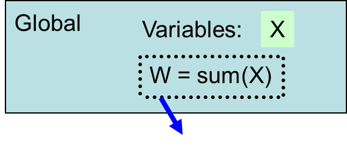

From the global scope, we have an array X in the workspace. We call sum(X), which opens a new stack frame for the function sum, and sends\* the value of X to it. But note: in the new stack frame, the variable will be called whatever the function sum has asked it to be called. In this case, it gets named ARRAY. This variable ARRAY is a **formal argument**: it is a slot that gets occupied with a value sent from the caller. Also note, the variable X is no longer visible! The local stack frame hides the global workspace.

[\*footnote: The name X itself is not directly visible inside the function, but the contents are. In Matlab, the actual array values are sent. In Python, arrays are **passed by reference** (like a pointer to the array) so that changes in the elements are sent back to the caller. In R, a term is sent that evaluates to the numbers in the array.]

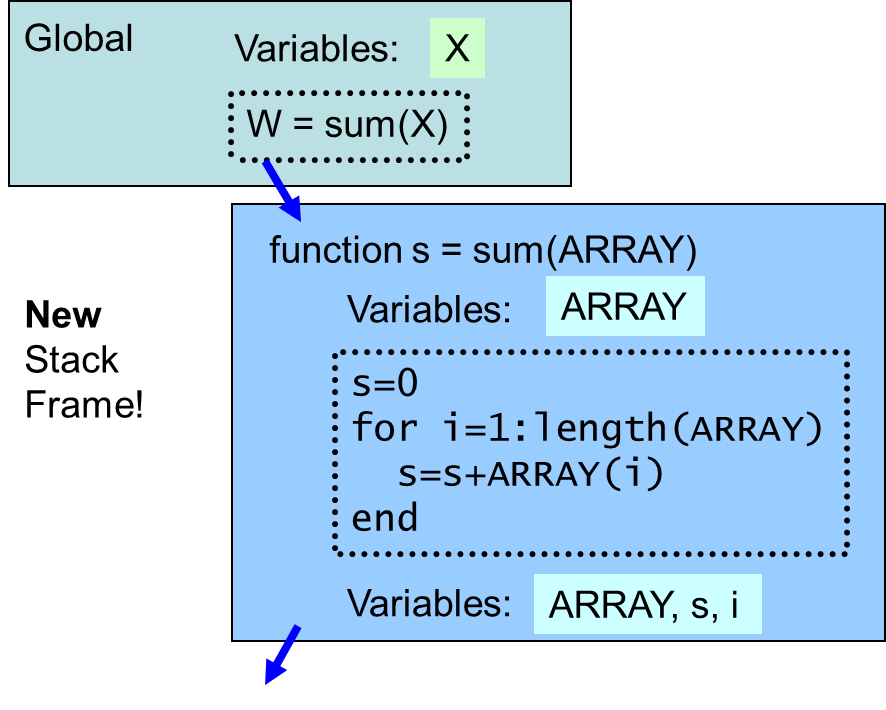

Within the function sum, other variables can be created. Here, s and i are created, to hold the sum so far, and the array iteration counter respectively. The output of the function is s, and the value of s gets sent back to the place where sum() was called.

When the function sum has finished, only s is preserved. The other variables ARRAY and i are destroyed, along with the stack frame. Note that the *name* s is deleted, because stack frames contain the bindings of names and values. But its value is now assigned to W, as per the assignment on the line where the function was called. So result gets named whatever the *caller* wants it to be named. This is bound in the frame of the caller, in this case, the global workspace.

The same holds true if the caller is also a function. This means you can have many frames, creating a chain that specifies who called who. This tree is sometimes termed a ‘call graph’, or a **call stack**. For example, if you call a library routine that calls another library function, which then calls a built-in function, there might be four “layers” of variables, only one of which is active at a time. If an error occurs in that built-in function, the call stack at the moment will contain four frames. These frames get examined, and if no error handler is found, they are reported as a **stack trace** or stack dump.

\<bigger picture\>

The way values are sent to functions differs according to the language. In Matlab and R arrays are **passed by value**, i.e. a copy of the array is taken, so that changes to elements of the passed array are not permanent, and vanish when the new stack frame collapses. Python arrays are **passed by reference**\* i.e. a pointer to the original is sent, so that if your function changes the array contents, those changes will be seen by the caller, even when you don’t return a value. This “side effect” violates the strong form of referential transparency, since you can send information to the caller that isn’t in the return value.

\</bigger picture\>

[\*Footnote – Some Python operations will modify the array, whereas others will lead to a copy being created. E.g, if your function receives a numpy array x, then you do x[0]=x[0]\*2 or x\*=2, this change will be seen by the caller. However x=x\*2 will not, since it creates a copy. ]

### Nested scopes and closures [Advanced Topic]

**Extended scope** arises if you use a variable defined outside your function, without passing it as a parameter. This violates transparency. In fact, simply using a built-in function violates transparency! This happens in R/Python, but not in Matlab:

len=1 \# never do this

**def** test():

**print**(len)

test() \# 1

**del** len

test() \# \<built-in function len\>

sin\<-1 \# never do this

test\<-**function**(){

**print**(sin)

}

test() \# 1

**rm**('sin')

test() \# .Primitive("sin")

pi=3 % avoid this

test = @() pi

test() % 3

**clear** pi

test() % 3

In Matlab, the function remembers the value assigned to pi, in a closure (read on!). Matlab closures takes a copy of the values it needs from the environment it was defined in. The variable will be constant every time the function is called. Python and R closures keep a reference to the **namespace** (i.e. **stack frame**, scope) of the environment they were defined in, so the variable might change.

**Nested scope:** When functions are declared within a scope, for example within another function, they are nested. Variables from the outer scope can be visible inside the nested function. In Matlab, the outer-scope variable is treated as a reference, so if you change it, that change is visible to the outer function (i.e. to the stack frame in which the function was called). Similarly, if the outer function changes the value, the nested function will see the changed value.

**function** f1()

a=0

**function** f2()

a=a+1

**end**

f2()

a % prints 1

**end**

In python, this happens for array elements but not variables\*:

**def** f1():

a=[0]

**def** f2():

**print**(a)

a[0] = 1 \# this changes a

\# a=0

\# assigning will produce an error!

f2() \# prints [0]

**print**(a) \# prints [1]

[\*footnote in 2.7; in 3.0 you can use nonlocal]

f1 \<- **function**(){

a\<-0;

**function**(){ a }

}

**Closures:** Have you ever accidentally used variables that were declared outside your function? It’s an common cause of silent errors. Accessing ‘outer’ variables can occasionally be useful, but it’s often a bad idea. It’s good to know how this works, so you can avoid it.

Variables created inside a function remain tied to that particular time the function was called – i.e. to that particular stack frame. This means that, if you return a function handle from a function, you obtain a **closure**. In a closure, variables from the outer scope get “baked into” the function at the time it is defined. Subsequent changes in this variable are not visible outside this instantiation of the outer function, and so changes made by the nested function are not propagated.

**function** nest = f1()

a=0

nest = @f2

**function** f2()

a=a+1

**end**

**end**

count1 = f1()

count2 = f1()

count1() % 1

count2() % 1

count1() % 2

**def** f1(a):

**def** f2():

**return** a

**return** f2

hold1 = f1(1)

\# f1 returns a function f2

\# that contains a reference to

\# the stack frame with {a:1}.

hold2 = f1(2)

hold1() \# prints 1

hold2() \# prints 2

f1\<- **function**(){

a\<-0;

**function**(){

a\<\<-a+1;

**print**(a)

}

}

u\<-f1()

u() \# prints 1

u() \# prints 2

Note that in R, you can read outer variables directly, but to assign to them, you need the \<\<- operator.

\<key point\>In short: functions returned from functions can contain some data embedded in them (i.e. the value of a in this case). \</key point\>

All this gets even more confusing, as it differs across languages. Although closures are useful in In functional programming, these kinds of construction are often **best avoided** in the interests of clarity, unless they add significantly to the economy of the code. Moreover, you must be very cautious about what gets referenced in the nested function, because those variables remain after functions terminate, on the **heap**, and can thus accumulate and consume memory.

Instead of nesting or closures, consider explicitly passing the required outer variables into the function, at the time the function is called:

**def** counter(state):

state = state + 1

**return** state

state=0

state = counter(state)

Here, persistence is done outside the function, rather than across function calls. Alternatively, consider object-oriented programming, which is another way of associating functions with data:

class Counter():

def \__init__(self):

self.state=0

def count(self):

self.state += 1

return self.state

count1 = Counter()

count1.count()

A common exception where nesting is useful arises if you create a likelihood function which requires parameters and data as input. Then to maximise the likelihood, you must send the optimiser an objective function of *just* the parameters, not the data. How can this be done?

**function** [opt_par, obj_fun] = find_optim(data)

**function** nll = neg_log_like(par, dat)

nll = **sum**( (dat-par).\^2 )

**end**

data = [1,2,3];

**function** o=objective(p)

o=neg_log_like(p,data)

**end**

optimum = **fminsearch**( @objective, 0 )

**end**

obj_fun = @objective

**def find_optim**(data):

**def** neg_log_like(par,dat):

**return** **np.sum**((dat-par)\*\*2)

data = **np.array**([1,2,3])

**def** objective(p):

**return** neg_log_like(p,data)

opt_par = **scipy.optimize.minimize**(objective,**np.array**([0]))

**return** (opt_par, objective)

In this example, the function objective() contains a copy of the data. This was incorporated on the line the function was defined.

If you need to reference information from an ‘outer’ function, make this unambiguous in the comments, and be alert for collisions and variable changes.

Closures let you “absorb” a parameter by creating a new function. You could convert plus(1,2) into add_1_to(2) – a function that adds 1 to its input. Now, a function that could perform this conversion is function_that_creates_a_function_add_x_to(). This **curry function** could be useful, for example, if you need to parameterise a likelihood function, and pass that to an optimiser.

createNLL = @(data) ( @(params) -likelihood(data,params) )

createNLL = **lambda** data: ( **lambda** params: -likelihood(data,params) )

In general, if you find your functions need access to data from the parent environment, closures may not be the best solution. They are hard to read and to debug. Either pass structures as parameters, or switch to an object-oriented design. In objects, functions and their associated data are bound together explicitly.

\<box\>

How can you avoid referring to variables outside your function?

Consider this function that operates on some data, but needs to know a bit more about the data:

SAMPLE_RATE=1000

**function** validate_data(x)

duration = **length**(x)/SAMPLE_RATE

...

This function uses a variable from outside its scope. While this might work, it creates confusion. What would happen if the number of channels was changed? It is not immediately clear. If there are lots of variables, it is cumbersome to pass them all as individual parameters.

Declaring the variables as global would clarify that SAMPLE_RATE inside the function refers to the same variable outside the function

**global** SAMPLE_RATE

SAMPLE_RATE = 1000

**function** validate_data(x)

**global** SAMPLE_RATE

duration = **length**(x)/SAMPLE_RATE

...

However, global variables create a host of other problems: conflicts and collisions, an inability to process two datasets with different sampling rates, and a lack of semantic link between the actual data samples and its corresponding **metadata**, which runs a real risk of using the wrong sample rate.

Instead, you could use a structure for metadata:

info.SAMPLE_RATE = 1000

info.N_CHANNELS = 4

**function** validate_data(x, info)

duration = **length**(x) / info.SAMPLE_RATE

In Python you might consider object-oriented code, where data is packaged with its metadata. Here, the number of channels and sample rate are kept along with the data, in an **object**:

**class** SampledData:

\__init__(self, x, sample_rate, n_channels):

self.x = x

self.sample_rate = sample_rate

\# note I used lower case as they aren’t treated as constants

self.n_channels = n_channels

**def** validate ():

duration = self.x.shape[0] / self.sample_rate

...

recording = SampledData( x, sample_rate =1000, n_channels=4 )

recording.validate()

Notice that the metadata don’t need to be visible outside the object: we have provided a method validate which does all we need.

\</box\>

### Function arguments from lists

How can we transmit many variables from one namespace to another?

A neat trick is to pass items of an array as separate inputs to a function. For example, a function might take two **arguments**, which you have in an array. You can call the function like this:

Inputs = {X,Y}

myFunction(Inputs{:}) % unpack cell to a list

Inputs = [X,Y]

myFunction(\*Inputs) \# unpack array

Inputs = {'X':5, 'Y':6}

myFunction(\*\*Inputs) \# unpack a dict as ‘kwargs’

Inputs = **list**(x=5, y=6)

**do.call**(myFunction, Inputs)

This process is called unpacking an array or list, because it turns myFunction([1,2,3]) into myFunction(1,2,3).

## 7.5. Debugging with a stack

Functions call function, which call functions. When an error occurs, it occurs within a function, which was called within a function, within another function. The positions where each function was called is kept in a special store, known as the function **call stack**. When an error occurs, the functions in the stack is known as the **stack trace**, and is shown in your console after the error. This is a list of function calls, from the innermost function, where the problem was noticed, to the outermost function – that you probably ran to start the calculation. Understanding the trace is crucial to finding the problem.

If you use the debugger, you can navigate up and down the stack frames. To enter the debugger, which is integrated with your IDE, you can either:

-   Create a breakpoint

    Set these in the left margin of the code editor. Or add keyboard, pdb.set_trace(), browser() at the appropriate point in your code.

-   Break on errors

    dbstop if error, pdb.pm(), options(error = recover), options(error = browser)

If you break on an error, you will usually be in the innermost stack frame – in the code that caused the error. If you did not write this code, step up through the stack, until you find your code.

To move up or down through levels of the stack:

dbup % go up one level

dbdown % go down one level

pdb.up() / u

pdb.down() / d

where \# location in stack

recover() \# stop on errors

parent.frame(1) % go up a level

Once you have found the line you wrote that triggered the error, ask what parameters did you use when calling the library function? If you can’t spot the cause, work backwards from the error, to see whether each step’s output was correct. You could set a breakpoint before, and then step through one line of code at a time, examining the local variables at each step.

dbstep

n

n

If you suspect the problem is in the calling function, set a breakpoint in the outer function. You can then step into inner functions:

dbstep in

s

s

**Conditional breakpoints** allow you to stop execution just when certain conditions are met. For example, you might want to stop inside a loop only when subject == 6, or when a statistic is NaN.

### If you can’t use the debugger

Occasionally, there are situations where you can’t easily stop in the debugger. For example, if you have a fullscreen display running, or if you have realtime data acquisition running in parallel. In these situations, you may need to adopt old-fashioned, less sophisticated debugging techniques:

-   Print the values of variables, just before the error line. This allows you to track progress, or view intermediate results. You could even write messages to a log file, with an option to switch this off.
-   Remove lines where the error could be. Temporarily comment them, or replace them with something benign. By trying without each line, you might find the problem.
-   If an error line is long, split it up into smaller commands. Break down each component of a compound statement. Calculate each term in a complex expression on a separate line.
-   Add **assertions** to trap situations likely to cause a problem – for example when a value goes out of range or becomes NaN (see errors)
-   Read error messages very carefully: each character is a clue (see errors)
-   Are you looking at the right version of the file? Often we make copies of a file (which is generally bad practice – see version control). Might you be editing one copy, but running the other copy?
-   Are you looking at the right output? Double check if your plot command or display code reflects the correct variables.
-   Find the smallest dataset that that reproduces the error.
-   Try cutting down the code, removing features, and deleting chunks, until you isolate the error. You are more-or-less guaranteed to find the line that causes the error this way. You can add things back later!
-   Take a break. Think about the problem overnight if necessary.
-   Write a highly simplified version of your code. Rewrite a new function from scratch to replace the erroneous code chunk, but in a very basic, bare-bones form. Try and find the minimal code that will reproduce the error. This also called a Short Self-Contained Correct Example (**SSCCE**).
-   If you are using a library function, google the error, with the library function and library name. You may find that other people have encountered the problem.
-   Ask online. There are excellent forums like StackExchange where programmers help other programmers. Format your question well, include all the relevant information, and be sure to include your SSCCE in the post.

## 7.7. Building an Application Programming Interface

APIs hide things. How can hiding things be good?

The **interface** is the contact point between your code, and the outside world. The interface is what other people need to know about, in order to use your functions. It is the public face of what you write. Traditionally, an interface is a set of function **declarations** or headers. In other words, it comprises

-   The function name, input arguments, and return values
-   A **contract**, e.g. in the documentation or comments: what you can expect it to do.
-   Error conditions – when it will and won’t work

It doesn’t tell you about the implementation – i.e. **how** it will achieve what it sets out to do. The details of what method it uses to achieve the goal, is beside the point for an interface.

The simpler it is, the better.

-   Fewer arguments and return values, with a sensible ordering
-   each function performs one task, not many
-   Matlab – either add prefixes on function names, or put the functions inside a class, to avoid collisions

### Why hide implementation? Isn’t code supposed to be open?

It is not about privacy or security: it is about allowing people to write code at the right level of abstraction. If you are smoothing a time series, you don’t want to think about how the function allocates memory for the intermediate steps. You just care about the behaviour: it needs to smooth your data. So, the function will **expose** parameters that affect its behaviour, but will hide details about memory allocation.

Sometimes the implementation might be changed – e.g. to speed it up, or to fix bugs – without changing the contract.

The API provides a fixed, comprehensive set of rules for how to use the functions, that is guaranteed to work. This interface is sometimes termed a “layer” of abstraction. It is an **opaque** layer in the sense that the person using your functions does not see the details of how you implemented it. This gives you freedom to implement the API how you please: you are free to change anything inside the functions. As long as you abide by the interface’s rules, you can be sure you won’t break anything for people who use your code.

\<key point\> Abstraction layers define information boundaries, which permit **modularity**.\</key point\>

If you are have a set of related functions which you want to share as a unit, that constitutes a **library**. Write your own rules: create an API that stipulates a contract which your library must abide by. Declare functions that can be called, variables that might be used, and define behaviours that your functions should adhere to. For example, figure 7.2 illustrates an API to create and plot some data.

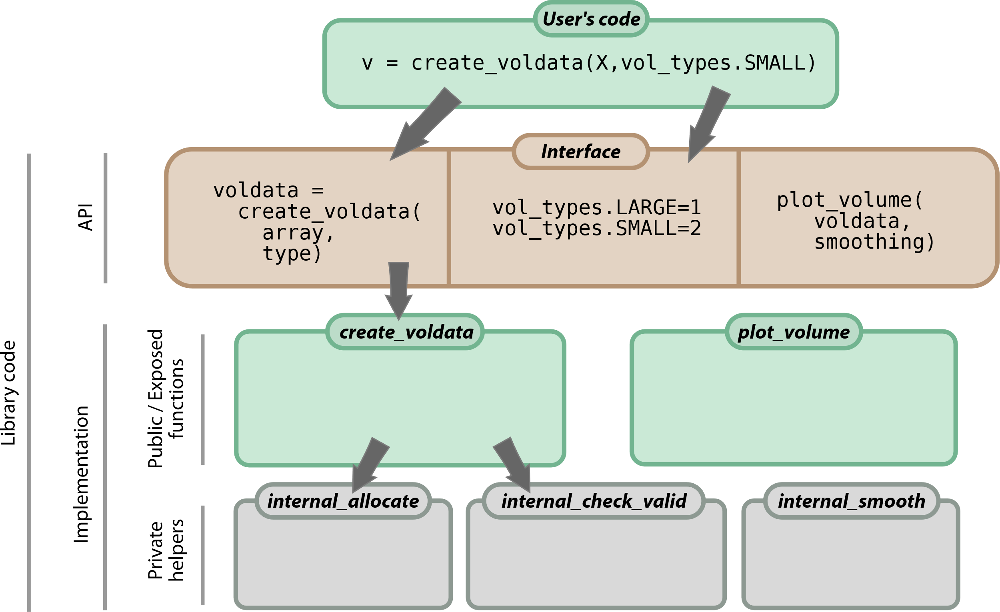

\<caption\> Fig.7.2: An **API** is the interface through which a user (top) can write their own, new, high-level code, by harnessing your existing low-level code. At the top is the code they need to write. What functions can they call? What variables do they have access to? These are specified in the API layer.

In this example, the API declares two functions and two constants. The user calls one of the functions, create_voldata: to use it, they only need to know what is in the interface. Behind the scenes, your library is free to use whatever method it likes to fulfil its contract. Here, the function calls other, internal functions ('helpers', in this example called internal_allocate and internal_check_valid) which are hidden (private) from the user of the API.

The library consists of implementation functions, some of which are “in the API” – i.e. they are documented, and you can use them directly. Other functions are private, called internally by the library. The API layer allows users’ new code to be **linked** to your existing library code.

Sometimes there are internal functions, not designed for people to use directly, that are publicly accessible. For example, com.mathworks.mde.desk.MLDesktop.getInstance, calling \__getattr_\_ or other functions beginning with \__, or accessing private members using :::.

\</caption\>

Similarly, the opaque layer gives the user freedom: they are able to rely on the code behaving in a particular way, even if the implementation changes in the future.

## 7.8. Refactoring

When you write code, you don’t always know which bits will need to be re-used. Also, it’s not always obvious what counts as re-use (see Spotting algorithmic similarity). Once you realise something might need to be re-used, you will need to re-arrange your code – this is called re-factoring. You should feel an urge to refactor when something is used even twice.

\<exercise\> How might you restructure this code?

X = **randn**(10,10);

Y = **randn**(20,10);

X = X - **mean**(X);

Y = Y - **mean**(Y);

X = X / **sum**( X(1,:).\^2 )

Y = Y / **sum**( Y(5,:).\^2 )

Here is one way:

X = **randn**(10,10);

Y = **randn**(20,10);

X = deviance_normalised_by_row(X,1)

Y = deviance_normalised_by_row(Y,5)

**function** deviance_normalised_by_row(X,row)

X = X - **mean**(X);

X = X / **sum**( X(row,:).\^2 )

**def** deviance_normalised_by_row(X, row):

X=X-**mean**(X);

**return** X/**sum**(X[row,:]\*\*2)

If one of the use cases is very frequent, use a default parameter value:

**def** deviance_normalised_by_row(X,row=1):

**if** \~**exist**(‘row’,’var’), row=1; **end**

**Advantages**: readability, “literate” style, less comment required, re-usable normalisation code, normalisation method can be globally turned off or changed in one place.

**Disadvantages**: need to scroll down to the function to read first line; cannot customise X independently from Y; the name could potentially be misleading e.g. if the function is changed; increases interdependencies between areas of your code.

\<exercise\> What are the benefits and disadvantages of the refactoring shown?

BAND = 10:20; % frequency band of interest

**for** i=1:NumSessions

**for** j=1:NumSubjects

data = **load**(filenames{i,j}, ‘DATA’);

data = applyNotchFilter(data);

data = applyLoPass(data);

y_fft = **abs**( fft(data(:,2)) );

m_band(i,j) = **mean**(yfft(BAND)); % mean for the band

**end**

**end**

Refactored version:

data = **cellfun**(@(f) **load**(f,DATA), filenames, ‘uniform’,0);

data = **cellfun**(@(d) applyFilters(d), data, ‘uniform’,0);

y_fft = **cellfun**(@(d) **abs**( **fft**(d(:,2)) ), data, ‘uniform’,0);

m_band = **cellfun**(@(y) **mean**(y(10:20)), y_fft );

**function** data = applyFilters(data)

data = applyNotchFilter(data);

data = applyLoPass(data);

**return**

**Advantages**:

-   parallelisable, so might run many times faster
-   no need for for loops, reads more linearly
-   Less chance of erroneous overwriting (m_band is created only once)
-   Filtering is a commonly re-used unit for pre-processing, so is separated out.

**Disadvantages**:

-   needs to keep all datasets in memory – not suitable for very large data
-   multiple anonymous functions are very hard to read
-   If an error occurs in one dataset, it is hard to find out which one is at fault since there is no (i,j), and you can’t step through. (This problem comes hand-in-hand with parallelisation).

A half-way solution might be to keep the for loops, which can perhaps be parallelised, but refactor the filtering.

\<key point\>

-   Refactoring is not re-writing: you just move code chunks around, so that each section only has access to what it needs to know. This allows it to stand alone, and therefore, be re-used.
-   Science is an iterative process. We don’t know in advance what we will need, and refactoring just has to be accepted.

\</key point\>

Many development environments have tools to refactor code. One important tool is **function extraction**. When you select a section of code, the editor automatically detects which variables are needed as inputs to the code, and what might be used as output. The code segment is automatically removed, placed inside a new function, and the original is replaced with a function call. Furthermore, refactoring tools provide options to rename all the calls to a function in one go.

Some tools include **instant** **renaming**, where if you edit a variable or function’s name, an option pops up to change the name everywhere, automatically. Some IDEs will do this for all uses of the variable, or calls to the function, and can also apply across multiple files.

### Functions and versions

Creating new functions can be used as an alternative to versioning.

\<exercise\> Imagine you have a function that does task X, and you want a version that does task Y which is quite similar. E.g. perhaps your function taskX() operates on one dataset, but your new dataset has a slightly different format. Here are 3 solutions:

1.  Some people might create a new function taskY(), as a copy of file taskX(), and edit it. You have a lot of duplicate code in two different files, but at least the two analyses can be changed independently, and there is no chance of messing up your old analysis.
2.  A neater solution would be to rename taskX() as taskXY_generic(), and edit this file. Do not remove the old functionality, but provide a switch, as a parameter (see below).
3.  Alternatively you might spot the subsections within taskX() that are in common with taskY(). Perhaps the pre-processing or plotting is identical. Extract these components into separate functions, such as taskXY_generic_preprocess(), taskXY_generic_plot(). Now you can rewrite taskX() using those generic sub-functions. That new function, taskX(), now only contains the parts idiosyncratic to taskX(), plus calls to the common functions at appropriate times. Then write taskY() similarly.

What are the advantages and disadvantages of each approach? \</exercise\>

Alternative 3 has a number of advantages:

-   you don’t need to play spot-the-difference between two files;
-   common elements can be changed for both tasks in a yoked fashion;
-   the **factorised representation** of the two tasks allows far greater scope for future re-use.

Option 2 works well in many simple cases, and avoids proliferation of taskX_() function names. But it adds new parameters to your function, so be careful not to break existing code, and avoid modifying the API.

\<Exercise: How might you refactor the following two functions? Imagine that the code here is much longer, but the structure is similar, with the two functions having some matching and some non-matching parts.

**function** stats = time_stats(data)

data = data - **mean**(data,1) % preprocess

data = permute(data,[2,3,4,1]) % reshape

data = **log**(data) **% transform times**

[stats.p, stats.t] = **ttest**(data(:,:,1),data(:,:,2)) % perform stats

stats.minP = min(stats.p)

**function** stats = accuracy_stats(data)

data = data - **mean**(data,1) % preprocess

data = permute(data,[2,3,1]) % reshape

data = **asin**(**sqrt**(data)) **% transform accuracy**

[stats.p, stats.t] = **ttest**(data(:,:,1),data(:,:,2)) % perform stats

stats.minP = min(stats.p)

Solution:

**function** stats = time_stats(data)

data = generic_preprocess(data)

data = **log**(data)

stats = generic_stats(data)

**function** stats = accuracy_stats(data)

data = generic_preprocess(data)

data = **asin**(**sqrt**(data)) **% apply arcsine transform**

stats = generic_stats(data)

**function** data = generic_preprocess(data)

data = data - **mean**(data,1)

data = permute(data,[2,3,4,1])

**function** stats = generic_stats(data)

[stats.p, stats.t] = **ttest**(data(:,:,1),data(:,:,2))

stats.minP = min(stats.p)

This code has the advantage that, if you added new columns to your data, or wanted to use a nonparametric test, you could do it all in one place, by just changing generic_stats. We will see later how passing functions as parameters could make this even more efficient.

You can view this example as introducing an extra layer of **indirection**: You call a function time_stats, but this function might not actually include any code that actually does statistics: the ttest itself is in a different function. The user asks for a statistical test, but your function is just delegates this to a lower-level function. Indirection is a common design pattern to make code more general-purpose without making the functions themselves long and complicated.

\<tip\> Always use some kind of version control, or save a backup copy, when you try to restructure large chunks of code. \</tip\>

### Introducing parameters

\<keywords: parsing options\>

Indirection, as shown in the above example, involves passing new parameters to functions, to specify options. To provide a generic function that does two jobs, you might control flow with if statements so that generic parts of the code interleave with case-specific parts. This allows you to control the conditional execution with **flags**, that can be supplied as parameters For example, taskXY_generic might use the input flag to determine whether or not to run the taskX-specific parts of the code:

**function** stats = generic_stats( data, is_time )

data = data - **mean**(data)

**if** is_time

data = **log**(data)

**else**

data = **asin**(**sqrt**(data))

**end**

stats = **ttest**(data(:,1),data(:,2))

Typically function parameters are **positional**: they must be specified in order, e.g. plot(a,b) always means a is on the x-axis, and b is on the y-axis. But rather than using ordered parameters, many people prefer **named parameters**.

-   They allow the parameter to be omitted and a default value used
-   They improve semantics and readability, producing self-documenting code
-   Naming the parameters reduces the programmer’s memory burden about parameter order – which is often arbitrary (consider Matlab’s cat(DIM,x) vs mean(x,DIM)), and inconsistent across functions (e.g. regress(y,X) vs fitlm(X,y)).

R and Python permit direct named parameters. The Matlab convention for passing named parameters is parameter-value pairs, which need to be parsed e.g. via inputParser. A firther strategy is to pass a whole structure/dictionary of options like {‘param’:value}. You can flip between passing structures/dictionaries and direct named parameters using \*\*kwargs or do.call(). The structure strategy has advantages:

-   you can create the structure separately – e.g. at the top of your code
-   one structure can be used for multiple function calls (though if you are writing multiple similar function calls, you might need to think about using loops or vectorisation, see spotting algorithmic similarity 6.4).
-   you can pass the structure down to other functions. This is useful when re-factoring code into sub-functions.
-   parameters can be easily saved along with the data – after all, they are values, not code.

The main disadvantage is that it is more ‘bulky’: within a function, you don’t need to worry about namespace pollution, but you still have to write longer code to reference the parameters (e.g. params.a instead of a). So it removes some of the convenience that is usually gained by writing inside a function.

Beware that introducing multiple parameters to a function is sometimes a sign you need to break the function down into smaller components.

\<Exercise\> Take a look at this snippet of code taken from commercial scientific software. What are the good and bad features of this coding style?

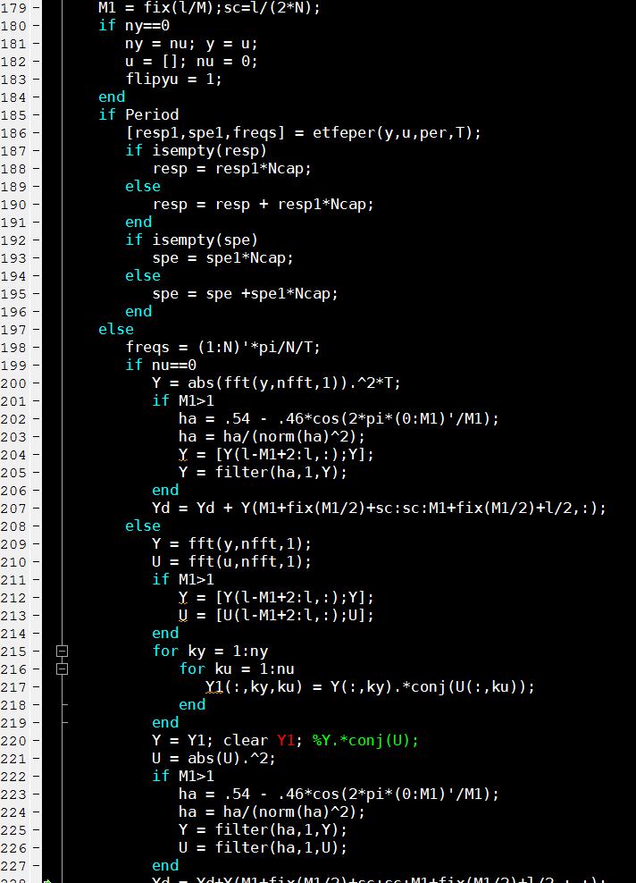

| Pros                                                                                                                    | Cons                                                                                                                |
|-------------------------------------------------------------------------------------------------------------------------|---------------------------------------------------------------------------------------------------------------------|
| Sensible conventions capitalising constants (T, N)                                                                      | Many short variables with long scope (l, y, M1, u)                                                                  |
| Use of options (if Period)                                                                                              | Long code blocks in need of functionising                                                                           |
| Systematic naming of variables (nu, ny, nfft indicating number of elements)                                             | Numbered variables (M1, spe1) suggest array needed, but actually ‘1’ is supposed to convey a different meaning here |
| Good use of space between operators and terms, to keep code readable                                                    | Use of clear indicates the preceding for loop should be in a function                                               |
| Neat indentation                                                                                                        | Commented out statement – purpose unclear                                                                           |
| Short line length                                                                                                       | Nested for loops (ky/ku) can be vectorised                                                                          |
| Alignment of similar code makes errors easy to spot and refactoring easier (e.g. neat parallel assignments of Y and U)  | Seemingly arbitrary weighting factor is hard-coded (0.54 - 0.46\*x).                                                |
|                                                                                                                         | Multiple if statements – can they be simplified, e.g initialising resp = 0 rather than []?                          |
|                                                                                                                         | Literal constant 0.54 is used twice (four times if 0.46 is counted)                                                 |
|                                                                                                                         | Some variables (eg spe1) look like they are only needed for a few lines, and should be scoped as such               |

It is wholly unfair of me to criticise someone else’s code. I will point out that this code was written in 1987 and is still in use today. Therefore it has been extremely well tested and used, and has even been revised a few times. It is speed-critical code, so the ‘inlining’ of functions could be acceptable. In an era before syntax highlighting, bare code with fewer comments was clearer to read. Furthermore the author was clearly an expert in algorithms and may have considered the code self-explanatory.

My comments here are really just to get you thinking about the right coding style for your purposes.

\<key point\> How small to carve up your functions is a matter of taste and context: Know the pros and cons. Some people break everything into 2-line chunks; other people use page-long blocks. \</key point\>

### Returning values

Mathematical functions return a single number. But often, we want to process a whole dataset, and return it when we are done. All languages allow you to package up a large amount of data into a single variable – using arrays, structures, and objects. These techniques also allow you to include **metadata** with your return value.

What if your function doesn’t manage to do its job, say, if the data is bad? Or a file is missing?

Historically, programmers used to return **error codes**. These are arbitrary signals that indicate something went wrong. For example, the result -1 might indicate that required data is not found. Or even worse, a zero when a measurement couldn’t be obtained. Critically, the person using the function needs to be aware of this, and know the error codes. However if the user forgets to check for this error code and deal with it, very nasty bugs can arise. You might just store the -1, and do some maths with it, without knowing.

Modern practice eschews error codes, in favour of

-   **throw** / **catch**, where if the calling code forgets to deal with (catch) the problem, then the end-user will have to, as the error **propagates** to the top of the **stack**
-   packaging results that could have problems into an object or structure. Here, the result is a field of the structure, but this field could be missing and another error code field could be present. This prevents misinterpretation of the error code.
-   **NaN propagation**: By returning **NaN**, you prevent any sums being done on that value. Functions like sum() will just spit out nan, whereas you deliberately want to ignore problems you might use nansum() / na.rm=TRUE.

\<key point\> Don’t return a numeric value if you are indicating a problem that needs to be dealt with. \</key point\>

## 7.9. Ordering code

Your script or function normally runs from top to bottom. Loops and functions break this flow. They allow code to jump around in the file, from an **entry point** (the place where the computer starts to read instructions from) to sub-functions and sub-sub-functions, and back up again to previously executed lines. Functions can be arbitrarily ordered in your file: the computer will find the function definition, wherever it occurred. This gives you freedom to shuffle the ordering.

How should you order functions?

-   Keep related functions near each other. Try and group them by their purpose or theme. Is there a natural hierarchical order?
-   Try to tell a story. Your code is a narrative, and people should be able to read from top to bottom, without having to jump around. If things can’t be understood on the first pass, add comments to explain in advance what functions do.
-   If a function (the caller) calls another (the callee), try and put the callee just after the caller.
-   The main function (entry point) should be either the first or last function in a file \*

\*Footnote: in Python you can define your main function first, as long as you don’t actually call it till the end of the file.

If you do not order your functions well, you may have to scroll up and down and use “find” to locate the function when debugging, updating and improving the code. This is a pain but note that many editors include ‘bookmarks’, so you can jump between recently visited locations in a file.

Just like telling a story, there are different ways to tell it. For example, here are two common strategies:

-   “zoom in”: put the entry point first. This enables a quick overview of the structure of the program. High-level, abstract description of the flow comes first. Then drill down into each of the branches, defining its subcomponents. Finally come the leaves, where the nitty-gritty of the lowest implementation level is done.

make curry:

fry spices

add veg

cook

fry spices:

heat oil

add 4 cardamom

wait until aromatic

add veg:

wash veg

...

cook:

...

wait until aromatic:

aromatic = false

while not aromatic:

stir

aromatic = sniff()

Although Python files are executed from top to bottom, it is straightforward to define the functions in whatever order you like, and call the curry function right at the end.

-   “zoom out”: put the entry point last. Define things in an order where you never have to look ahead to understand things. Start with simple building block functions, then gradually organise them into routines, and at the end put all the largest blocks together.

Both methods have advantages and disadvantages, and there are of course various intermediate options – such as navigating each “branch of the tree” in turn. Choose what makes sense to you.

## Chapter summary

Breaking code into self-contained functions is the key to neat, reusable, readable code. Fewer errors are likely to arise, and those errors will be easier to pin down, when code is broken into **insulated** **chunks**. Aim for short functions that do one job. Functions create stack frames. These are local namespaces, which act like a firewall to keep variables from colliding, and you will never need to clear/del/rm variables again!

Discussion Questions: Some people feel that breaking code into functions makes it disjointed, hard to follow, and hard to debug – especially when you are just trying out different analyses. Is this reasonable? Have you ever written a function within a function, and why? Have you ever needed recursive functions, and why?

Further Reading: Lopes 2000, Henney 2010

# Chapter 8: Data

What counts as data? In general, data is whatever can change, between different runs of your code. Obviously, anything you have recorded for analysis counts as data. But other things might also count as data. For example, if you run an analysis with different thresholds, the threshold might count as data – it is an input to your script, that might be configurable, and should be stored in a variable.

This chapter will guide you in

-   Choosing appropriate data formats
-   Using structures, arrays and objects

Linked to this chapter are two appendices, 11.1 for some technical background about numbers, and 11.2 for details on how arrays are stored internally.

## 8.1. What is data?

Data is “that which is given” – the stuff that is given to your code. It means many things: facts for analysis, the results of observations or measurements, or in our current context, numeric values in digital form.

One definition separates data from **information**: data is not directly connected with an interpretation; whereas information is meaningful data. So, if you package your data together with a script that interprets the data, or with **metadata** describing how to interpret each part of the data, then your package technically contains information. For example, a word processor ‘doc’ file is data, which becomes informative if you have the word processor to open the file. In fact, a piece of software is itself just made of data, but it becomes a computer program when you have the appropriate CPU to interpret it.

In science, we mean something different by data. We mean measurements, observations, numbers that have a scientific meaning. Data represent something we’re studying outside the computer. Data usually means scientific information.

### Importance of data formats

It is sometimes said that 80% of analysis is organising the data (Wickham 2013) and that clever data structures are better than clever code.

Spend time planning the structure of the data – ideally before collecting data. What counts as a repeated measure? Should data from one experiment be split across multiple files? How will I link data from one source to another?

### How to separate code from data?

A central principle of programming is to keep your data clearly separate from your code. However, the line between data and code is blurred. Code itself is a form of data – it’s data that is used by the interpreter or processor. Furthermore, you can store a reference to a function in a variable. Code itself is “parametric”, to the extent that there are different operations you might perform, and with different options and variables as inputs.

Example: Let’s say I compute energy using a formula $$E = \frac{1}{2} m v^{2}$$, from velocity: energy = 0.5 \* 10 \* velocity\^2. Clearly velocity and energy are variables containing data. But is the mass (10) data? Is the coefficient 0.5 data? Or is it code?

Clearly there is a correct ‘level of abstraction’ to separate code from data, and that might depend on several factors.

Separating your data from your code is not always practical when you are rapidly drafting and prototyping scripts. But keep an eye open for what might be allowed to change – e.g. at a later date. Might you need to run the script with a different number of datapoints? Might coefficients like the mass 10 be different?

How separate should the code and data be? This was covered in \<link Externalisation 6.3\>. You could write the equation as energy = 0.5 \* mass \* velocity\^2. Then you have a number of options:

1.  declare variables just above the point they are used. For example, mass = 10 might appear just above the energy line – making it clear that it is potentially variable.
2.  you could move the declaration mass=10 to the top of the function or script. Someone opening the script for the first time knows exactly how to change this value.
3.  mass could be an input parameter to the function, specified in a higher-level function. Anyone who calls your function needs to provide a mass.
4.  Or to maximise separation, the values like mass could be saved in an external parameter file, and loaded before the analysis.

If you use different data transforms, then even a function could count as data: you might send the transform function as a parameter, stored in a variable:

compute_group_pvalue(data,@**log**);

**function** p = compute_group_pvalue(X,transform)

Xt = transform(X);

[\~,p] = **ttest**(Xt(:,1),Xt(:,2))

**def** compute_group_pvalue(X,trans=**lambda** x:x)

Xt = trans(X)

p = **numpy.stat.ttest**(Xt[:,0],Xt[:,1])

**return** p

compute_group_pvalue(data,**math.log**)

See also lambda functions.

### What are numbers?

Everything in a computer is a number. Letters are numbers coded using a **character set**. Integers, floating point values, complex numbers and arrays are all numbers stored in different ways. For science, it can be helpful to understand how each of these is stored inside the computer. In particular, it is valuable to know how **NaN** (not-a-number), infinity, and **integer** values work.

## 8.2. Natural representations of quantities

There are some ‘hard rules’ for how to code numbers, in the most natural way for computers to understand them.

-   **Proportions not percentages**. Using proportions allows you to perform common calculations (like mixing or scaling) by just multiplying by the proportion. Proportions can be calculated as the mean of an array of **boolean** values due to weak typing (they get converted into 0 and 1). You might want to show percentages when plotting, though.
-   **Radians vs. degrees**: Radians allows you very easy rotation of vectors, geometry, and phase calculations. This is because trigonometric functions and exponentials work directly with radians. However, with degrees it’s easier to spot exact right-angles or round angles in a list. Radians = degrees\*pi/180; degrees = 180\*radians/pi.
-   **Log base e**: in programming languages, log means base e, but some fields use other bases like 10 (acoustics and some engineering applications) or 2 (information theory or entropy). log10(x) = log(x)/log(10).

Choose a natural unit for your variables, and stick to it – consider all the places where data arrives: Check – are they in the same units?

\<case study\> Famously, the Mars Climate Orbiter mission launched in 1998 crashed into the Martian atmosphere the following year, because software from Lockheed Martin sent the total impulse data in Imperial units, but they were interpreted as standard metric SI units. The mission may have cost more than \$300 million USD.

 NASA/JPL/Corby Waste - <http://www.vitalstatistics.info/uploads/mars%20climate%20orbiter.jpg> (see also <http://www.jpl.nasa.gov/pictures/solar/mcoartist.html>)

\</case study\>

Check the discretisation of your inputs: are they quantised with a particular granularity? Plot a histogram of values in a small range to check.

## 8.4. Structures, Fields and Reflection

Structures allow lots of different pieces of information to be accessed using a single variable. This is invaluable when you need to send information to other functions. The way to create structures depends on your language. Matlab uses the syntax

loc.x = 1;

loc.y = 2.

In Python you can use dictionaries loc= {‘x’:1}; loc[‘y’]=2, or you could create a class:

**class** Data:

x=1 \# use this method if you know the fields in advance

loc=Data()

loc.y=2 \# use this or Dictionaries if you don’t

loc \<- **list**(x=1)

loc\$y=2

Generally, you can use the fields as if they were variables. Why is this helpful?

-   You can keep **semantically related** variables together as a group
-   The variables do not **pollute** the workspace – so less chance of name collision and accidental overwriting
-   Code involving many variables can be **easier to read**
-   You can **iterate** over fields – i.e. repeat an operation for multiple fields (see next section)
-   Many variables can be **passed as parameters** to a function in a single breath – making a neat way to send options or configuration (but see also unpacking)

In general, structures serve as namespaces that are separated off from the global workspace. One downside to using structures is that IDEs are not yet intelligent enough to automatically highlight structure fields.

### Dictionaries and dynamic fields

How might you perform the same operation over multiple fields? For example

Data.start_times = [ 1, 2, 3 ]

Data.end_times = [ 10, 11, 12 ]

fn = fieldnames(Data)

for i = 1:length(fn)

Data.(fn{i}) = log( Data.(fn{i}) )

end

data = {

‘start_times’: np.array([ 1, 2, 3]),

‘end_times’ : np.array([10,11,12])

}

for fn in data:

data[fn] = log(data[fn])

If you find you are doing this often, it means that you should have used an array instead of different fields. For example, Data.event_times = [ start_times, end_times ]. Then you can operate on all the values with a single log operation.

### Overusing structures

You can build a semantic structure for your data using nested structures. For example:

Experiment(1).Subject(3).PrelimSession.Trial(20).LeftStimulus.Location.x

Experiment(1).Subject(3).LatestSession.Trial(20).RightStimulus.Location.x

Think carefully about whether this is the best way to store your data. Structures tend to occupy more space than plain arrays. Will you need to access information repeatedly from different parts of the structure? Will the code look long-winded?

An attractive alternative to structures here is n-dimensional arrays, plus a key for names, and maybe complex values, like

Location{ experiment }( subject, session, trial, stimulus ) = x + 1j\*y

session_names = {‘Prelim’,’Latest’}

stimulus_names = {‘Left’,’Right’}

Where there are different numbers of elements, you can

-   use cells/lists, or
-   simply pad data with NaNs, or
-   mix-and-match the structure format and n-dimensional array format (see next section).

### Passing by value

In general structures allow you to **send** many variables to a function, in one go. But can you use structures to **receive** information from a function?

In both Matlab and R, structures are ‘**passed by value**’, meaning that if a structure’s elements are changed within a function call, the changes are discarded. If you want the changes to be kept, you need to return the structure as one of the function’s outputs, and the calling code will need to make an assignment:

Y = include_mean(Y)

**function** X = include_mean(X)

X.mean = **mean**(X.data)

include_mean \<- function(X){

X\$mean = **mean**(X\$data)

}

Y = include_mean(Y)

def include_mean(X):

**\# warning! this changes X**

X['mean'] = X.data.**mean**()

include_mean(Y)

In python the changes to structures and arrays are kept, as objects are **passed by reference**. Returning the structure is not needed. But it means that **referential transparency** is not strictly enforced, and functions can have invisible side effects.

People sometimes worry that passing structures by value (as R and Matlab do) creates copies that waste time or memory. This isn’t the case unless you actually change the structure in your function, as they actually “pass-by-promise” – sending a read-only reference, and copying only if necessary.

### Looping over variables

Sometimes you want to do the same thing to several variables. This is one of the commonest causes of code repetition. One solution is to loop over them. Grouping variables in a namespace helps.

For example, to select valid rows from several variables:

data = **struct**(...)

include = data.times\>0 % select valid samples

data.times = data.times(include)

data.values = data.values(include)

data.isValid = data.isValid(include)

fields = fieldnames(data)

data = { ... }

include = data[‘times’]\>0

data[‘times’] = data[‘times’][include]

data[‘values’] = data[‘values’][include]

data[‘isValid’] = data[‘isValid’][include]

data \<- list(times=... )

include \<- data\$times \> 0

data\$times \<- data.times[ include ]

data\$values \<- data.values[ include ]

data\$isValid \<- data.isValid[ include ]1

could become

**for** i = 1:**length**(fields)

data.(fields{i}) = data.(fields{i})(include)

**end**

data = { key:val[include] **for** key,val **in** data.**items**() }

data \<- lapply( data, function(x)x[include] )

But note instead you could (and perhaps should) use a built-in type that allows row-wise operations:

data = **table**(...)

data = data(include)

data = **pandas.DataFrame**(...)

data = data[include]

data \<- data.slice( df, include )

## 8.5. Should I use Long or Short (wide) Form?

Imagine you have data with three factors: You tested 10 subjects, in an experiment with two conditions, and collected response from 20 trials per condition. The data is 10 × 2 × 20, and can be stored in three **dimensions** of an **array**:

response( subject_id, condition, trial_number )

There is one ‘slot’ for each combination of subject, condition and trial. So you have 400 slots arranged in a 3D grid. This is the short, n-dimensional, or “wide” form.

You can ‘flatten’ this grid into a single column to produce a long table with 400 values. The equivalent long form might look like this:

| subject_id | condition | trial_number | Response |
|------------|-----------|--------------|----------|
| 1          | 1         | 1            | 0.273    |
| 1          | 1         | 2            | 0.411    |
| …          | …         | …            | …        |

If the dataset is complete, the number of rows will be the product of the number of subjects, conditions and trials, prod(size(response)). Typically, a missing row in long form corresponds to a NaN or NA in the short form.

Putting data in short form is useful if you want to

-   remove one subject – simply delete the “slice” corresponding to that subject

response( bad_subject, :, : ) = []

response = np.delete( response, bad_subject, axis=0 )

-   calculate a statistic along one dimension – for example, a mean across trials, for each subject and condition:

mean_response = mean( response, 3 )

mean_response = response.mean( axis=2 )

-   and more complex statistics are equally easy:

sd_across_subjects_by_condition = std( mean( response, 3 ) )

The dimensional, short (“wide”) form is useful when there are the same number of observations in each ‘cell’. If you have variable numbers of observations, you may still benefit from the short form, by padding with NaN.

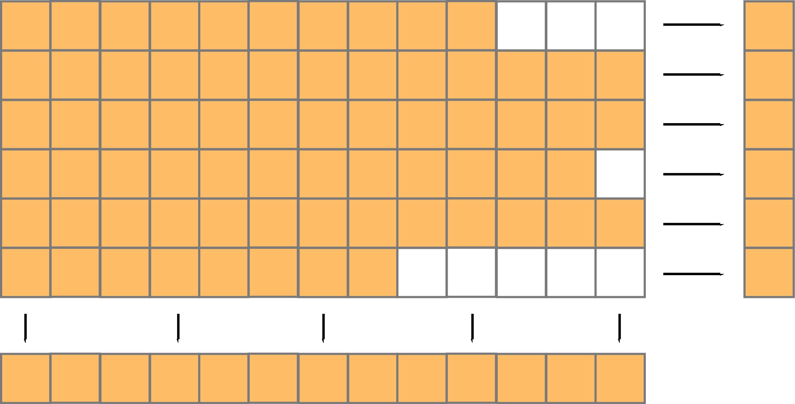

\<caption\> Fig.8.1: Padding with NaN: white cells show that some rows have fewer datapoints. Marginal means on one dimension preserve the different levels on all other dimensions. \</caption\>

\<exercise\> Why do you use long or short form for your own data? What factors influenced your decisions?

| **Long form**                                                                             | **Short form**                                                                                                                       |
|-------------------------------------------------------------------------------------------|--------------------------------------------------------------------------------------------------------------------------------------|
| May use less RAM with highly variable numbers of observations                             | Uses less RAM when same number of observations per cell                                                                              |
| Rows as observations, so no padding needed                                                | Requires NaN-padding when there are different numbers of observations per condition                                                  |
| Requires specific tools to calculate statistics for particular conditions                 | Permits easy statistics along particular dimensions                                                                                  |
| Requires filters to select appropriate rows                                               | Quick to remove one subject                                                                                                          |
| Easy to view as a table, since it is 2D                                                   | Harder to visualise N-dimensions                                                                                                     |
| Hard to see which observations match with each other, as the row order is arbitrary       | Easy to select and view one condition                                                                                                |
| Columns can be named, using tables or dataframes                                          | Requires metadata explaining what each dimension or factor means                                                                     |
| Columns could take categorical values, such as strings, that are semantically transparent | Requires metadata explaining what the levels within each factor mean                                                                 |
| Need to calculate how many levels there are for each dimension                            | Easy to see the structure of the data, e.g. the number of conditions, sessions or subjects – this simply appears in the shape / size |
| Extracting one condition requires checking and selecting matching rows of the table.      | Faster memory access, indexing and better CPU caching, if speed critical                                                             |

### Structuring long-form data

A standardised way to organise and present tabular data is **data frames**. There are many excellent packages for this such as pandas and tidyverse’s tidyr. Whether this suits you depends on your data and libraries.

### Converting to long form

Long form is incredibly useful as it allows almost anything to be put into a 2-dimensional table, like a CSV file. In R, this is the concept behind **tidy data** (Wickham 2013).

An *n*-dimensional array can be converted to a table with *n* index columns, and a column of values.

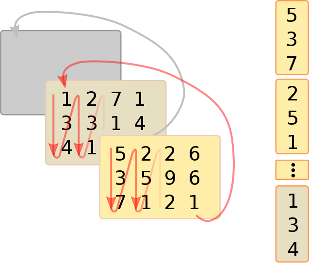

\<caption\> Fig.8.2: If you flatten a 3D array with X(:), or flatten(X), you run through rows, then columns, then slices. In contrast, X.flat or X.ravel() run through slices, then columns, then rows. \</caption\>

This puts all the values in one long, flat list. Length of this list is the product of the original dimensions: numel(X) == prod(size(X)), X.size == np.prod(X.shape), length(X) == prod(dim(X)).

In **column-major** languages, the values column is taken from the array by laying out the columns, one below the other, i.e. to run through dimension 1 first, then through dimension 2. Put another way, the first subscript changes the fastest. In row-major languages, the values are laid out by running through the highest dimension first, e.g. the top-left element in each slice is laid out first. Here, the last subscript changes the fastest.

\<caption\> fig.8.3:

Column-major ordering (left: Matlab, R) vs Row-major (right: C, Pascal, Python) arrays. Numpy can rearrange arrays using column-major indices with reshape(m,n,order=’F’), and in Matlab/R this is achieved by transposing or permuting (permute, aperm).

\</caption\>

Then, you need to create an index column for each dimension, each with the same length. To do this, you will need to repeat an index many times. There are many ways to achieve this. For a 3-dimensional array X,

idx = (1:**size**(X,1))' + 0\*X

Y(:,1) = idx(:) % uses singleton expansion

idx = **repmat**(1:size(X,2), **size**(X,1),1,**size**(X,3))

Y(:,2) = idx(:) % uses repetition and flattening

Y(:,3) = **kron**((1:**size**(X,3))', **ones**(**size**(X,1)\***size**(X,2),1))

Or

idx = {[],[],[]};

[ idx{:} ] = **meshgrid**(

1:size(X,1),

1:size(X,2),

1:size(X,3) )

Y = [ idx{1}(:), idx{2}(:), idx{3}(:), X(:) ]

idx = **np**.**arange**( X.**shape**[0] )[:,**None**,**None**] + 0\*X

Y[:,1] = idx.**ravel**()

...

Or

Y[:,1] = **np.kron**( **np.arange**(X.**shape**[0]), **np.ones**( (**np.array**(X.**shape**[1:]).**prod**()) ) )

...

Or

(Y[:,1], Y[:,2], Y[:,3]) = (\~np.isnan(X)).nonzero()

Note how the Kronecker tensor product kron expands matrices by duplicating copies of the second argument for each element in the first array.

Some existing functions could help you do this automatically, such as pandas.melt(), pandas.wide_to_long(), np.where(\~np.isnan(X)), reshape2‘s melt() and tidyr‘s gather().

### Converting to short form

Collapsing a long table into a n-dimensional array is a bit harder. It is sometimes called ‘pivoting’ the table. You may have seen this in Excel. Pre-built functions exist for this kind of transform, such as unstack, pandas pivot and reshape / dcast. A more sophisticated approach is to use accumarray with a lambda function.

**Dimension ordering**: Dimensions of data are often nested. In the ‘column-major’ convention, it is common to put the ‘smallest unit of data’ in the first dimension, and the ‘largest unit of data’ in the last dimension. For example, if your data X comes from 3 experiments with 4 sessions, and 100 datapoints within each session, your data would be X(100, 4, 3). This is because:

-   when flattening the data, the ordering is more sensible
-   when taking averages, functions like mean(X) operate by default on dimension 1.

Exactly the opposite conventions work well in Python – where the **most-significant bits** are in the first dimension – and here it pays to always specify the dimension a function operates on, e.g. X.mean(axis=-1). Note that in Matlab, the first dimensions are the easiest to visualise when displaying an n-d variable, but in Python, the last dimensions are easiest to see.

**Consolidating data**: Depending on the size of your data, it is often better to consolidate data into a single file where possible. This is usually feasible if the combined data file takes up 1/5 of your RAM or less, and if it takes less than 10 seconds to load.

\<example\> You have 10 files, collected on different days, containing tables with the same columns. What should you do?

Assuming you have 32GB RAM, and the tables are smaller than 500MB each, then consider stitching them together. If you opt for Long form, add a column indicating the date of collection. If you opt for Short form, either add a third dimension, concatenating the tables on dimension 3, and padding with NaN. Or else store the tables themselves in an array.

The advantage is that you can quickly calculate statistics across the datasets, compare data quality, obtain summary statistics as needed, and run exclusion criteria or transforms on the whole dataset in one go.

## 8.6. Text as data

In many situations, you may need to obtain data from a text file. This might occur when data is non-tabular, or non-numeric, or came from an unusual source like a web server or custom device. You need to **parse** the text into meaningful units – often extracting numbers. For example, if a string str contains the two digits “12”, you might parse it into a number:

x = str2num(str)

x=float(str)

x\<-as.numeric(str)

In addition to cutting strings using indices, you may need to trim or strip white space eg. strtrim or str.strip(). You may also need to find instances of a particular word, using strfind, str.find, or grep.

But one of the most useful operations is to search or substitute using **regular expressions**. Rather than searching for a exact sequence of characters, you can search with wildcards. Certain characters in the text you are searching for are treated specially, e.g. ., \*, [], () and \\. While you can buy whole books on regular expressions, knowing a few examples can save hours.

-   'ca.\*n' will match can and caravan, because .\* means “any number of any character”
-   '[0-9]+hz' will match 2hz and 20hz, but not just hz, because [0-9] means any character in the range 0 to 9, and + means “at least one of them”
-   '([0-9])+hz' will match 20hz, but the brackets let you extract just the 20 part as a matching-group.

If possible, find code already designed to read the format. E.g. if you are reading **HTML**, **XML**, or **JSON**, never parse these yourself. These formats are hierarchically structured, and **need recursion**. Avoid using regular expressions here, as they cannot do nested searching. Instead, libraries are available for all languages. For XML/HTML you may also avail of command-line tools like XSLT, which allow extremely powerful searches using a language called XPath.

## 8.7. Object-oriented programming

Object-oriented code hides the data from the programmer. It reveals, instead, a set of functions for operating with the data. A discussion of objects and classes is out of the scope of this book (dedicated books include Phillips 2018 and Gamma 1994), but you should be aware of when they could be useful.

Take the example of fitting a linear model to your data. Traditionally, you would call a function, sending it your data:

P=fitlm(x,y)

P=sklearn.linear_model.LinearRegression().fit(x,y)

P=lm(y\~x,data)

Traditionally, this function would return some numbers, e.g. the parameter estimates. But then, if you then wanted to know the $$r^{2}$$, you would need to call another function. You’d need to run the whole regression again – which would be ridiculously inefficient.

Instead, these functions return an **object** representing the model – a bundle of data, packaged up with selected ways of accessing or using that data. These ways of accessing the data include functions called **methods**, and virtual variables called **properties**. For example, there might be a property called coefficients, another called squaredError, and a method called addRegressor, which might change the model. You can think of the methods or properties as being “inside” the object, though in reality they are just ways of accessing the data that’s inside the object.

P.Coefficients

P.Rsquared

P.coefficients

P.score(x,y)

P.coef\_

summary(P)\$r.squared

How can an object hide data from the programmer? The linear model knows things we don’t. Was a sophisticated algorithm used to fit the model? Did the fitting converge exactly? Did the fitting procedure have to try different methods? While some fitting objects might choose to **expose** this information (e.g. via additional properties), they don’t have to. This information could be **private** – strangely, privacy can help the programmer:

-   it makes it easier to find what you need
-   it means you can write the same code to run many different fitting algorithms
-   you can remain agnostic as to which fitting procedure was used.

For example, we don’t know whether the $$r^{2}$$ has been calculated before it is requested. Moreover, we don’t even know if the model has actually been fitted before accessing the coefficients – the object’s code could choose to defer all calculations until needed. These sorts of decision are delegated.

\<key point\> In general, privacy promotes **abstraction**. The less you worry about the implementation detail, the more you can think at a higher level. \</key point\>

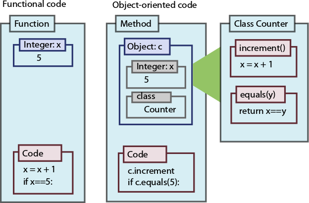

\<caption\> Fig.8.4: An illustration of how standard, non-object-oriented programming styles differ from object-oriented programming (OOP). The two examples both count up to 5. Object-oriented languages hide data (like the value of the variable ‘x’) from any functions that aren’t part of the object. In the object-oriented example, code inside the red code box cannot actually obtain the value of x, as it is wrapped inside c. So, to change and check the value of x, it must call the methods ‘increment’ and ‘equals’. \</caption\>

Objects belong to **classes** – classes are fixed templates for objects of a certain type. They specify what data such objects are allowed to have, and what functions can be called on those objects. For more on OOP read (Phillips 2010).

Advantages:

-   The functions that can work with a particular type of data can be kept together.
-   Appropriate functions can be auto-completed.
-   It makes it less likely that you would use the wrong type of function on your data – for example try '1'+1 in Matlab, which invokes numerical addition on a string type.
-   Why would you want to hide information when programming? It makes errors less likely. For example, consider a counter like the figure. There might be parts of the code that rely on the counter never decreasing. But a careless programmer using the counter might try to do x=x-1. This mistake is simply not possible in the object-oriented framework – OOP allows programmers to **constrain and validate** data types.
-   It helps code re-use, since the same methods can be used for many objects, and can even be harnessed on different types of objects. Sub-classes **inherit** behaviour from parent classes.
-   Since classes form templates, they form a neat, self-documenting **API**.
    -   They help to separate interfaces from implementations – i.e. for keeping the contract distinct from the code that fulfils the contract.
    -   They help to separate code from data – i.e. for clearly defining what is allowed to vary from what must be kept fixed.

Disadvantages

-   Objects sometimes take up more memory space than other kinds of data.
-   The syntax for ‘verb-like’ methods might not read as well: increment(counter) vs counter.increment()
-   Syntax for binary operations is ambiguous: should it be dog.eats(bone), or bone.eaten(dog)? The latter is appropriate when the bone gets altered by the dog, but the former when the dog is altered by the bone!

Object-orientated programming is most useful when manipulating high-level data like dates (months, years), accessing database records, and in user interface design. But it can also be a useful general principle for designing a good **API**: i.e. for preparing your code for third party use.

## 8.8. Graphical output

### Plotting

There are a wealth of ways to learn good data presentation.

-   If you are writing a paper, look at high-end journals in your field. Critically analyse how the figures are put together.
-   Look at the growing online resources on visualisation and presentation. It’s crucial to know the variety of kinds of graphs you can plot. There are even books on it.
-   Find libraries you are comfortable with, like matplotlib, ggplot, and write your own functions. Put as much of the figure in code as possible – like legends and subplots. This makes alignment much easier later.
-   Choose colour schemes appropriate to your data – should it look increasing (cool-to-hot) or diverging (positive vs negative)?

### Binning

A common task is to visualise continuous data – such as time series or many graded measurements. Histograms are a great way to check the distribution of values a variable can take. But often people end up “binning” measurements – for example into ranges with fixed edges. This is usually bad practice because

-   Binning discards information
-   The distribution of bin counts are much more complex than continuous data, and so statistical assumptions are often violated
-   The number of bins, and the bin edges, are usually arbitrary – this can impact robustness of results
-   Taking means of another variable in each bin can result in different numbers of observation per bin, so the means may be unevenly weighted.

Instead consider other options:

-   can you use continuous statistics, such as a linear model, instead?
-   Would a sliding window be better, rather than fixed bins?
-   Consider a true histogram (bins with the same numbers of samples in) rather than evenly spaced edges
-   Examining quantiles, and quantile regression
-   Consider a kernel smoothed density or fitting a curve.

### Image files

When saving graphics, many people save out **bitmaps**, rather than **vectors**. Avoid this as much as possible – converting from vector to bitmap is irreversible and destructive.

For example, many people save figures as png, gif, tif or bmp files. Saving as jpeg is terrible practice, because your graphs get compressed according to a photographic algorithm, and any lines will develop artefacts. Anything that is saved from Photoshop, Paint/Paintbrush, Gimp or photo-editing software gets degraded into a bitmap.

\<caption\> Fig.8.5: Avoid bitmaps – use vector formats wherever possible. Saving figures as png will result in aliasing (second row), and JPEG leads to compression artefacts.

However far better than bitmaps, is to save as a **vector format**. Most programs that produce graphs, draw the graphs using lines (vectors), and can save in a vector format. Bitmaps are made of pixels, and have limited resolution when you zoom in – resulting in ‘aliasing’. Vector formats are made of instructions for drawing lines, and so crisp smooth lines will be seen even after zooming. Examples of vector files are svg, pdf, eps, emf and wmf. SVG, scalable vector graphics, is an open format and conforms to XML (extended markup language) – meaning that your image is stored in a similar form to information on a web page. PDF is an Adobe format based on postscript commands, but may be easiest and is supported by Matlab (e.g. using the print command), matplotlib savefig and R (using the pdf() function).

You can post-process your vector images using any vector drawing program, such as Inkscape, Illustrator. This will allow you to change the colours, line thicknesses, text and fonts, as well as put together panels. Investing some time into learning a vector drawing program, rather than powerpoint, can be very worthwhile.

A quick look at a vector file will give you an insight:

pdf / postscript

q

4 0 0 4.00247219 0 0 cm

0 0 m

2979 0 l

2979 1618 l

0 1618 l

0 0 l

png (decompressed)

00 00 00 8A FF FF 4B 00

00 00 00 00 83 FF FF 22

00 00 00 00 00 75 FF FE

Notice that a pdf / postscript image is actually a series of commands for drawing lines “m” = move, “l” = line, whereas bitmaps indicate the colour level of each pixel.

**When to use bitmaps**? For photographs, scans, and for complex images that have been drawn or retouched in photo-editing software. Some filters like bevels and drop shadows will also need to be saved as bitmaps, because the standard pdf language does not include complex instructions.If you plot millions of points on a graph, a bitmap may be smaller and faster.

**If using a bitmap**: Make sure the scale is correct (e.g. 10 cm), choose a sufficiently high resolution (e.g. 300 dots per inch), and use a “lossless” compression format such as png (but remember, it’s not actually lossless if you are saving a drawing).

Further reading: Wilke, fundamentals of visualisation

## 8.9. Hierarchical data and Recursion [advanced topic]

Many kinds of data are tree-like. You might apply a rule to chunks of data, some of which contain sub-chunks where you need to apply the same rule. Common examples are **XML** or **HTML** which have nested tags, expressions (e.g. in a + 2\*(b+c), the addition rule is applied inside a bracket), and language itself (“the dog chased the cat that chased the mouse”). Other tree-like structures include linked lists, semantic models and certain graphs. The trick is to recognise these data, as they are uncommon but difficult to navigate.

Recursion is useful when your data has a nested or tree-like structure. You might start trying to write nested for loops, but then realise you need an unspecified number of nested for loops, one within another. Here you need recursion.

For example, you might want a function that deals with each condition in an experiment – each condition involving a combination of experimental factors. But, there are a variable number of factors. Let’s say each factor has two levels, and in some datasets you have labels

factors.A = 0 or 1, factors.B = 0 or 1

whereas in another dataset you have

factors.A, factors.B and factors.C, each of which can be 0 or 1

and in general there might be N factors.

Fig.8.5: Factorial designs can be considered as a hierarchical data structure.

How might you loop over all levels of the factors?

**for** levA = [0,1] % for each level of factor A

**for** levB = [0,1] % for each level of factor B

processCondition( levA, levB )

This would work for two factors, but you cannot\* have a variable number of nested for loops. The problem is that, if we have N=5 factors, each with 2 levels, then we need to call processCondition() 25=32 times.

[\* footnote – In any language, I believe?]

One alternative is to use a while loop

current_condition = 0

**while** current_condition \< 2\*\*N:

current_condition = current_condition + 1

levels = [ (current_condition // (2\*\*i)) % 2 **for** i **in** **range**(N) ]

processCondition( levels )

But this is clearly a fudge, and doesn’t convey the structure of the algorithm. Instead, you need **recursive functions**. According to many textbooks, the Fibonacci sequence is a typical situation where you might need recursion, but I personally don’t know anyone who has needed a Fibonacci sequence. Recursive functions call themselves, always with different **arguments**, such that once an argument reaches a threshold value, the function stops calling itself and returns. The arguments determine where in the tree you are currently at.

To write recursively, think how you would get from one branch of the tree, to the next set of branches. In the case of factorial designs, imagine we have a value for factor A and B; how do we progress to the possible levels of factor C? We need to

-   start at a particular factor
-   if all the factors have been determined, operate on the leaf and return
-   otherwise step through the levels of the next factor
-   for each new combination, call the same function again

**function** processFromFactor( current_factor, N, levels )

**if** current_factor == N % are we at a leaf?

processCondition( levels )

**else** % we are at a branch

**for** i = 0:1 % for each level of the factor

% go into that branch by calling myself

processFromFactor( current_factor+1, N, [levels i] )

**end**

**end**

**end**

**def** processFromFactor( current_factor, N, levels ):

**if** current_factor == N: \# are we at a leaf?

processCondition( levels )

**else**: \# we are at a branch

**for** i **in** [0,1]: \# for each level of the factor

processFromFactor( current_factor+1, N, **list**(levels) + [i] )

\# note that “list” duplicates the levels.

processFromFactor(0,5,[])

In general the cases where you need recursion are

-   Traversing a hierarchical tree-like data structure
-   Parsing text with nested structures – like an expression with parentheses, or XML/HTML with start & end tags

Recursion can be used in many other ways too, but in many situations a while loop would suffice. In order to have recursion, your code needs to be ‘re-entrant’.

**Re-entrant code** is a block of code which is happy to be called even from within itself. Once you have called the function, it can be re-entered before you leave the function. For the example above with N==2 factors, a stack frame might look like this:

So what is going on here? Confusingly, your code defines a variable current_factor, and there are simultaneously three different copies of it – all in different stack frames – by the time processCondition is eventually called. Your function has been called three times – and each one is still mid-flow of execution. The first two runs are stuck at line 7, denoted by the first and second outermost boxes. These frames correspond to earlier branches. The third run is stuck at line 3, corresponding to reaching a leaf, where it has established a level for both factors, and calls the processCondition function. There are also three copies of N, though they all contain the same value. There are three list instances: the last one is the final product indicating the path to a leaf, but the earlier copies indicate branches, and are used as templates for creating the other conditions at each branch point.

In general, your code can achieve re-entrancy this if you don’t change or rely on anything outside your stack frame. Recursion requires re-entrant code.

**Stack overflow**: Stacks, which contain stack frames, have a limited capacity. Normally a programming language sets a **recursion limit**, because recursion can occur by accident. and if too many frames are on the stack, you get an error. The error looks very long, because it lists all the function calls in the recursion!

\<exercise\> While loops are used when we don’t know in advance how much data we are going to encounter. It turns out that any while loop can be replaced as a recursive function call. Can you re-write this simple while loop using a recursive function?

x=0

while x\<=5

print(x)

x=x+1

solution:

def printRecurse(x):

print(x)

if x\<5:

printRecurse(x+1)

printRecurse(0)

**Note:** it is bad practice to use recursion when a simple while loop will do!

Truly functional languages (E.g. Haskell, F\#) allow **tail-recursive** functions, where a stack frame can be re-used, avoiding this problem.

## Chapter summary

-   Getting your data in the right form is as important as writing good code.
-   Structured data can increase readability, and make data “self-documenting” – but there is a trade-off.

Discussion Questions: People often advise that curating your data should be the first step in analysis. But often it ends up being the last thing we do, before publication. Why do you think that is? Does curating data for your analysis differ from preparing data for publication?

Further reading

# 9. Efficiency

Efficient code has few lines, and runs faster. Sometimes these two economies trade off against one another, for example if you need to write a fast routine using low-level instructions. Sometimes, they both trade off against readability or reuse, because short fast code often makes more assumptions.

We will cover

-   Approaches to make code run faster and use less memory
-   How to vectorise code, and when to consider parallelisation
-   How humans might interface effectively with code

## 9.1. Making code run faster (and use less memory)

The old advice is, “make it work, make it right, make it fast” – in that order. Don’t optimise too early. Only optimise the parts of your code that are speed critical, so you can prioritise readability for the rest. Often the bottleneck is just one or two lines.

### Run a Profiler

The simplest thing you might do is time your code. you can check the timer before and after your script, or use builtin functions (tic, toc, timeit(), proc.time()). First, you may want to try out several ways of calculating something – for example with different formats of array, or nesting your loops differently. Second, you might want to try timing different chunks of your code, to identify the most costly element.

Profilers are code analysis tools that automatically identify the slowest parts of your code. They show how much time your program spends in each function. You can use them to identify hotspots or bottlenecks where you should focus your efforts in optimising. Matlab has a built in profile tool, Python has the profile module, and Rstudio has the flame graph.

\<case study\>

At the start of a job, a colleague was asked to speed up a section of code, as the operation was taking 9 minutes to run. He spent 2 days rewriting the bit of code he was given. He sped it up by a factor of \>30, by converting python for loops to numpy array operations. The code now ran in 8:59, because the bit he was asked to optimise only took 1 second in the first place. The rest was pre-processing and extracting the data.

\<caption\> Fig.9.1 Example profiler output. Each function call is listed, showing how many times it was called, and the total time spent within that function. Look for functions you wrote (highlighted pink), and the Matlab functions you call (here, the purple line, fminunc). You will see the main function, at the top, population_stats. It calls fit_population_model 1000 times, which takes most of the time. Within this, compute_log_likelihood is called 33,000 times, but itself this only accounts for 20% of the time. The rest is spent in lineSearch – an Matlab internal function, which presumably guesses a better parameter. So in this case, don’t waste time speeding up your likelihood function!

\</caption\>

\<key point\> Sometimes it’s better to have a slower program, if it’s only for single use, than spend time optimising.

Locate the bottleneck in speed before you optimise.

Never sacrifice reliability for efficiency. If you are coding an experiment, save, save, and save the data, as much as speed and space allows.

Avoid sacrificing readability for efficiency. Comment all optimisations carefully.

\</key point\>

\</case study\>

Once you have identified the lines that take the most time, you can think about how to speed them up. Particular operations are disproportionately slow, and rarely you might need to compromise code legibility for speed. One of these techniques might help:

-   Minimise stack allocation (‘**inlining’**): write short functions out in full at the location of the original function call. This disrupts readability, but in some cases can speed up execution. It saves on allocating memory for a new stack frame.
-   Replace high-level data structures with simpler arrays. This can make the data less easy to visualise, but can be quicker to access.
    -   Usually, Matlab plain arrays are faster than cells and tables; numpy.arrays are faster than lists or dataframes. This is because they are **type**-constrained, **memory-mapped** arrays.
    -   Consider replacing strings (e.g. for categories in tables) with numeric categorical variables.
    -   Consider whether you need large numbers of free parameters when fitting models. Searching a space with just a few more free parameters can be disproportionately slower. Can you re-parameterise a model to reduce its complexity? Can you get away with a constrained covariance matrix in your mixed model?
-   Ask someone to re-code the slowest function in C. C gets compiled into static machine code, and can be called on from your script. Sometimes, this can give appreciable speed-ups over interpreted code.

\<exercise\> Which function is likely to be the bottleneck here?

for i = 1:10000

functionA(i)

for j=1:100

functionB(i,j)

for k=1:10

x(i,j,k)=functionC(i,j,k)

end

end

end

Typically, the bottleneck arises in the innermost lines of a set of nested loops. Those lines are executed the largest number of times.

FunctionC is called 107 times – far more than the other functions. Is it allocating any memory inside the function? Is there any input/output, apart from the return values? Does it access the disk, display or other devices? Can it be inlined, or written in C?

-   **Pre-compute** or **memoize** values. You may find that you require the value of a function several times while looping through data, at unpredictable times. It might be slow to calculate that function. For example consider an array X, and you need to calculate specific estimates Y for each value of X. The estimate involves a complicated iterative function:

**for** i=1:**length**(X)

Y(i) = slow_estimate(X(i))

end

**function** y = slow_estimate(x)

delta = **inf**

y = 1 % starting value

**while** delta \> 0.001 **% this may take a while**

est = y + 0.1 \* f(x,y) **% get a step closer**

delta = **abs**(est-y) **% how much did it change?**

y = est

**end**

**end**

-   If X takes discrete values, one solution is to calculate values before you start the loop, and store them in a **lookup** table. It could be a pair of vectors, uniqueX and uniqueY. Then look them up as needed, in your loop. **Precomputing sacrifices memory for speed**.  
    uniqueX = **unique**(X) % possible values of X  
    **for** i=1:**length**(uniqueX)   
     uniqueY(i) = slow_estimate(uniqueX(i)  
    **end**   
    **for** i=1:**length**(X)  
     Y(i) = uniqueY(uniqueX==X(i))  
    **end  
    **or in vectorised form,  
    uniqueY = arrayfun(@slow_estimate, uniqueX)  
    **% order of items in uniqueX corresponding to X:  
    **[indices,\~] = find(uniqueX' == X)   
    Y = uniqueY( indices )
    -   If you don’t know in advance the X-values at which you need to calculate the function, an alternative is to **cache** the results as you compute them. A **hash table** might work well (containers.Map, dict(), list()[[ ]]). Each time before you evaluate the function, check the cache first:  
        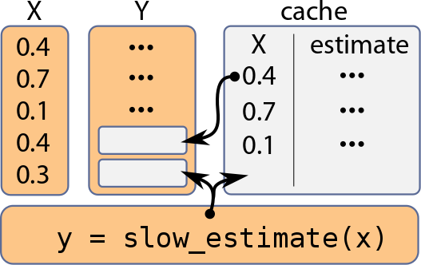  
        \<caption\> fig.9.2: Caching or memoizing return values to speed up a function.\</caption\>  
        **function** [est,cache] = find_estimate(x, cache) **% cache = [x,e]**  
         lookup = **find**( cache(:,1) == x )  
         **if** lookup **% old x-value?**  
         est = cache(lookup,2) **% use memoized value**  
         **else** **% new x value?**  
         est = slow_estimate(x) **% run slow calculation**  
         cache(end+1,:) = [ x, est ] **% cache it**  
         **end**  
        **def** find_estimate(x,cache={}): \# cache = {x:e}  
         **try**:  
         **return** cache[x]  
         **except** **KeyError**:   
         val = slow_estimate(x)  
         cache[x] = val  
         **return** (val,cache)  
        memo \<- **list**()  
        find_estimate \<- **function**(x){  
         key \<- **as.character**(x)  
         val \<- memo[[key]]  
         **if**(!**is.null**(val)){  
         **return**(val)  
        }else{  
         val \<- slow_estimate(x)  
         memo[[key]] \<\<- val   
        }   
        Note that the last R example violates transparency and should be enclosed inside another scope; alternatively pass the cache in and out of the function, as per the Matlab example.
-   Use approximations like **interpolation** or table lookups, rather than precise calculation of a function.
    -   What precision do you need? Very often, you will use a stock / library function to calculate something. These functions are designed to be machine precision – i.e. guaranteed to be correct for double-precision values. As mentioned in \<Link\>8.2 numbers \</link\>, this is rarely needed in science, if you have chosen appropriate units and zero-points. Can you come up with a simpler algorithm to calculate the function? A short **Taylor expansion** might be more than enough.
    -   If your function has a continuous domain, consider precomputing a table of values at key points. Then as you iterate, interpolate between the values in the table (interp1, np.interp, approx).

### Check for duplication

Your code will be more efficient if a set of similar lines is placed in a for loop. See conceptualisation.

### Remove any graphical or text output

You may be sending logging, debugging or progress messages. Consider having a flag to switch them off:

VERBOSE = false;

**if** VERBOSE

fprintf(‘subject %g’,i)

end

if VERBOSE:

print(‘subject %g’ % i)

If a Matlab calculation doesn’t terminate with a semicolon, it will be displayed (which is slow). You can find these by looking for a yellow warning flag in the margin (configure this in the code analyser).

All graphical output is very slow, so do not update graphs during a long loop. Again consider a flag to switch graphics off.

Additionally, printing messages violates referential transparency, and pollutes the console. Think of the console like the global workspace: it can get “polluted”, and might be needed for something else. Consider logging the messages to a file instead.

### Discard intermediates

Sometimes new variables get created that are not directly outputs of a function:

Y = **function** count_states(P, c)

**\# P=probability vector, c=counts**

logp = **log**(P);

plogp = P.\*logp;

Y = **exp**(c’\*plogp);

This code creates two intermediate variables, each as big as P. If P is large, this could be slow, as memory would need to be allocated within the function, and de-allocated at the end of the function. Some intelligent compilers will avoid creating so many intermediates, and transform your code into the following:

Y = **exp**( c’\*P\***log**(P) );

For long computations, omitting the intermediates can make code hard to understand. But it is worth trying to see if it speeds up your code, or equally

Y=**log**(P);

Y=P\*Y;

Y=**exp**(Y);

Makes just one new variable, and reflects what is actually going on inside the computer after optimisation -- but is arguably much harder to understand since there are no semantic labels. It is fine to do this if you comment well, though.

You can also sacrifice legibility for less memory use, if you use the input variable itself as the intermediate variable. In this case, no new variables are created:

**function** X = count_states(X,c)

X = X .\* **log**(X);

X = **exp**(c’\*X);

### Preallocate memory for arrays

Most code is faster if you know in advance how much space you need for an array.

X=**np.array**([])

**for** i **in** **range**(4):

X=**np.insert**(X, i, **np.**log(i+1))

Becomes

X=**np.zeros**(4) **\# preallocate**

**for** i **in** **range**(4):

X[i] = **np.**log(i+1)

X=[];

**for** i=1:4

X(i) = **log**(i);

**end**

becomes

X=**zeros**(4,1)

...

X\<-**c**();

**for**(i **in** 1:4){

X[i]\<-**log**(i)

}

Becomes

x \<- vector('list', 10)

...

### Vectorisation

Each of the above can be written as a vector operation:

X = **log**(1:4)

X = **np**.**log**(**np.arange**(4)+1) \# or **np.log**(**np.c\_**[:4])

X\<-**sapply**(1:4,log)

See Vectorisation next.

### Harness built-ins

There are a lot of things you can write manually, which there’s already code for. Notably:

-   Statistics functions including standard distributions, various types of regression, mixed models.
-   Functions that plot particular kinds of graphs
-   Commonly used domain-specific code, such as signal processing and filtering,
-   Several matrix operations including inversion, covariance and correlation, eigenvectors and eigenvalues (see Vectorisation next)

However, certain common operations often still require manual or custom coding, such as permutation tests, data normalisation, time-series epoching. Although these algorithms are conceptually domain-general, the details of what is needed are often dependent on context and on your data format.

Most floating point functions are actually done on the CPU, so all algorithms should be equally fast (like sin, sqrt etc). However they way they are optimised depends a lot on the context: in some versions of Python numpy.sqrt is far slower than math.sqrt when applied to a scalar whereas numpy.random.normal is far faster than random.gauss. Although they do roughly the same thing, they involve different error checks, type **cast**s and **indirection** (layers of additional function calls). Furthermore, some implementations are hidden but hand-optimised in C or even **assembly language**, whereas others are readable in your language but rely on automatic compilation, which is less efficient.

\<key point\> In speed-critical code, try out alternative syntax or functions. \</key point\>

### Boolean indexing

How might you add up the numbers in a list that are bigger than 2?

To select the numbers matching your condition, you need to perform an operation known as filtering, or masking. You might think of running through your list with a for loop, using an if statement:

total = 0

**for** i=1:**length**(data)

**if** data(i) \> 2

total=total+data(i)

**end**

**end**

To do this quickly, you can use boolean or logical indexing:

data = [2,1,5,4,1,3]

mask = data\>2

\# so mask == [False, False, True, True, False, True]

subset = data(mask)

**sum**(subset)

data = **np.array**([2,1,5,4,1,3])

mask = data\>2

subset = data[mask]

**sum**(subset)

data \<- **c**(2,1,5,4,1,3)

mask \<- data\>2

subset \<- data[mask]

**sum**(subset)

### Parallelise for loops

Modern computers have multiple **cores**. A core is a self-contained processor, with its own arithmetic, registers and thread of execution. Each core can execute different code. Some operations automatically take advantage of multiple processors (see Vectorisation, next).

for loops by default are serial, but can be converted, with a little work, to run in parallel. you will need the appropriate packages: the Parallel Processing toolbox in Matlab which allows replacing for with parfor, the multiprocessing/handythread module in Python, and library(parallel) or rpud in R which parallelise foreach. Depending on the computations, array sizes, language and library, you may need to specifically rewrite your code to take advantage of parallel processing:

parfor i=1:10 % each iteration runs in parallel

**% i must be the first index in arrays**

result(i) = run_long_operation( data(i) )

**% operation must be independent across iterations**

end

pool = multiprocessing.Pool()

results = pool.map( run_long_operation, data_as_list )

registerDoParallel()

result \<- foreach(i=1:10, .combine=cbind) %dopar% {

run_long_operation( data[[ i ]] )

}

Note that copies of data are sent to each processor, so there are language-specific tricks you should look up to make this more efficient.

If there are several nested loops, usually, the best thing to do is to parallelise the outermost loop. This is because there is a large time cost when you start and stop a parallel loop. The CPU has to set up multiple cores with their own allocated memory, start an instance of the interpreter in each core, and deliver those cores with their own copy of your data and code. This can take many seconds, so should not be inside a loop.

\<key point\> Parallel processing can make some programs several times faster, has significant overheads.

Parallel coding is more difficult. You’ll need to identify which calculations can be done independently of each other – i.e. don’t need to occur in sequence.

\</key point\>

If you find yourself needing to parallelise an inner loop, you should probably consider more sophisticated ways to parallelise, such as spmd (single program multiple data) or MPI (message-passing interfaces). These methods allow controlled communication of certain signals between different parallel units.

**Gustafson’s law** states that if a proportion $$p$$ of your program’s run time is parallelisable, then with $$N$$ processors you get a speedup factor of $$1 + p ( N - 1 )$$. In other words, if all your code is parallelisable, your code is N times faster, whereas if none of it is, there is no speedup.

### Harness a GPU (Graphics processing unit)

See Vectorisation below

### Consider sparse arrays

If your data is largely constant values, e.g. mostly zeros with a few numbers, you may benefit from “sparse arrays”. Typically matrices or arrays are stored with one memory slot per array slot. For example, a 10 x 10 array occupies 100 memory slots. However, if you know that most slots will be unoccupied, you can store the array in a much smaller space. Moreover, in some situations you can get away with many fewer maths operations.

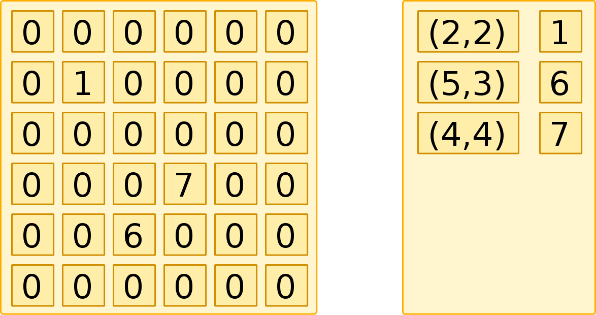

\<caption\> Fig.9.3: How are sparse matrices stored? Left: memory spaces used by a full matrix; Right: the same matrix represented in sparse form; notice it uses fewer memory spaces. \</caption\>

As a rule of thumb, sparse arrays become efficient when \>50% of the elements are “background”.

Typical examples of a sparse matrix include

-   an image stored as an array, where part of the image is a plain background, or transparency.
-   exclusion masks, where you put a ‘1’ just where you want to remove data
-   time series where infrequent events occur (assuming the background reading is truly constant)

Ensuring your data is saved in a **compressed format** can be especially useful in these cases. Do not store full-form of sparsely-populated data in CSV files, or ASCII text. Instead use save, np.save, and save, which will by default compress files appropriately.

### Operate on small data chunks

When you have very large data, you may need to use **out-of-memory data**. This simply means that most of the data is kept on disk, but gets ‘paged’ in and out of RAM as needed.

-   One common strategy is memory-mapped arrays memmap(), np.memmap(), and the package mmap.
-   You could set up a database – an external program that curates data tables. This requires some overheads, but makes it much easier to find data in a large store. Rather than accessing your values simply by row and column indices, databases offer a query interface to filter efficiently by values too. Matlab offers tall() arrays where a table can be backed by a database until needed; or you can manually connect to databases (e.g. sqlite2 and odbc) and extract subsets into memory as needed.
-   Operating systems can also manage paging, using **virtual memory** or “swap files”. In this case, data can be addressed as though it is in RAM, but is actually being stored on disk. The advantage is you can use large arrays straight off; the disadvantage is that you have no control over when things gets written and read from the disk, and this is not always intelligent.

The inverse setup can also be useful: **RAM disks**. In this situation, you save a file to a folder which is not on disk, but instead is in RAM – using a virtual file system. RAM can be accessed many times faster than data on disk. So RAM disks can be useful when you want to use the same code for small data and large data: your code can deal with files, and sometimes those files are on a true disk, and other times they are on a virtual RAM disk.

For huge datasets, you should think about an analysis method that **avoids the problem** altogether.

-   Calculate per-chunk summary statistics, e.g. means and variances for each trial or session? Can you parameterise distributions early on in the analysis pipeline?
-   Can you use subsampling, e.g. pick smaller subsets randomly, then run the analysis many times?
-   Can you apply dimensionality reduction at an early stage? Consider how much true redundancy is in the data. What is the “underlying dimensionality” of the physical or biological process your data is tracking?
-   Could you down-sample your data to a lower sampling rate? Or apply a spectral transform or decomposition that shifts your analysis from the time domain to another domain?

***

### Back to the drawing board

If you are struggling to make code to run in a sensible timeframe, then sometimes you need to take a step back. Are there any mathematical shortcuts? Can you make some assumptions? Perhaps the algorithm is not suited to your problem.

***

Algorithms take longer when they operate on more data. For example, adding two arrays together will take 10 times longer if you make the arrays 10 times bigger. But sorting the array may take over 20 times longer. The scaling law can be represented by **big O notation**: adding arrays is $$O ( n )$$, whereas sorting them is $$O ( n \log {n )}$$. If O is bigger than $$n$$, you may be able to split your data into smaller chunks. But does your algorithm have the right scaling properties, in the first place?

***

-   This is sometimes the hardest part of good coding: to abandon the method you have invested in programming, scrapping your code, and drafting a new approach to a problem.

## 9.2. Vectorisation

In many situations, you will want to perform the same maths on each element in an array, in parallel. Most numerical operations can “distribute” over a matrix. For example, addition, scalar multiplication, and trigonometry will automatically apply to each array element. This is true in Matlab, Python numpy, and in R – but interestingly, not in most other computer languages! In C, C++, Java, Javascript, Basic, and even in plain python, maths does not automatically distribute over arrays.

Vector operations generally run faster than loops.

-   In some cases the calculations can be run on the Graphics Processing Unit, or **GPU**. Many desktop computers have a dedicated graphics card that has its own powerful processor. mainly for running 3D games. Running a 3D game at high resolution may require a million pixels to be calculated every 17 milliseconds. The only way to do this is to be able to add whole arrays together in one step – something that is done by having **millions of parallel arithmetic channels** in the GPU. The GPU is therefore optimised for operating on very large arrays. The GPU might receive a single instruction that operates on millions of numbers at a time. The GPU also has its own memory – usually used for storing textures and image maps. This incredible power can now be harnessed by most modern languages.
-   In some cases, the computer can take advantage of **multiple CPUs** (central processing units) or multi-**core** CPUs for such distributed operations. Modern desktop computers have between 2 and 16 independent ‘cores’. If the operations are independent for each element of the array, then the maths libraries may be able to split large arrays so that each CPU handles a portion of the array.

This is called parallelisation, or **vectorisation**. However it is often not beneficial to do this, because of there are overheads for delegation, like initialisation, and splitting and re-joining the array.

Not all code is amenable to parallelisation. How can you tell if yours is suitable? Useful rules of thumb are:

-   Ask yourself whether you could delegate different parts of your data to different people, who can’t talk to each other, giving them all the same instructions.
-   If the order of the iterations doesn’t matter, then the algorithm is in principle parallelisable, so think about vectorisation.
-   If the individual iterations of the loop are sequentially interdependent on each other, vectorisation may not be possible.

**To use the GPU**, in Matlab create a gpuArray to hold your data, and many built-in functions will run in parallel. Several GPU Python libraries are available (eg numba). Additionally, most neural network implementations (such as TensorFlow, Keras and PyTorch) take advantage of the GPU, since they require mainly parallel additions and multiplications.

Consider using the GPU:

-   If you can represent your algorithm in terms of large multidimensional arrays and tensor products. The GPU is better than the CPU if you are operating on millions of values in parallel – for example, adding images together, linear algebra with large matrices, and optimisation using genetic algorithms, simulated annealing and particle filters.
-   If you can do most work on the GPU, without needing to transfer data back and forth. As with multi-core parallelism (above), there is an overhead to transferring data to and from a GPU. The GPU’s memory is also smaller than your main motherboard RAM.

**Simulations** are ripe for parallel processing. Each random sample can be computed independently of the others, and so can be computed on GPU.

Specific non-parallel computations are specially optimised for parallel processing: matrix multiplication, matrix inversion and singular value decomposition (SVD) are key examples. If you can express your problem in terms of these operations, you will gain a lot of speed.

**To take advantage of multiple CPUs**, there are techniques for parallelising loops. Advanced techniques include manually creating processes, synchronising them, and transferring data between them. See (Czarnul 2018)

### Matrix multiplication

There are many situations where you need to multiply elements by some coefficients, and add them up. These operations can be conveniently summarised as matrix multiplications. The basic concept is that you have some structured data, and you want to combine parts of that data by mixing, weighting the components in some way. Matrix operations are known as **linear algebra**, because you can accomplish any linear transformation using matrices.

\<key point\> Temporal filtering, rotations, linear regression, some dynamical systems and neural network layers can all be written as matrix multiplication. \</key point\>

Useful matrices to know

eye(5) a matrix with ones on the diagonal, and zeros everywhere (identity)

diag(X) turns a vector into the diagonals of a matrix (and the reverse)

toeplitz([1,2,0,0]) a matrix with diagonal and off-diagonal stripes

cov(X) covariance of a (NxP) matrix, giving a PxP matrix

eig(X) the matrix of eigenvectors (principal axes) and the eigenvalues (stretch factors)

svd(X) singular value decomposition, split a matrix into rotate \* scale \* rotate

triu(X) the upper triangle part - set everything else to zero. (cf. tril)

You will find amazing uses for matrices. Knowing some linear algebra will speed up your coding, and allow you to express some clumsy-looking algorithms more succinctly.

Examples:

1.  You have four items. What are the possible pairs of objects? (hint: there are 6 pairs)

[i,j] = **find**( **triu**(1-**eye**(4)) ); [i j]

np.c_[ **np.where**( **np.triu**(1-**np.eye**(4)) ) ]

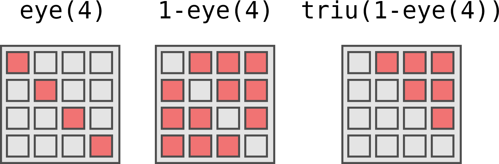  
\<caption\>Fig.9.4: creating useful matrices for common tasks. \</caption\>

2.  You record a time series from 5 sensors, and know the measurement error for each one. You want the mean of the 5 readings, but weighted by their precision.

X = data(time, sensor); P = precision(1,sensor)

Y = data \* P' / sum(P) ;

 \<caption\>Fig.9.5: Almost everything is a matrix multiplication \</caption\>

Can you express your problem in terms of matrix inversion? Matrix pseudoinverses (Moore-Penrose inverse) are computed very efficiently, and can be used to obtain b in a model y \~ Xb + ϵ, from a dataset y, by y\\X (Matlab’s matrix left-divide operator), or np.linalg.pinv(X)\*y.

Linear algebra operations are **highly optimised** in terms of run-time. The BLAS library (basic linear algebra subprograms) is tailored to your hardware. You could check which version of BLAS is being used (eg. with version('-blas'), np.show_config(), sessionInfo()). Having the right version of BLAS can speed up matrix operations 10-fold.

### Boolean masking

Boolean masks are useful when you vectorise a loop that contains an if.

Let’s say we have two data vectors, X( time ) and Y( time ). Let’s say we want the average of the X values just when Y\>0. We can do the following:

mean( X( Y\>0 ) )

np.mean( X[ Y\>0 ] )

But what if X and Y are matrices? Let’s say we have X( time, trial ) and Y( time, trial ). Here, selecting the values as above will not work, as it doesn’t preserve the trial structure. X(Y\>0) will give a single column vector, but really, we want a mean for each column. One solution is to use a for loop over them:

**for** i = 1:**size**(Y,2) **% for each column**

meanX(i) = **mean**( X( Y(:,i)\>0, i ) );

**end**

meanX = [ **np.mean**( X[ Y[:,i]\>0, i ] ) **for** i **in** **range**(Y.**shape**[1]) ]

[**np.mean**(x[y\>0]) **for** (x,y) **in zip**(X.T,Y.T)]

But can we do it without looping? We can use ‘nan’ in conjunction with nanmean: the nan values are ignored when calculating the mean.

maskedX = X;

maskedX(Y\<0) = nan;

nanmean( maskedX )

| Pros                                                                 | Cons                                                         |
|----------------------------------------------------------------------|--------------------------------------------------------------|
| Shorter code for same effect                                         | Requires commenting                                          |
| More “semantic”                                                      | Less explicit                                                |
| Can be reused for multidimensional arrays, without changing the code | Unclear how many dimensions it’s operating on, from the code |
| Can be automatically parallelised – so often faster                  | Not all operations will work with nans                       |

\<tip\> Note that the mean of a Boolean array gives probabilities or proportions. \</tip\>

### Singleton Expansion (‘Broadcasting’)

Python and Matlab support expanding singleton dimensions as required. What is a singleton dimension? Consider the mean of a 3-D array

X = **rand**(5,5,5) X = **np.random.random_sample**(5,5,5)

X = **mean**(X,1) X = X.**mean**(**axis**=1)[:,**None**,:]

The size of X is 1x5x5, where the first dimension is a ‘singleton’. What would happen if we add a column vector to this?

Y = [ 1 ; 2 ; 3 ; 4 ] **% column vector**  Y=c_[:4]

X=X+Y

The size of X is now 4 x 5 x 5. It is as though we had duplicated X 4 times along its first dimension, and duplicated the column vector 25 times, before performing the addition. This can be very useful.

\<caption\>Fig.9.5: Harness the power of collapsing and expanding along dimensions. These three operations use broadcasting or singleton expansion. \</caption\>

Example:

You have a vector of numbers. How many are greater than 10, and how many are greater than 20, 30, 40 etc.? This is the cumulative frequency or density. Here is a naïve way of calculating it:

X = 100 \* **rand**(100,1);

cutoffs = [0,10,20,30,40];

for i=1:**length**(cutoffs); Y(i)=**sum**(X\>cutoffs(i)); end

X = **np.random.uniform**(0,100,(100,1))

cutoffs = **np.array**([0,10,20,30,40])

Y = **np.zeros**(cutoffs.shape)

**for** i **in** **range**(**len**(cutoffs)):

Y[i] = **np.sum**( X\>cutoffs[i] )

or perhaps better

Y = np.array([ np.sum( X\>c ) for c in cutoffs ])

The singleton expansion method is simply:

sum( X \> (0:4)\*10 )

( X \> 10\*np.r_[:5] ).sum( axis=1 )

Versions of Matlab prior to 2016 do not automatically expand singleton dimensions, except for scalars (i.e. normal 0-dimensional numbers). There, expansion needs to be done explicitly using bsxfun:

bsxfun( @gt, X, [10,20,30,40] )

note that the \> operator must be replaced by its function equivalent, in this case, gt (greater than). In R, there is no neat solution, but pracma::bsxfun() or sweep() can be used. Alternatively you can duplicate the rows of the second vector to create a 7x3 matrix, and take advantage of R’s **array recycling**,

| Pros                                 | Cons                                                                       |
|--------------------------------------|----------------------------------------------------------------------------|
| Parallelisable                       | Increased memory cost                                                      |
| Usually faster, but depends on RAM   |                                                                            |
| Simpler to read compared to for loop | Not as explicit Risk of silent bugs when two dimensions have the same size |

\<tip\> Caution – check carefully which dimension is being broadcast. \</tip\>

### Applying functions to arrays: Mappings

Often we define a function that applies to scalar inputs, but we want to apply that function to each element in an array.

cellfun, arrayfun, structfun, map, np.apply_over_axes() (apply functions over n-dimensional arrays) and np.vectorize()which allows multi-argument functions that work on scalars to operate in parallel on arrays, and apply.

If you want to solve an equation that depends on a parameter, and you want to solve it for several values of the parameter. You could write

**function** solution = solver(param)

...

allSolutions = **arrayfun**( @solver, [1,2,3,4] )

**def** solver(param):

...

all_solutions = **map**(solver, **np.c\_**[:4])

or

all_solutions = **np.vectorize**(solver)(**np.c\_**[:4])

solver \<- **function**(param){

...

}

all.solutions \<- **apply**( **matrix**(c(1:4)), 1, solver)

If you want to apply a binary function – a function with two inputs – to a single input array, you might be looking for a **fold** operation, where the function is successively applied to its own result and the next item in the array. For example, sum is the fold of plus.

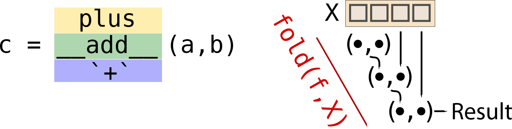

\<caption\> Fig.9.6: Folding lets you apply a function several times, cumulatively. The operation c=f(a,b) can be applied to an array X, by initially applying it to the first two elements of the array, then taking the result, and applying f to this again together with the third element, and so on. \</caption\>

If you want to apply a binary function to two arrays that are incompatible sizes, you might be looking for a **convolution**, where the smaller array is ‘slid over’ the larger one, and the function applied on every possible pair of sub-arrays (convn, np.convolve, and the functional form sweep). Smoothing is a common example.

Although you can sometimes rely on the underlying implementations to optimise these vector operations, you might want to try explicit optimisation with parfor, Multiprocessing.map, parLapply, as well as the GPU options mentioned earlier.

With enough thought, almost every for loop can be eliminated!

But this is often not a good thing, as we have seen. Consider carefully: Will it make the code easier to read and understand? Will it be easier to maintain in the future?

## 9.3. Lambda functions

Consider a situation where you need to limit the range of values in a vector:

X = **min**(200,**max**(800, X ))

Y = **min**(200,**max**(800, Y ))

In this case, we are limiting the values to lie between 200 and 800. If I need to change the criteria, I would need to change the number in two places. This is bad, and here are three solutions you have already seen:

-   Make constants like MIN_VAL=200, MAX_VAL=800, and use those instead. This makes the code longer, and has the disadvantage that people have to look up or down to find the definitions of the constants. The advantages are that you can change them easily, or pass the constants in to the function from outside, save the constants with the data etc.
-   Keeping the X and Y as separate variables is “missing the hidden structure” in your data. If X and Y are the same length, perhaps they should be stored in a single two-column matrix, or as a complex number, so you need just one of the lines of code. Or if they are different lengths, perhaps they should be stored in a cell or list.
-   Create a function to limit the range, like   
    function y= limitRange(x)  
    y=max(200,min(800,x))  
    def limitRange(x):   
     return max(200,min(800,x))  
    limitRange \<- function(x){  
     return max(200,min(800,x))  
    }

Maybe what we want is to create a temporary function. These can be created quickly using this syntax:

limitRange = @(x) min(200,max(800,x));

X = limitRange(X)

Y = limitRange(Y)

limitRange = **lambda** x: min(200,max(800,x))

limitRange \<- **function**(x) max(200,min(800,x))

Now the constants are used once, they can be kept near the relevant code, and you can give the function a meaningful name. The fact that you are doing the operation twice is kept explicit, by requiring two lines.

If you are working in a script in Matlab, creating a function may mean creating a new file. In Python, this is less useful, since you can define functions wherever you like with def. The main benefit of a quick anonymous lambda function is that you can create functions in the middle of an expression – e.g. when calling map. For example to count nans in each of a list of vectors,

**cellfun**(@(x)**sum**(**isnan**(x)), {v1,v2,v3})

**map**(**lambda** x:**np.isnan**(x).**sum**(), [v1,v2,v3])

In R, all functions are anyway created as anonymous objects, which are stored in variables. For quick one-off use, e.g. when using apply to distribute the function over a matrix, you can provide the function anonymously, i.e. without assigning it to a variable first: apply(X,1,function(x) min(200,max(800,x)) )

\<exercise\> What are the disadvantages of lambda functions in Python/Matlab?

They cannot have attached documentation, so the inputs and outputs are often unclear. They can only contain one expression, so they often appear condensed and less legible.

## 9.6. User interfaces

In some situations, it may be useful to create a user interface (UI) to your scripts. This might be:

-   console-based, where you offer options and the user presses a key
-   a graphical user interface (GUI), with on-screen buttons that can be clicked.

Would a UI be useful in science? Perhaps your student or assistant is performing a repetitive task. You might make life easier for them if they could just click a couple of buttons. Or perhaps you want to easily browse through data, without having to manually load and type in commands. In general, a UI can improve automation when human input is required – this might be sanity-checking / eyeballing data, or classifying images, or simply configuring options and setting up a pipeline.

### How to build a UI

Text-based UIs are the easiest. At the simplest level, you might ask the user some questions at the start of your script. Just print text to the screen, and read input from the keyboard. You might

-   confirm some options
-   ask for an input file
-   ask where an output file should be stored;
-   pause for a keypress after a figure is drawn.

Sometimes this is enough to achieve the goal.

To build a graphical interface, you need to use new commands. Unfortunately, each operating system (Windows Mac and Linux) each have very different ways of drawing buttons and icons on the screen. To resolve this, several platform-independent “toolkits” (i.e. APIs that interface with multiple operating systems) have been developed. Each language has its own way of talking to these toolkits. Matlab gives you some interactive figure elements, or you can tap into Java’s javax.swing tools. Python links with tcl/tk via tkinter, Qt via PyQt, or Gtk; R links with all of these with gWidget. A newer way of creating interfaces is through a web server: this approach allows a user to view and interact with your data through a web browser. One advantage of this is that you can work across platforms, locally or remotely, and publish your work in a more accessible format. But note that using your local computer as a server comes with all the attendant security risks.

Dialog boxes are the simplest graphical interface. You could, for example, show a standard file dialog, using just one or two lines of code. More complex tasks can require much more code, and may need an event-driven architecture.

User interface design – and providing the best user experience (UX) – is an enormous topic. The best UIs are “transparent” – you don’t notice them, because they let you access exactly what you need with great ease. You need to be aware of so many things to design a good interface, and most of them are not obvious. This is beyond the scope of the book, so I will just highlight a couple of considerations:

-   Consistency – are things where people would expect to find them? Do the elements behave the way people expect when they interact? Re-use design elements wherever possible. Is there easy navigation?
-   Ergonomics – is it easy for people to move between elements, and select things? Is information easy to scan, and can you minimise eye movements? Does it feel convenient? Allow people different ways to do the same thing, for example typing a number or moving a slider.
-   Aesthetics – are the colours balanced, contrast sufficient, fonts appropriate and the right size of type? Are elements arranged neatly, sorted sensibly? Is there appropriate space between elements?
-   Control – inform people what is going to happen, and don’t force choices on the user. Anticipate their needs but allow for rarer use cases. Is the wording simple, without jargon?
-   Safety – Protect against user error. Protect the delete button, ask for confirmation, and display any critical information clearly. Allow actions to be undone or cancelled.
-   Simplicity – one screen of an interface should deal with just one task. Organise elements hierarchically.

Plenty of courses and books are available on UI/UX design principles – including graphic design, web layout, and data visualisation.

### Is a UI really needed?

A UI is not always be the right thing:

-   Is there a risk of people using your software without fully understanding it? GUIs usually oversimplify the nature of a task. Partial knowledge can be a dangerous thing.
-   UIs are most useful when the code needs to be used by a non-scientist. It must therefore be foolproof – you need to check the inputs carefully. For example:
    -   Provide information at the prompt about what kinds of inputs are allowed, and what are not. Must it be numerical? An integer?
    -   check input values are in range – and parse them correctly. In the rare case you want to use eval, make sure that users cannot inadvertently damage something by entering an odd value here.
    -   if you are going to save a file, it is good practice to check whether that file already exists (using exists, path.exists, file.exists). Then check with the user whether to overwrite ( “Abort/Overwrite?”), and perhaps keep a backup of the old file by renaming or moving it before writing your output file.
-   Be aware that while automating statistical tests can be useful, it does open up **multiple comparison problems**, and permits **p-hacking** by tweaking parameters. While adjusting model parameters is an important part of understanding pilot data, detecting artefacts, and formulating hypotheses, it has no role in statistical tests. Multiple statistical tests are fine when running simulations or doing power calculations.
-   As soon as you add an interface, you actually reduce the ability to automate the analysis. You can’t easily automate mouse clicks! It is often much better to provide an **API** through which another script can control your code.

### Making a long operation more friendly

If you are writing a loop that goes round and round, operating on many items, it is courtesy to provide some feedback to the user. Perhaps you want to spit out:

Processing item 1 of 256…

Processing item 2 of 256…

It is good practice to always include an option to switch off this message.

A marker of progress also helps you decide whether it is worth waiting for it to complete, or to cancel and refactor before re-running.

### Event-driven programming

Event-driven code has no ‘main’ function. An event-handler is present in the background, that waits for something interesting to happen. When an event occurs, it **dispatches a message** to deal with the event. The handler can then call all the functions that have registered an interest in the event, called event **listeners** or **hooks**.

Event-driven programming is used in three main situations:

1.  for graphical user interfaces (**GUI**s), where you need to respond to a click or keypress
2.  hardware interfaces, where you need to respond to a signal from a sensor or a message from a device
3.  servers, where you need to respond to requests from clients – such as a web server, which sends web pages on demand.

You can create event-driven code in standard languages with a while loop that just goes round and round, checking for events. This ‘polling loop’ can then call other functions when a particular signal is received.

One useful pattern in event-driven code is the **callback**. Callbacks are a kind of **asynchronous** interface, which lets two different pieces of code run at their own pace, yet remain in communication. Most commonly, it is used for GUIs: you might write a function that should be called when a button is pressed. You add your “handler” function to the interface, so it can receive messages. The point in the message chain where your callback is added is called a **hook**. How could this pattern be useful for us?

\<caption\> Fig.9.6: example of event-driven pattern. You register your interest in an event by sending a function handle (your mouse_handler) to the operating system, so that it can call on you when needed. It keeps track of your request. Your code carries on or waits. The operating system is running in the background all the time, and when a mouse movement is detected, it calls your code back. \</caption\>

Suppose a user is calling your function from their own code. If your algorithm takes a long time to complete, it may be useful to interact with the user’s code while your algorithm runs. Essentially, your algorithm’s main function can ask the user to provide their own function -- in the form of a **handle** or callable function object – essentially, a link to their own code. Your algorithm can then call them back, to let them know about how it’s going. For example, the user might want to draw a progress bar, or to collect interim results from you. You can even get signals back from the user, from the function’s return values. Maybe the user can tell your algorithm when to stop, or it could even feed you more data.

In short, callbacks allow your application to continue an interactive dialogue with the user’s code, without exiting your function.

## 9.7. Your hardware

Hardware is cheap compared to development time. Optimising is hit-and-miss, and your performance gains will depend sensitively on your dataset, **library** versions, interpreter implementation, and **operating system**. and even good code runs slowly on some tasks. You can consider using the most up-to-date hardware, including

-   Increasing your system RAM
-   Solid-state drives or NVMe (solid-state disks that attach directly to the motherboard)
-   Faster **CPU** – or rather, multicore CPUs. We no longer enjoy the benefits of increasing clock speeds; rather, new technology runs more things in parallel. Critical code should be parallelisable.

Failing these, you can invest in **high-performance computing** (HPC), available at most Universities or purchasable online. You will need to learn some shell scripting and batch creation to operate these, but the benefits can be massive if your operations are correctly parallelised.

## Chapter summary

You can make code faster by a number of tricks: simple re-writing, parallel processing, or GPU calculation. Vectorising computations allows for more expressive code, with large complex operations being expressed in a single operation. Avoid saving images as bitmaps.

Discussion Questions: We often think that execution is slow because we perform complex algorithms on large datasets. Have you come across exceptions to this? Speed trades of against many things, can you list them?

# Chapter 10: Errors

Errors can be upsetting, but every time you get an error message, be thankful! They are there to protect you. When an error occurs, one of the oldest tricks is to temporarily insert a print statement that reports on critical variables, just before the point of the error. In this chapter we will explore some other ways to find code problems.

After reading this chapter, you should know how to

-   use errors, warnings and assertions
-   pare down code to find errors
-   spot common errors
-   write code that will stop if you try something bad
-   test code

You will also realise that code cannot really be proven to be correct or incorrect: code itself defines an algorithm.

## 10.1. When Errors are a Good Thing!

Errors are blessings in disguise. Errors are due to problems in your code, or problems in the way someone used your code.

It is much better to halt with an error, than give the wrong result!

\<Exercise\>

Let’s say you write a function to statistically compare two lists of numbers.

**function** stat = compare_groups(g1,g2)

[\~,stat] = **ttest2**(g1,g2)

**def** compare_groups(g1,g2):

**return** **scipy.stats.ttest_ind**(g1,g2)

compare_groups \<- **function**(g1,g2){

t.test(g1,g2)

}

It is possible that you send the function some strange or inappropriate inputs. For example, you might give it an empty list for g1. What is the best thing to do in this situation? Cover up the right column of the table below. Consider your options (left column) and see if you can work out what’s good or bad about each (right column)

| One reasonable behaviour is for the function to return a strange or inappropriate result. For example, here, the comparison might return zero 0.                                        | Unfortunately zero could also result from a completely valid input, so the user has no way of knowing that something invalid has happened. Always use something distinguishable.                                                                                                                                                          |
|-----------------------------------------------------------------------------------------------------------------------------------------------------------------------------------------|-------------------------------------------------------------------------------------------------------------------------------------------------------------------------------------------------------------------------------------------------------------------------------------------------------------------------------------------|
| You might decide that returning an empty array [], or ‘not available’ NA, rather than a number, is more appropriate.                                                                    | Empty arrays can cause mysterious errors when tested. For example if you used the function, put the result in x, then checked if x\>2, would you get unexpected behaviour?                                                                                                                                                                |
| A standard “error code” number in this situation might be to return **not a number**, or NaN, in place of the result, indicating that the computation completed, albeit unsuccessfully. | This has the benefit of continuing the flow of execution, but mostly arresting later calculations using that value. The user might call your comparison function, store the result, then at a later stage use it. The problem **only becomes apparent later** when the result is used, and so the problem is hard to track down.          |
| Return a special text value instead of the number, and document clearly that the function might return some text in case of unexpected input. return ‘bad input’                        | The output of the function needs to be checked each time the function is called. It cannot be stored straight into a numeric array. Although it gives flexibility in what you return, this kind of “polymorphic” output makes life hard for the caller!                                                                                   |
| Print something on the screen indicating the input didn’t make sense. print(‘bad input to comparison’)                                                                                  | It’s hard to control arbitrary printed output from a function. The function might be called thousands of times, or from a GUI, where this would be inappropriate.                                                                                                                                                                         |
| Issue a warning that the value was unexpected, and return the spurious result                                                                                                           | While an alert programmer will spot the warning, it may not necessarily be seen.                                                                                                                                                                                                                                                          |
| Throw an exception, stopping execution: error(‘bad input’) raise ValueError(‘bad input’) stop(‘bad input’)                                                                              | This forces the user to stop and think whether they really meant to pass the strange inputs to your function. They will either need to check the values and avoid calling your function when it is inappropriate, or **catch** the error. It adds to checking code, but may force the user to “do the right thing” when data is invalid.  |
| **Assert** that the input is valid (see 10.2 Assertion)                                                                                                                                 | When assertion fails, it usually signifies a fatal problem. What if the user wants to carry on, despite the problem?                                                                                                                                                                                                                      |

If you choose to throw an error, you would insert code at the start of your function to check for the error condition, and generate an appropriate message like this:

**function** stat = compare_groups(g1,g2)

**if** std(g1)==0 \|\| std(g2)==0

**error**(‘stats:novar’,‘ groups have no variance!’)

**end**

**def** compare_groups(g1,g2):

**if** np.std(g1)==0 **or** np.std(g2)==0:

**raise** **ValueError**('groups have no variance!')

compare_groups \<- **function**(g1,g2){

**if**(sd(g1)==0 \| sd(g2)==0)

**stop**('groups have no variance!')

}

Try to test for the broadest range of conditions that will cause problems.

\<end exercise\>

\<key point\>You might curse every time you see an error. But really, they are saving you hours of time. Imagine how much worse things would be, if your code just ran incorrectly, giving spurious results. \</keypoint\>

## 10.2. Anatomy of an Error

There are two types of error: syntax errors, and semantic errors.

-   **Syntax errors** will show up as errors, in annoying red text. The computer can recognise them, because they violate the rules of the language.
-   **Semantic errors** often run without a hiccup, and so are much more dangerous. They may go unnoticed, and the cause may be hard to pinpoint.

Example

**for** i = 1:**length**[X] % syntax error – won’t run

**for** i = **length**(Y) % two semantic errors, one warning

test(X(i),Y(j)); % warning

**end**

**end**

In the first line, the wrong kind of brackets are used, and the computer can see instantly that it doesn’t make sense.

In the second line, the variable i is re-used. The computer can run this code, but in some versions of Matlab, it notices something is odd here: “loop index is changed inside a for loop”. Some Python IDEs may also notice this. But don’t count on it!

Also, in the second line, the iteration should presumably extend over items of Y, but the start of the range is missed out. The computer will happily run this code, assuming you just wanted to use the last element of Y.

In the third line, if you haven’t created a variable j in your script, you might be lucky and get another warning that j has not been created. But this might not be noticed until run time.

Learn to read the error messages carefully to pinpoint the error. Errors come with a stack trace, telling you which functions were called in the lead-up to the error.

### Understanding error messages

If an error tells you that:

| index exceeds matrix dimensions  index is out of bounds index is out of range                                            | Either an array is not big enough, or the index (i.e. the number in the brackets) is wrong. Print both out and see. |
|--------------------------------------------------------------------------------------------------------------------------|---------------------------------------------------------------------------------------------------------------------|
| subscript indices must be real positive integers only integers, slices (\`:\`)… are valid indices invalid subscript type | The number in brackets is wrong. Print it out and see.                                                              |
| in an assignment, the number of elements…;  could not broadcast input array…                                             | the left-hand side of an equals sign has brackets, and the number of items doesn’t match the right-hand-side        |
| nans cannot be converted to logicals                                                                                     | You have nan in an if statement, or are trying to assign nan to an element of a logical array.                      |

These should be enough to see that the error message isn’t user-friendly, but does give you a lot of information if you understand what it really means. Note that in R, you can use indices that lie outside an array, or even nan and inf, and won’t give an error! It gives you NaN. An error might only arise when you try and use this result. This can result in difficult-to-debug behaviour, because the error message occurs far downstream of the incorrect line.

\<key point\> Try and throw errors as soon as something *could* go wrong, e.g. by using **assertion**. \</key point\>

### The Stack trace

The stack trace is a vital microscope for debugging. Ignore nothing in the output. Here is an example:

Traceback (most recent call last):

File "\<stdin\> ", line 1, in \<module\>

File "test.py", line 2, in a

File "test.py", line 8, in b

File "test2.py", line 2, in c

NameError: global name 'd' is not defined

Why is the stack trace so complicated? When an instruction results in an error, the error is ‘raised’, and ‘**thrown**’ up the call stack. The error terminates the function in which it occurred, which then terminates the function that called that function, and so on. Finally, the command or script you executed terminates, and the error is **dumped** on the screen. As the error propagates up the stack, each function tags some information onto the error, to give you the context in which the error occurred, resulting in the stack trace. Crucially, information from different levels in the trace could be relevant in different situations. Your job is to investigate the crime scene by following the leads from the low to the high levels.

**The first line to look at** **is the last one**. This gives the actual kind of error that occurred. Every detail of this line is important.

Above this is the ‘lowest level’ line of code on which the error can be pinned down. Often, you did not write that code. Often, it is in a function from a library, or a built-in function. Here, the code is in the function c() defined in test2.py. So why is an error happening there? The answer is that you fed this function some bad data. If a function receives data it was not expecting, the graceful thing to do is to raise an error. This helps you work out what you did wrong – even though it looks like the error isn’t yours. The actual mistake is probably higher up in the stack. So ignore this line for now.

**The next line to look at is the lowest line that is in your code**. If test2.py is not yours, but you did write test.py, then go to line 8 in test.py, and look at your call to c(). Most likely, you have sent an invalid parameter to c. This gives you clues for solving the problem with the debugger (see 7.5 debugging with a stack). A sensible next step would be to place a breakpoint at line 8 of test.py, inside the definition of function b(), just before you call c().

You might find that the function b() is blameless, but some of the values it received are amiss. In that case, a() is reprehensible, and you can climb up the debug stack into a() (with dbup, u).

### What if no error is thrown?

There are several difficult-to-debug situations where you think an error should be thrown, but it is not:

-   Using arrays or other numerical values for an if statement: all kinds of things can be interpreted as true or false, without errors.
-   Indexing with logicals that are smaller dimensions than the matrix: if the boolean index is smaller than the parent array, this is usually a coding mistake; but a subset gets silently used.
-   Indices become negative: could arise from bad arithmetic, but instead of warning, Python counts backwards, and R drops an element, without warning.
-   NaN indexes in R silently return a NaN
-   Automatic broadcasting
-   Find doesn’t find anything: in some cases negative values or empty arrays denote no result – always check for and handle this case.

### Assertion

One way to ensure that results are correct, is to throw an error when certain expected conditions are not met. Whenever you make an assumption about the value of a variable, check the value first. This is known as assertion.

**if** **any**(**isnan**(x)), **error**(‘encountered nan in x’); **end**

**assert**(\~**any**(**isnan**(x)),’encountered nan in x’)

**if** **np.any**(**np.isnan**(x)): **raise** **OverflowError**(‘encountered nan in x’)

**assert not np.any**(**np.isnan**(x)), ‘encountered nan in x’

**stopifnot**( **sum**( **is.na**(x) )==0 )

Assertions are useful right at the start of a function, to check the inputs, and after calling a library function where the outputs are not always as expected. This leads to a style called **defensive coding**, where you make no assumptions about even your own code. Here, you assume that you might have sent an invalid input to each function, and check thoroughly.

Unfortunately, many libraries return arbitrary **magic codes** when something goes wrong, when it is often more helpful to get an error. A common example is if you are searching for text in a string, eg using Python string.find(), the function might return -1 when a string does not match. A better system is to throw an error, or return error codes in structures.

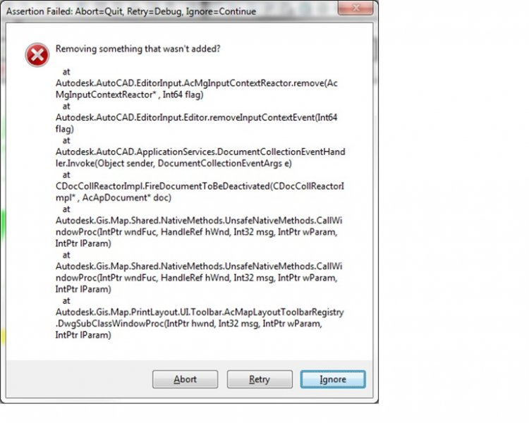

\<caption\> Fig.10.1: example of a moderately useful error message, with a message explaining what you probably did wrong, a stack trace, and providing options for how to continue. How could this message be improved? \<caption\>

### Generate warnings

If you find yourself dealing with corner cases in your data, consider displaying warnings.

Example:

You write a function that requires a two-dimensional input. But let’s say that it is obvious what your code should do if the input is only 1-dimensional, but this makes some assumptions, and you don’t want to do this except in special cases. You could issue a warning: “warning: one dimensional input will be treated as two-dimensional”.

This goes hand-in-hand with paying attention to warnings issued when you run your code.

## 10.3. Error handlers

Error handlers are segments of code that are executed as soon as an error occurs. Some error handlers are global. The debugger is itself a global error handler. More usually, you want a local error handler, that is only triggered in a specific block of code.

### Throwing and catching

Python makes an important distinction between errors and exceptions. Errors are generally fatal, triggering the end of your program, whereas **exceptions** are often “caught”. Catching an exception means that you are aware that it might happen, and define what should happen in that situation – you **handle** the exception.

\<key point\>Try-catch is a design pattern allowing for control to change hands with minimum fuss, when an ongoing course of action needs to be cancelled. \</key point\>

Throwing an error or exception means that you give the user the option of dealing with the problem. When you throw the error, your function immediately ends. The stack frame is deleted, and the caller’s code is examined. If the calling line is not enclosed within a try block, then the caller’s function also immediately ends, and their stack frame is also deleted. The error thus propagates up through each calling function, until the base stack frame is reached. Nobody caught the error, so it is displayed for the user, in the console. You get a big red stack trace!

\<caption\> Fig.10.2:

Catching an exception. When something goes wrong, you might know what to do. For example, if some data isn’t found, you might decide to use NaN or NA. In this code (left panel), the result is calculated in a subfunction analyseSingleSubject, and data is loaded in a deeper subfunction, analyseSession. One sensible way to avoid an error would be to check the data exists, before trying to analyse it. But this would either require sending messages up to the analysis functions e.g. from analyseSession to analyseSingleSubject, or the analysis functions must check to see if the data is OK before proceeding with analysis. Throwing and catching is a quick way to send a message straight up to the top function, while cancelling any calculations that might be scheduled to happen in between. Here, the missing data causes an runtime exception to be thrown (red code). At that moment in time, there are three open stack frames (middle panel). Because the catch occurs in the outermost function (blue code), the inner stack frames are collapsed, and control is returned to the outermost function. The catch code also receives the error data in a variable (here, x) containing the stack trace and message.

\</caption\>

If any of the callers have enclosed the call in a try block, something different happens. The control of execution jumps to the corresponding catch / except block. This allows the caller to deal with the problem, then continue its work, in the knowledge that the exception occurred. No error message is printed.

Errors can have different types. This is useful:

**try**:

Y = 1/x[i]

**except** **ZeroDivisonError**:

...

**except** **IndexError**:

...

Matlab has limited support for error types.

Consider displaying the problem inputs when creating an error. Here is an example in javascript:

fileName =(

“./experiments/expt1/”

\+"subj" + i +

\+"/session" + j + “.csv”

)

Can you spot the error?

**Bad Error**: cannot find file.

**Useful Error**: cannot find file “./experiments/expt1/subj1NaN/session2.csv”

Some languages will silently skip over errors like “+ +”, which is an example of what happens if you don’t give sensible errors.

\<case\>

### Case study

The first launch of the Ariane 5 rocket in 1996 resulted in a colossal explosion 30 seconds after launch. The programmers had left in some legacy code from the previous rocket design, Ariane 4. This code was not required for the launch, but was left running in the background, checking sensor values. The code raised an overflow error because the rocket was going much faster than it had been designed to allow. Because no error handler had been written for this condition, the error propagated and stopped the control of the rocket. Control was transferred to a backup computer, but this was running the same code and threw the same error, and terminated too. So, both control computers crashed, leading to a “rapid unscheduled disassembly”.

Credit: ESA/CNES/Arianespace – Photo Optique Video du CSG – S. Martin

Learning points:

-   Remove code that is no longer needed. You can always get it back if needed, using version control.
-   Check what errors each line of code could lead to. Languages like Java require compulsory exception-checking, where all exceptions of certain kinds must either be declared or caught. For example, in Java you cannot write “openFile(‘test.txt’)”. Instead, you are obliged to write “try{ openFile(“text.txt”); } catch (FileNotFoundException e){ … }”. This forces programmers to think about what should happen in every eventuality. In less strict languages like Matlab, Python and R, you should still mentally think about what happens in each possible case.
-   One way to know if code is working, is to try a second way of solving the same problem, to see if you get the same result. You might write the same statistical analysis in two ways, to check the implementation is correct. Although building in redundancy in your checks is great, if an error occurs in an aspect that is shared between your implementations – eg. the data format, or the algorithm itself – then the duplication doesn’t help.

\<end case\>

## 10.4. The short, self-contained code example (SSCCE)

If you are stuck during debugging, the quickest way to find the problem is to **simplify the code**. Try and find the shortest, simplest piece of code that can reproduce the problem you are having. Ideally it should be under 15 lines long. This is also called a reproducible example, or reprex.

Let’s say you have a script that plots a graph, and it plots a blank. Where is the problem? Try and find a **single explicit case** where the code fails

-   Remove any optional parameters
-   Feed in fixed known data values – the simplest values you can think of
-   Delete lines which are not being run in this particular case
-   Remove any function calls which are not strictly needed to get a result out

These **paring** steps will identify whether there are specific conditions that make the code fail, or if not, narrow down the lines on which the problem could be. You can also work in the opposite direction, **building**:

-   Start by showing that a basic plot command, on its own, works fine.
-   Add in the data to this command, showing that it works when it is given the right numbers.
-   Gradually build the function around this, line-by-line, adding one feature at a time, until it stops working.

Once you have the minimal code to reproduce the problem, you could post it on an online forum (e.g. Stack Exchange) to see if anyone can spot why the code is failing. It has been said that the kind of answer you get depends on the way you ask the question: Choose the right forum, provide a specific meaningful title, do post code examples, write in clear grammatical English, be precise, informative and objective, and describe your overall goal not just the steps. Post a follow up if you find a solution.

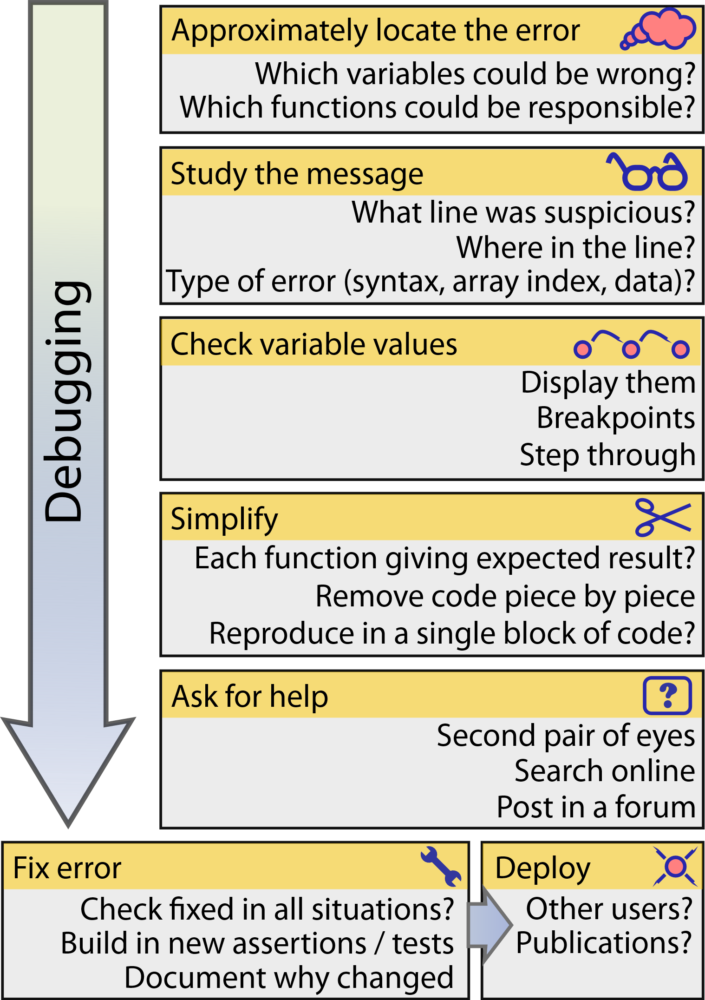

\<caption\> Fig.10.3: A quick guide to debugging. \</caption\>

## 10.5. Spotting some obvious errors

Here is a checklist of the commonest hard-to-spot errors:

-   Is the **right version** of your function being called? Use which; start python with python -v; check filenames in sys.frames(). Have you got two versions of your script – an older version, or maybe a backup? A common cause of this is working from a portable hard disk. Also try setting a breakpoint in the file you are editing, and see if it stops when called: If it does not, perhaps it is running a different file.   
      
    The problem is cured by using good version control.
-   Are the right **versions of libraries** present? Different versions of your language may have different features (e.g. Matlab 2016 and broadcasting; Python 3 and integer division), and different libraries and toolboxes have idiosyncrasies.
-   **Using the wrong data**: Often we change, overwrite, edit data files – for example adding or removing runs of an experiment, filtering trials, preprocessing in various ways. If you load a data file, are you sure it contains what you expect? Data files should be kept apart from analysis scripts, at least conceptually, to keep your code re-usable with different datasets. But this naturally permits situations where you read in an incorrect version of the data.   
      
    Keep a log of what has been done to each file, and when – using version control, or keeping notes, adding meta-data, or commenting the scripts that made the changes.
-   Re-use of a loop index that gets overwritten (for example, i).
-   **Modifying assigned arrays** in Python: Consider this code:  
    x = **np.array**([1])  
    y = **np.array**([2])  
    z = x+y **\# version 1: now x=1, y=2, z=3  
    **z = x; z+=y **\# version 2: now x=3, y=2, z=3**  
    Someone unfamiliar with Python may be utterly confused by the last line, where z is inadvertently linked to x. The z=x line may be intended to create a copy, like z=x.copy() or z=np.copy(x). This does not happen in Matlab or R, which both assign numbers by value, not by reference.
-   **Modifying arrays passed by value** in Python: If an array is passed to a function, and is modified inside the function, it will affect variables outside the function. Consider this function call:  
    **def** transform(val):  
     val[0] = np**.log**(val[0])   
     **return** val  
    x = **np**.**array**([1])  
    y = transform(x) **\# x is also modified**  
    val contains a reference to the original array, and storing values into it change the original. The transform function violates referential transparency: a pure function would return a modified copy as an output parameter. This cannot occur in Matlab, where function calls **pass by value**, not **pass by reference**.. Note that this doesn’t happen if the local variable val itself is re-assigned to a different array within the function:  
    **def** transform(val): **\# val refers to the original array**  
     val = **np**.**log**(val) **\# val now refers to a new array**  
     **return** val  
    x = **np**.**array**([1])  
    y = transform(x) **\# x itself remains unharmed**  
    The decision to use pass-by-reference for python arrays makes it more memory-economical, because you are less likely to copy arrays unnecessarily.   
    In R, passing is usually by value like Matlab, but can be overridden because R actually passes by **promise**, and the caller’s environment can be accessed using ≪-, or   
    transform \<- **function**(val){  
     **assign**(**deparse**(**substitute**(val)), val+1, **parent.frame**())  
    }
-   **Masking** of a library function on the path (Matlab). There might be two functions of the same name, in different libraries. You can check for path collisions using which plot -all.
-   **Uncleared variables** in a script – maybe your first analysis creates an array with 8 items, but the second analysis only writes 6 items. The result will contain the last two items from the first analysis. This is cured by using functions or namespaces.
-   Using = instead of == (though this is becoming less common with smarter syntax checking)
-   Using \^ instead of \*\* in Python. Unless you are used to working in binary, you might be surprised that 3\^4 == 7. This is a painful hangover from C, where exponentiation (raising something to a power) needed a helper function, and \^ was helpfully designated as bitwise exclusive-or.
-   If you have moved from Matlab to Python, check you haven’t used \~ instead of not. You will be startled to learn that \~True == -2, which bizarrely means True if used as a **boolean**.
-   Loading data from a saved workspace, that accidentally overwrites current variables. Cured by never loading directly into the workspace.
-   Using **zeros for missing data**. This results in silent, catastrophic errors that are usually caught too late. For example, mean(X) will systematically underestimate the mean. Always code an experimental abnormality, error or failure as NaN.
-   **Excluding datapoints** unevenly: If data is missing or removed from one condition, in paired or matched data, there is danger of losing the alignment between rows. For example if removing rows using X(:,bad_index)=[], np.delete( X. [bad_index]), X\<-X[-bad_index,]remember to remove the same rows from any other matched variables. Note that array concatenation ignores empty arrays (in fact [[]] reduces to [], np.concatenate(np.empty(0), np.empty(0)) is [], c(c(),c()) is NULL) so this can give silent errors.
-   **Zero-based indexing.** For example, you may label datasets as “1,2,3” in a spreadsheet, but need “0,1,2” in Python. Similarly, when “slicing” arrays to get a subarray, check whether you want the end index to be included (Matlab) or not (Python).
-   **Indices out-of-sync**. It is common to remove outlier datasets from an analysis, but ensure this doesn’t mess up your indexing. Often it is better to remove datasets right at the end of a analysis – while plotting and calculating statistics. Alternatively, remove them right at the start – e.g. before pre-processing. Another case is when an array is edited in a loop: This code  
    for i in range(len(X)):   
     if X[i]==0: del X[i]  
    leads to an index error as X gets shorter, and what’s worse,  
    i=0  
    while i\<len(X):  
     if X[i]==0: del X[i]  
     i+=1  
    silently fails to delete repeated zeros.
-   Mixing up visually similar characters
    -   Full stops vs commas ,/.
    -   Apostrophes and back-ticks ‘/\` and single vs double quotes ‘/” when delimiting strings
    -   Forward / and backward slashes \\ especially in paths in Windows vs Mac/Linux
    -   Parentheses vs braces in array indexing {/(

        Use a good font (section 3.2), increase the point size, good colour contrast, and a large screen.

-   **Bad refactorisation** – when you re-arrange code, changing the names of variables, simplifying long lines, removing repetitions, does the new code do exactly what the old code did? Test out both versions with some critical cases (see 10.10 testing).
-   **Inadvertent broadcasting**: Numpy and recent Matlabs automatically expand singleton dimensions. Great! But consider the following: a=[1;2;3]; b(:)=a; a+b; a=np.array([1,2,3])[:,None]; a[:,0:1]+a[:,0]. Here you create a column vector, and add it to what looks like a copy. But the two vectors inadvertently run in different dimensions, accidentally resulting in a 3x3 matrix.
-   **Inadvertent recycling**: A related (but worse) phenomenon occurs in R, where an operation on two vectors succeeds even if they are not the same length. R will ‘recycle’ elements of the shorter array: c(1,2,3,4) + c(0,10) gives c(1 12 3 14), with no errors. Check the dimensions of each array are as expected.
-   **Line endings**: Do you move code between Mac, PC and Linux? Some languages are sensitive to the type of **character** used for ‘line endings’. These are unfortunately denoted by different **ASCII** codes on Windows. Python scripts may generate strange errors with the wrong line-ending characters. You can check this using an editor that allows you to change the line ending type, or using a hexadecimal dump tool.
-   **Unhandled if conditions**: If you use if, make sure that you have dealt with the else side too. For example, when looping through an array, you might want to create some output when a condition is met.   
    for i=1:length(inputs)  
     if inputs(i)\>0  
     outputs(i) = log(inputs/2)  
     end  
    end  
    But, what do you want to output if the condition is not met? Matlab and R allow you to automatically extend an array to a specified index: x(10)=1, x[10]=1. Matlab will fill unassigned values with 0, and R will fill with NA. This code leaves zeros in the output, and if this is desired behaviour, it should be made explicit:  
     else  
     outputs(i) = 0

## 10.6. Code review

A key part of commercial software is that code gets reviewed by other programmers. This is a rare luxury in science. Can you:

-   Get peers or a student to read the code? It’s beneficial for them to understand how the code works
-   Send it to a collaborator – even if it’s just for them to re-run the analysis
-   Post it to an open science repository: the very act of preparing a code for publication can jolt you into spotting a new error.
-   Get a peers or a student to reproduce an analysis from a methods write-up: This has a double benefit: it ensures that every last detail is included in your Methods section – as well as ensuring that the result is robust to different implementations of the same analysis. This could be a good opportunity for junior students to make a solid contribution to a scientific paper.
-   Code in pairs – it can be a great learning experience for both people.

Many professional programmers do **Pair Programming** – where two people write code together. One person drives, while the other looks over their shoulder, approving or disapproving. If each person has a 10% chance of making an error, then the chance of both people making the error could be just 1%. \<ref Hannay et al. 2009\>

This is a great way of learning too: start with the teacher driving, then switch to the student driving. This is **scaffolding** (van de Pol, Volman and Beishuizen 2010), a teaching method where teachers first act as a model, then fade to the back, giving the student responsibility, but under direct supervision.

## 10.7. Heed the developer tools

### Heed the Warnings!

A warning is a message generated that indicates an expected condition was not met. When a warning occurs at run-time, the problem is not sufficiently bad that the program has to stop. The program continues to run despite the warning. You might have allowed this by design.

But unless you understand fully what you are doing, **try and eliminate all warnings**. In general they are a sign of a problem, and even if the code runs, you may not be guaranteed a correct answer.

There are some situations where you might want to disable warnings.

-   One common example is when you use legacy code, because an older piece of code can’t be changed easily.
-   The code that generates a warning might be buried in a loop, and warnings could slow down calculation
-   A lot of warnings might prevent important messages from being seen. Although printing things to the console can be a sign of bad code.

But if you do this:

-   Disable them only temporarily. When you set the **flag** to override warnings, cancel this when you are done.
-   Disable only the selected warnings that you are trying to remove.
-   Try and **preserve the state** of the warning flags – did someone already disable warnings? You can check this in your code and store that information before you change it. Try and respect their decision by checking if warnings are already disabled, and restore the state.

### Heed the Lint!

**Lint** is a tool built into your **IDE** that checks the quality of your code. It can check formatting, syntax, and spot some bad practices. IDEs will show lint warnings as symbols in the margin, wiggly underlines, or in a separate window.

\<caption\>Fig.10.4: example of lint output from Matlab’s code analyser

[Pic matlab warnings; pylint]

These warnings are determined from an initial parse of your code, and can flag up many common problems.

-   Unpaired brackets or sometimes wrong types of brackets, unpaired quotes.
-   Commas replaced by full stops, or vice versa. It is unfortunate that they look very similar, and are also neighbours on the keyboard.
-   Missing line-continuations (... or \\)
-   Assignment = instead of comparison == (sometimes)
-   Some structural problems can be picked up when variables are not created, or not used – this should immediately raise suspicion.

\<box\> Unless you fully understand what you are doing, **do fix all the lint warnings**. Although some warnings are just cosmetic, some of them reflect errors. Some of those errors will show up when you try to run the code, but some of them may not! The code might run just fine, but give the wrong answer.\</box\>

Paying attention to lint messages often spotlights semantic errors. A common example is using a variable before it is initialised. You will be able to run the code, if the variable had already been created in the workspace any time before. But the value may not be what you expect!

## 10.8. Strong and Weak Typing

Strong typing means that variables of one type cannot be automatically converted to variables of a different type. For example, numbers cannot be used as text, unless you specify how to format them. You cannot do print(‘loading dataset ’+i). Instead you must use a function like num2str, printf, str, format, or paste.

Python has quite strong typing. Consider this for loop:

Y = [1,2,3,4]

for i in range(Y):

print(Y[i])

Here, you probably intended to loop over elements in Y. The code as presented will not generate a syntax error: the range function needs to know the length of Y, but instead it is given Y. Python knows immediately that you cannot use range on an array. It raises “TypeError: range() integer end argument expected, got list.“

Matlab, on the other hand, does not notice the problem, since in terms of **type**, a number is the same as a vector of size 1x1:

Y = [1,2,3,4]

for i = 1:Y

disp(Y(i))

This runs fine, but gives just one result because the colon operator only looks at the first element. So the expression 1:[1,2,3,4] is treated (perhaps bizarrely) as 1:1.

The weak typing could possibly allow some interesting tricks, for example 1:[] yields []. But it makes debugging hard!

### Numerical casting

Some languages are weakly typed, and allow this kind of automatic type conversion (**type casting**). This can lead to difficult-to-spot errors. For example, integers sometimes stay as integers:

0.5+int8(1) = 2

Though in Python 2.x, integers are converted but only when a floating point value is present

5/3 = 1 5/3. = 1.667

Beware of your language versions. “Brodacasting”, or singleton expansion, is a more subtle example of weak typing. In older Matlab, you cannot add a 1x5 to a 5x1 array.

conditions = [1; 2; 3]

for i=1:length(conditions) % iterate through the column vector

m(conditions(i)) = mean( data{i} ) % this makes m a row vector!

end

u = m(conditions\>1) % indexing a row vector using a column – OK

v = conditions(m\>0) % indexing a column by a row – also OK

m = m + 15 \* (conditions\>1) % increase m for certain conditions\*

m = m \* (conditions\>1) % zero out condition 1\*

The last two lines do not work, because m has unfortunately turned out as a row vector. In older Matlab the addition happily generates an error. However, later Matlab and Python allow **broadcasting**, which silently creates a large matrix. You might never detect this error, for example if you just select values from m using m(condition==1) etc. The last line always fails silently in Matlab because matrix multiplication is overloaded on the \* operator, and so a scalar is produced; in this situation Python still broadcasts, using element-wise multiplication (matrix products would require an explicit call to np.matmul).

### Boolean casting

Sometimes Booleans stay Booleans when they should not:

flag = (0==1) = 0

flag(1) = 5 = 1

x=np.array([0==1]) = False

x[0]=5 = True

x=c(FALSE) = FALSE

x[1]=5 = 5 [the expected answer]

Basically, these ‘nonsense’ conversions happen without warning, leading to very confusing behaviour. This is because in these languages, variable **types** are not “strong enough”: numbers can get down-**cast** to Booleans – a **narrowing** conversion. It was a design decision, however, since there are situations where weak typing makes life considerably easier, for example with adding logical values to obtain a count, averaging logical values to obtain a proportion, or indexing a 2-item array with logical values converted to integers.

Similarly watch out for conversions in comparison:

x=5

if(x) print(‘yes’) yes

if(x==TRUE) print(‘yes’) (does not print yes)

This is the case in all three languages: although nonzero numbers are “true”, when used in an if statement, it is **not** true that they are (equal to) true. Again, this is because if coerces numbers into booleans, whereas equality testing (==) coerces the other way round, **promoting** booleans into numerical 1 or 0. This is just a rule you have to get used to!

## 10.10. Testing

Always test your analysis. Software designers advocate **test-driven development**, and write tests for their code in parallel with their code. Tests are themselves pieces of code, that call your code and reveal whether it does what it is supposed to. Often the test code is as long as the actual code! This is not always suitable for scientific code, as your specification is rarely known in advance.

When you write an analysis script, make sure you test it on synthetic data. You will need to write a separate script to create the **synthetic data**, in the exact format of what you expect the real data to look like.

-   Create test data that contains the effect you are testing for.
-   Create test data with additional effects that you are not testing for, to make sure that does not invalidate the analysis
-   Permute (shuffle) the test data so that the effect should come out as null.
-   Create noisy data, or data without signal.

Then run your analysis on these three types of test data. This demonstrates that your code does not produce spurious significance, can detect significant results of a given size, and is not distorted by additional effects.

\<Exercise\>

Can you create a simulation to test the compare groups function in 10.1?

**function** p = compare_groups( g1,g2 )

[\~,p] = **ttest2**(g1,g2)

**function** [g1,g2] = generate_sim_data(N,effect_size)

g1=**randn**(N,1);

g2=**randn**(N,1)+effect_size;

**function** test_compare_groups

[g1,g2]=generate_sim_data(100,1)

compare_groups(g1,g2)

Any statistics you do should, ideally, be tested with your original data shuffled, so that it would in theory not produce a significant result.

### Creating test data – How to run a simulation

Try and think about the process that generates your data. Can you write this as an algorithm? This is sometimes called a ‘forwards model’ or **generative model**. Defining your forwards model is crucial for hypothesis testing, so you should have one even if you are not creating test data.

\<caption\> Fig.10.5: Scientists often use a model to interpret their data. The most common process is to fit parameters to data (right-to-left here), and examine those parameters. But all models tacitly describe the process that generates data, and so are capable of sampling (left-to-right). This can be done from assumed parameters, fitted parameters, or even randomly sampled parameters based on a posterior estimate. \</caption\>

Consider a linear model, y \~ Xb + ϵ. Here y is a data vector, b is the parameters of the model that generate the data, and X is the design matrix – the set of conditions for each datapoint. ϵ is an error term. How would you generate test data? First consider what is the range of x that your predictors (independent variables) can take. Maybe you have two conditions, tested in two populations. Then you need 4 levels of X.

You will need to include randomisation. You might generate X as follows:

condition = random boolean vector

(e.g. randi(2,1000,1)-1, random.randint(2,size=1000))

population = another random boolean vector

intercept = vector of ones e.g. ones(1000,1)

Then combine the columns to obtain a design matrix

X = [ intercept, condition , population ]

Then you will need to set some plausible values for your parameters. Perhaps b will be [3; 2; 1]. This would signify that y is expected to have a mean of 3, that y will increase by 2 for condition==1 compared to condition==0, and that y is increased by 1 for population==1 compared to population==0. Finally, you need to decide on the noise, e.g. ϵ = 0.5. Now you can generate simulated data, by calculating y_sim = X\*b + ϵ \*randn(1000,1).

Then, run your analysis on the simulated data. Fit the data to your model. Can you extract the original parameters b?

Your forwards model might be much more complicated than this simple linear example. You may need for loops or use mathematical functions. For example, you might include interaction terms, random effects and error covariance. But essentially, you need a route to get from the conditions to some expected data.

-   First, simulate first with a very large number of data points, e.g. 5000, to check the model can be fitted at all. Some models simply cannot be fitted. If the parameters have high covariance, this means that the same data can be explained by two parameters. You can estimate the covariance by simulating multiple times, and correlating the parameters.
-   Then, simulate with the same number of data points in your dataset. This determines whether you have enough data. Are you getting sensible parameters? You can perform your statistics on the simulation to obtain a simulated p-value – are you getting an effect, with the estimated effect size?
-   You can do your own power calculation. Estimate your power to recover effects by varying the sample size and running multiple simulations. How often do you recover a significant effect?
-   You can check whether your statistical test adequately corrects for multiple comparisons. You can measure the **family-wise error** (FWE, overall chance of a type 1 error) and **false-discovery rate** (FDR, chance of a positive result being a type 1 error): set the effect size to zero (e.g. b(2)=0 in our example) and run the same simulations.

\<bigger picture\> Do you have a forward model?

Forward generative models are a crucial part of understanding your data, because they capture the assumptions you make.

-   If you are recording a time-series of data points, think about Gaussian processes or Markov processes.
-   If you are recording the times of events, for example response times, think about drift-diffusion models or race models.
-   If you have a timecourse of response to an event, consider convolution with a temporal finite impulse response function, which can be empirical or theoretical.
-   If you are measuring whether a condition is met, or which category something falls under, consider logistic or multinomial Bernoulli processes.

Each of these let you generate stochastic, simulated data from some assumptions.

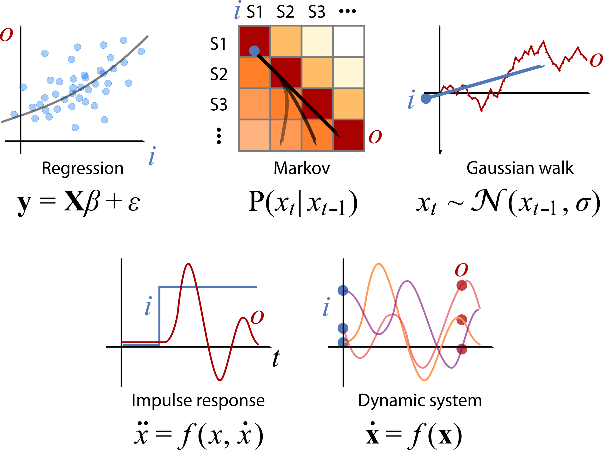

\<caption\> Fig 10.6: Some examples of models that support a forwards, generative process, together with a representative equation. Regression models map one set of values onto another. Markov models and Gaussian processes map one state to a subsequent state, generating a time-dependent “walk”. Impulse responses and dynamic systems generate a timecourse from initial conditions. \</caption\>

\</bigger picture\>

### Simulating after fitting

Once you have fitted a model, consider re-creating surrogate data from it. Then you can run this surrogate data through your analysis pipeline, to confirm your fitting works correctly.

**Posterior predictive sampling:** One useful way to do this is to include the uncertainty in the estimated parameters (b in the example above)\<ref Wilson\>. To do this, you need a correlation, scale, or covariance matrix of the estimate b. This gives you the posterior distribution of b, from which you can draw samples, e.g

b_samples = b + chol(cov_b) \* randn(N,length(b))

b_samples = np.random.multivariate_normal(b, cov_b, N )

b_samples \<- mvrnorm( N, b, cov_b )

Here, the Cholesky decomposition acts a bit like a square-root. Finally, simulate with these new values, and re-plot. Does it look like your data? Posterior predictive checks tell you whether your pattern of results is truly captured by a model.

\<caption\> Fig.10.7: Parameter recovery helps you test if your fits are valid. Left: the fitted value is plotted against simulation value. Values on the diagonal are recovered well. Middle: Bias from the true value is reduced when simulating large datasets, but some fitting methods still carry asymptotic bias with infinite data. Right: the mean absolute error is one measure of variability of recovered values, across different runs of the simulation. It declines to zero when each run simulates many samples. \</caption\>

**Parameter recovery**: Are the parameters of interest actually distinguishable from your data? To check this, simulate with a range of parameters, fit the simulated data, and compare the true and recovered values. This tells you the bias and spread of recovery.

\<ref\> Wilson R & Collins AGE, eLife 2019 [10.7554/eLife.49547](https://doi.org/10.7554/eLife.49547) \</ref\>

### Unit Tests

A unit test is a piece of test code that accompanies a function you have written. It specifies what your code is supposed to do, using examples. Here’s an example of how you might write a unit test. Consider a function that calculates the average of an array:

function a = average(X)

a = nansum(X)

a = a/sum(\~isnan(X))

The corresponding unit test might be:

function averageTest()

assert(average(1)==1) % test a basic scalar

assert(average(ones(10,1))==1) % test basic vector

assert(average([1;nan])==1) % check it ignores nan

assert(isnan(average([]))) % test empty array

assert(average(1+1j)==1+1j) % check it works for complex numbers

assert(average(ones(3))==[1,1,1]) % test average of matrix

A collection of tests like this is called a **test suite**. The idea is that you run this suite whenever you make modifications to the average function. It might seem ridiculous testing out all these little possibilities, especially for such a simple example function. Perhaps it hardly seems worth it…

However, you may notice that the last test will fail, picking up the missing elementwise division in the function: a = a ./ sum(\~isnan(X)). This could be quite a hard error to detect in some situations!

The more of your code is validated against tests, the better. You can use **code coverage** tools to check if your test suite is missing something. You may think of new scenarios to test as you write other parts of the program.

\<Key point\>

Keep building the test suite while you write the program.

When a bug is found, add it to your test suite. \</key point\>

## 10.9. Provability

Computers are logical, and so everything they do is clearly defined, precisely determined, and known in advance. Right? Well, not quite. The idea of a program being “correct” is not straightforward. A standard definition of correctness \<ref\> is that for *every* possible set of conditions the program runs in, it will produce a specified result. Such a program is provably correct, or **verifiable**.

\<ref\> David Gries, The Science of Programming”, 1981\</ref\>

It is hard to prove a program is correct. It requires a huge amount of specification. You can view proof as an extreme extension of **unit tests** (see previous section). Unit tests specify a few key cases where a known output should be produced. But this is not enough for proof: the expectations for every condition must be set out. For the proof to be useful, the conditions must be set out in a more abstract form than the program itself, e.g. as a formula against which the code can be verified. The formulae may be specified in formal logical propositions, whereas the code is specified as a series of instructions – the **implementation**.

Separate computer languages exist for writing specifications for proofs, and tools are available in some languages for automatically proving code matches such specifications. However, there are some problems with provability:

-   The code is only as good as the conditions that are laid out. Just because a program is provably correct, doesn’t mean it will do the right thing.
-   Writing the specification is itself laborious and error-prone.
-   Most useful applications use constructs that are inherently not provable – you may have heard of Turing’s **halting problem**: you cannot write a program that can decide whether any other program will finish executing (and this can be proved!).
-   Usually, each function is proved separately. But it is all too common for individual functions to operate perfectly, but for bugs to crop up when functions are pieced together. Do functions work in the same units or coordinates? Do they interfere with each other? The whole is greater than the sum of the parts, and so requires additional proof.

Consequently proof is not available in most scientific languages. Unless life-critical decisions depend on the software, most developers do not validate their code with proofs. It’s simply too time-consuming. You may get on well with simpler alternatives, like **assertion** and unit tests.

## Chapter Summary

Be hyper-vigilant for variables overwriting each other, overwriting built-in or library functions (especially in R and Matlab), unexpected data, or invalid inputs. Sadly, there are many situations where code fails silently. This is a worst-case scenario, and is made worse by certain language features like weak typing and idiosyncrasies of indexing. Make errors occur gratuitously – always check and assert. To minimise bugs use team coding and review, respect all warnings or ‘underlines’, and when necessary, handle errors with caution. Use simulated or shuffled data to make sure your code and statistics work as expected. Build unit tests to double check code works in every possible scenario.

Discussion Questions: Why do you think error messages are hard to interpret? Why might it be harder to spot your own errors than your colleague’s? Why is it that after 40 years, computers still crash?

# Appendices

## 11.1. How do computers see numbers?

You may have heard that numbers are stored as 1’s and 0s, a sequence of binary digits (bits). But how do the numbers you use in your analysis relate to these bits?

Historically, many computers used 8 binary digits to store individual numbers. Eight ‘0’s means 0, and eight 1’s would mean 255 in binary. To store a number bigger than 255, you would need two **byte**s – so for example 258 would be stored as ‘0000 0001 - 0000 0010’. The two bytes are held in neighbouring slots in the computer’s memory, and together represent a larger value. This leads to some major questions: What happens if you add together numbers, and the result is bigger than will fit? How might a negative number be stored? What if you want to store decimals?

To solve these problems, **floating point** numbers were created. In these numbers, some bits represent the number, and other bits represent the order of magnitude (a binary version of ‘powers of ten’). The number component is termed the mantissa (or significand or fraction) and the order of magnitude is called the exponent. There is a specific **bit** that indicates whether the number is positive or negative, another bit indicating whether the exponent is positive or negative. Furthermore, the Institute of Electrical and Electronics Engineers (IEEE) specifications for floating point numbers – which are widely used now – also reserve special bits to indicate things like ±infinity, and Not A Number (NaN). Depending on how many bytes are used, a floating-point number (sometimes just called a **float** for short) can be single-precision (4 bytes), or most commonly double precision (8 bytes, sometimes just called ‘doubles’). [ref: Goldberg]

Why is this important?

Numbers close to zero (either positive or negative) can be represented incredibly precisely – since a large negative exponent allows the mantissa to “zoom in” there.

The great news is that nowadays, these number formats are integrated into the lowest level components of your computer – the CPU itself knows the rules. So, these floating point numbers behave consistently across most languages.

### Integers

Integers have a fixed range. This means they have limited precision: half of 1 is zero, because there are not fractional digits. Integers need to be appropriately scaled in terms of their measurement units. This has benefits as well as disadvantages.

Beware of integers. There are many situations where you need integers, but many new types of error can occur, if you’re not used to integers:

-   There are many formats, and conversions can be tricky. There are 8-bit bytes, 16-bit words (short integers), and 32- to 64-bit “long” integers. There are signed and unsigned integer representations. There are ‘little-endian’ formats in which the least-significant byte (the one representing the smallest powers of 2) comes first, and ‘big-endian’ with reversed byte order.
-   Division is confusing, as remainders are discarded.
-   Languages differ in when integer representations are used. When you calculate 1/2, Matlab, R and Python 3 treat this as a double-precision calculation, whereas Python 2.7 defaults to an integer, yielding 0.
-   **Overflow** is common – where a calculation goes above or below the maximum representable value. You might need to check each calculation to avoid silent errors. For example, 32767+1 is not representable as a 16-bit signed integer.

You can ignore integers unless you

-   deal with hardware. Embedded firmware and custom analog-to-digital conversion often return data as integer formats.
-   use older file formats, for compatibility with older data or machines
-   need significant data compression. If high precision is not meaningful for your data, for example due to a noise floor, you may be better off converting to a fixed-point (integer) format.

The latter point is pertinent. Most of our data doesn’t need 64 bits. You can probably compress data enormously, simply by converting to an integer format.

For an average pressure sensor, it is not worth storing readings to more than 12 bit precision. This means that each sample can take a value from 0 to 212=4096, which might be an ample number of gradations as long as the baseline is accounted for. If it is not enough, then store the logarithm, so that you can expand the precision of small values, while allowing coarser representation of larger values. Or equivalently use a floating-point representation. A 12-bit format would occupy less than 1/5 the disk space. Notice that zipping the data (lossless data compression) would not help.

Some images are best represented using a single byte per pixel, occupying ¼ of the space.

The extreme example is for data made up of 1’s and 0’s, such as ‘yes/no’ responses, or masks (an array used to select from another array). If space is an issue, check that you are using an 8-bit integer format. And better still, you might be able to use a 1-bit format, where 8 datapoints are collapsed into a single byte – sometimes called a bit array.

### Double precision formats

These days, most numerical operations are done to “**double** precision”: usually a 64-bit format with 52 bits of mantissa, 11-bit exponent, and a sign bit. The exponent thus allows scales from 10-1023 to 10+1024.

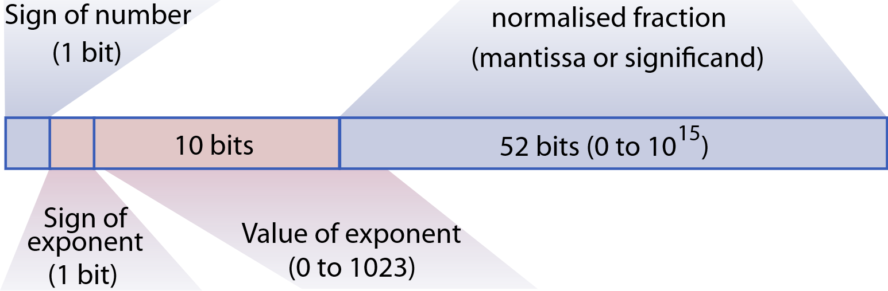

\<Caption\> Fig.11.1: Double-precision floating-point values are stored in 64-bits (i.e. they occupy 8 bytes). They include an exponent ranging from -1023 to +1023. The missing value of exponent (effectively +1024) is used to indicate +/- infinity (when the mantissa is 0) and NaN otherwise.\</caption\>

This is great for manipulating data: the number format is IEEE standardised, the results of operations too are standardised, all modern CPUs are fully optimised for these kinds of number, so if you encounter rounding errors, the problem is in your algorithm.

In the rare situations, you might need bigger numbers. Some platforms support long double (numpy.longdouble) or extended precision floating point numbers, with usually 10-byte (80-bit) numbers, or even larger 128-bit floats. These allow a larger range, but not always greater precision. There are also packages which support arbitrary precision – for example symbolic toolboxes.

I have not encountered a situation that needs more than a double: the real solution is usually to change the scale of the variables.

\<caption\> \</caption\>

\<box\> Did you know there are two zeros? Doubles can hold positive zero or negative zero, even though these are defined to be equal. You can recover these in the binary representations e.g. compare

**num2hex**(-1/**inf**) vs **num2hex**(0)

which in Python can be done with

**hex**(**struct.unpack**(“\<Q”,**struct.pack**(“\<d”,-1/**np.inf**))[0]).

\</box\>

### Infinity and beyond

Infinity is generated when a number goes out of bounds. They behave like you might expect:

1/inf == 0

inf + inf == inf

\-1e1024 == -inf

-   Negative and positive infinity are distinct.
-   There are also various species of complex infinity.

Integers do not support infinity, and they will **overflow**. Different languages adopt different strategies to deal with this. Matlab will **saturate**:

int8(126) + 2 127

int8(-127) - 2 -128

uint8(0) - 1 0

Numpy instead wraps around, which is perhaps the most confusing!

np.int8(126) + np.int8(2) -128

This bizarre behaviour occurs because the ‘sign bit’ (which determines whether a number is positive or negative) is the most significant bit, and the value -1 is actually represented in binary as 11111111.

On the other hand, plain Python integers get automatically **promoted** to a higher number of bits when needed, with implicit conversions. This allows Python to have **arbitrary precision** arithmetic:

np.int8(127) + 2 129

type(np.int8(127) + 2) \<type 'numpy.int64'\>

But as you will see, these type conversions can easily lead to dangerous, silent errors in your code! My advice is, wherever possible, to stick to double precision floating point numbers.

\<tip\> Stick to using doubles, if you can! \</tip\>

### NaN and her family

NaN, meaning **not a number**, is a special value that can result from an indeterminate or invalid calculation. It is designed to stop erroneous values appearing when you try to do something silly. Historically, all computations that could result in bad results needed to be manually checked; now, NaN behaves like an **overflow** flag to indicate something bad has happened:

inf – inf NaN

0/0 NaN Python Error: divide by zero

inf \* 0 NaN

NaN propagates whenever it is involved in calculation:

1 + NaN NaN

But is confined to its position in an array:

[0,1,2,3] + [NaN,1,2,3] [NaN, 2,4,6]

sum( [0,1,2,3, NaN] ) NaN

Importantly, NaN never meets the criteria for numerical comparison:

NaN \> 0 == false

NaN \< 0 == false

This means that NaN can be “un-propagated” (removed from the calculation) using comparators.

\<tip\> Caution: Boolean operations can conceal a problem with earlier calculations. \</tip\>

Another way this can happen in R/Python is by raising it to the zeroth power, giving 1:

NaN\^0 NaN

np.nan \*\* 0 1

NaN\^0 → 1

Crucially remember that NaN is not equal to NaN. Really! Try it out:

NaN == NaN false

np.NaN == np.NaN False

NaN == NaN NA

To find out whether a variable is nan, use isnan(x) np.isnan(x) is.nan(x)

Given the last peculiarity, you might notice that you could also use x==x to check if a value is not NaN.

But notice that converting NaN to a truth value depends on the language. Matlab and R won’t let you, while python thinks NaN is true.

if nan, print ‘true’; end NaN’s cannot be converted into logicals

if float(‘nan’): print(‘true’) True!

If(NaN){ print(‘true’); } argument is not interpretable as logical.

In R, you have the option of specifying a missing value NA (not available). This value indicates “unknown *yet existing* data” – something that does have a value but which is not known. This is an important distinction in statistics. It behaves as follows:

NA \> 0 NA

NA+1 NA

NA==NA NA

if(NA){print(‘true');} missing value where TRUE/FALSE needed

\<box\> Did you know that there are actually many different NaNs? They can be divided into “quiet” and “signalling” NaNs. Most NaNs are quiet: they are propagated through calculations, so that you can catch the error at the end of a sequence of operations. Signalling NaNs have a different binary representation, and actually generate an error when used. They aren’t generated but normal calculations but you can create one with decimal.Decimal('snan')\</box\>

\<Case study\> Don’t let missing data have the last word

In a Nature paper in 2019, a study of world religions in \>400

(Whitehouse et al. 2021)

\</case study\>

### Empty, Null and Void (Advanced Topic)

It is worth noting that although NaN is universally an “error value”, all languages have a separate way of denoting ‘nothing’, or where something is missing. This can be very confusing, since it is variously called “null”, “void”, “empty” or “none”. In some situations, this can be conceived as an array with no size, or a box which has been “squashed until it is flat” in one or more directions. Contrast this with NaN and NA, which occupy space. In other situations, you are better of as thinking of such variables as completely different – with unique properties.

\<from here in three columns?\>

In Matlab, empty arrays [] serve this function, and behave even more peculiarly than NaN:

[] + 1 []

[] \< 1 false

[] == [] false

If [], print ’true’ (it’s not true.)

Curiously, empty arrays still retain a knowledge of their size.

ones(0,0) == [] []

ones(1,0) == [] Error using ==: Matrix dimensions must agree

ones(1,0) == ones(2,0) Error using ==: Matrix dimensions must agree

And this depends on the version of Matlab because singleton expansion can kick in!

ones(0,0,0)==ones(0,0) 0x0x0 empty logical array

In Numpy, empty arrays are distinct from None.

np.ones((0,2)) == np.ones((0,0)) False

np.array([]).shape (0,)

np.array([[]]).shape (1,0)

np.array([[[]]]).shape (1,1,0)

np.array([])==np.array([[]]) [] 1x0 boolean array!

And dimensions with size 1 are special, as they can be **singleton expanded** (“**broadcasted**”):

np.ones((0,0)) == np.ones((1,0)) [] 0x0 (RHS broadcasted down: shrinks)

np.ones((0,0)) == np.ones((2,0)) False (no singleton dimension to broadcast)

np.ones((1,0)) == np.ones((2,0)) [] 2x0 (LHS broadcasted up)

np.ones((1,0)) == np.ones((0,1)) [] 0x0 (both singletons broadcasted down)

np.ones((1,0)) == np.ones((0,2)) False (non-singleton dimension mismatch)

The situation with R arrays is different: R has various classes of data. A numeric variable can contain a list of values,

x\<-c(1,2,3)

but this can be converted to an array with array(x), or a 3x1 matrix with matrix(x). They are all different. You also have NULL, which functions like the empty array in Matlab and Python, but is not the same as an empty array or matrix:

c() NULL

array(dim=c(0)) numeric(0)

array(dim=c(0,0)) \<0x0 matrix\>

array(dim=c(1,0)) \<1x0 matrix\>

array(dim=c(2,0)) \<2x0 matrix\>

But

array(dim=c(1,0)) == array(dim=c(2,0)) logical(0)

array(dim=c(1,0)) + array(dim=c(2,0)) Error: non-conformable arrays

So unlike Matlab, R doesn’t mind testing equality with different size empty arrays, but will not do maths on them.

\<end columns\>

These are common sources of errors in Matlab. Can you spot the error here?

**global** sample_count

**while** **true**

do_something()

sample_count = sample_count + 1

**if** sample_count \> 100, **break**; **end**

**end**

What would happen if you run this?

This code runs an endless loop! When you create a global variable in Matlab, but don’t initialise it, it will start as []. The error []+1 is not picked up, since Matlab treats size 0 x 0 as compatible with other sizes. Note that empty arrays still have a size. [] is a 0x0 array, but this is not the same as ones(1,0).

In contrast to empty numpy arrays, None is used in Python to denote non-numeric empty values. While it is not a numeric class, it happens to be smaller than any number:

None + 1 unsupported operand type(s) for +: 'NoneType' and 'int'

None \< 0 True \| (fail in Python 3)

None \> 0 False \|

None==None True, but avoid this and use is instead of ==

True if None else False False

### How precise are my numbers?

When you add an exponent, you lose precision in the mantissa. For example, 1 is greater than 0. 1001 is greater than 1000. 1 + 10\^10 is bigger than 10\^10. But if you add very large numbers, the 1/0 bit becomes so insignificant that it vanishes (sometimes called **underflow**). The scale at which this occurs is given by “epsilon”:

1 + eps \> 1 : true

1 + eps/2 \> 1 : false

eps = sys.float_info.epsilon

eps \<- .Machine\$double.eps

You can also find the largest possible number (in float_info; realmax; Machine\$double.xmax).

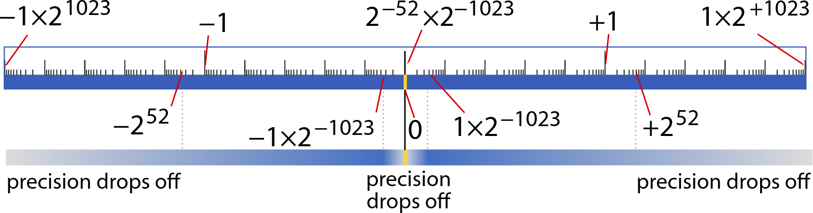

\<caption\> Fig.11.2: Double precision numbers have a colossal range. Due to the separate exponent, they are good to about 15 significant digits, but you can shift those digits up or down by about 308 decimal places. For numbers around 10\^15, the value is correct only to the nearest integer. The precision falls off as numbers get larger. For tiny numbers, when the exponent gets down to its lowest, around 10\^-308, the precision again falls off as fewer significant digits can be represented. \</caption\>

It is rare to truly need anywhere near these limits in science. If I had to measure the length of a ruler to the nearest atom, but coded its start and end positions relative to the north pole, I might *just* exceed the precision limit. If you are genuinely having issues with reaching the maximum values or minimum precision, then your algorithm may need revising.

Rounding errors arise when you don’t have enough digits available in your mantissa, so that the least-significant bits get truncated. For example did you know that:

0.3 + 0.3 + 0.3 + 0.1 == 1 False

0.1 + 0.3 + 0.3 + 0.3 == 1 True

The values of these sums is also displayed differently in Python, Matlab and R.

**Dealing with rounding errors**

1.  **Normalise** the values that need to be precise, so that they lie near zero, and store the bias (i.e. the constant large component) in a separate variable. Instead of storing your timestamps as femtoseconds since 1st January 1970, store them relative to the start of your experiment. You can store the start time separately. Storing just the offsets frees up the whole of the mantissa. You rarely need to represent things more than a few orders of magnitude difference, and if you ensure your values all have the same relative scales, you are unlikely to run into rounding errors.
2.  **Remove ‘hard comparisons’** from your code. Statements like if x\>0, or if x==y are discontinuous, because a tiny change in x can have a large effect. This genuinely doesn’t happen in the real world! If you are using these kinds of comparison, think again about your model. You probably want a soft comparison. For example instead of   
    z = 0 if x == 0 else 1, consider something more physically plausible like   
    z=1/(1+exp(x)) also known as a **softmax** or logistic function, and instead of   
    z = 0 if y==x else 1, consider something like z=(x-y)\^2 – i.e. rather than asking if they are identical, use the quantitative difference. This makes functions differentiable, so their outputs don’t vary suddenly with their inputs.
3.  **Use log scales** when numbers get small. A very common situation is for likelihoods in statistics. If you are fitting a model of a large dataset, the probability of obtaining that exact dataset by chance is ridiculously minuscule. But it is by no means negligible: to fit a model, you need to compare it with other probabilities on the same scale. For this reason, we use log likelihood. Similarly, if you are computing a softmax probability exp(v(1))/sum(exp(v)), and the values v are moderately large, you should subtract the maximum value from them v=v-max(v) – because only the relative values are important here.
4.  **Look for small denominators** or highly nonlinear functions in your code. If you divide by a number that is decaying towards zero, you will have problems, presumably because there isn’t a physical interpretation for what you are trying to do.
5.  **For ratios of factorials**, try and cancel terms in your equation, rather than computing them.
6.  **For differential equations**, switch from Euler methods (fixed timestep) to an adaptive method like Runge-Kutta. Nonlinear equations might need very fine timesteps for some regions of the solution. These methods are more complex, and so come at a cost.
7.  **Is your system chaotic**? If so, you may need new approaches. All the precision in the world will not save you here, so consider embracing the variability. Introduce small amounts of noise into your values, and run your analyses many times with different perturbations. It will be important to ascertain how sensitive your measures are to microscopic fluctuations.

\<Key point\> If you encounter problems from rounding errors, it’s not because you need more precision. It’s because you need to adjust your algorithm.

8.  **Last resort**: you can use a high-precision library e.g. Gnu Multiple Precision Floating-point Reliable library (MFPR). It is unlikely to be as tightly optimised as native floating point maths.

### Complex numbers [Advanced topic]

A complex number consists of two real floating point values, termed ‘real’ and ‘imaginary’ components. For a scientist, these can be incredibly useful for representing 2D coordinates, since there are built-in ways of calculating angles and lengths.

-   Rather than manipulating two columns for X and Y coordinates, or two separate variables for X and Y, you can use a single variable with real and imaginary components.

Z = X + 1j \* Y; % create a complex array

ampl = **abs**(Z) % the lengths of all the vectors

Z_rot45 = Z \* **exp**( 1**j**\***pi**/4 ) % rotate them all by 45 deg

This scales up to n-dimensional arrays without changing the code. Benefits:

-   You can sometimes halve the amount of code required for 2D operations
-   The code is usually easier to understand, since the semantics of adding and scaling work just like vectors.

    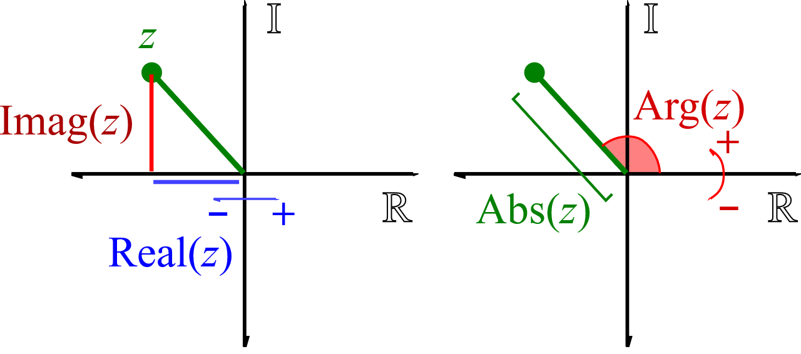

\<caption\> Fig.11.3: Complex numbers are a great trick for 2D coordinates. \</caption\>

In Matlab and R, you can simply plot(Z) directly to show real values on the x-axis, and imaginary values on the y-axis (termed an Argand diagram).

Note that mathematically, there are two types of infinity for complex numbers: the single-point ‘complex infinity’, and Directed infinities which have a direction. This is not true in most languages, e.g.:

-   **inf** \* (1+1j), or **inf** \* (1+2j). Although these go off in mathematically different directions, in Matlab, R and numpy, these produce identical results. The angle (argument) of the complex number resulting from these expressions is π/4.
-   Most languages only cope with 8 directions of infinity (the real and imaginary terms can each be +inf, -inf or zero), each having different arguments. For example  
    **angle**(**inf**\*(1-1j)) -π/4  
    **cmath.phase**(**np.complex**(-**np.inf**,1)) π   
    **Arg**(**complex**(**re**=0,**im**=-**Inf**)) -π/2  
    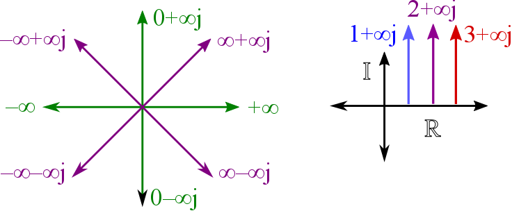  
    \<caption\>Fig.11.4: The many directions of complex infinity \</caption\>
-   However, one of the values can be finite, giving a whole range of infinities. Mathematically these are actually identical, but they are stored and treated differently by all languages except for Mathematica.   
    (0+**inf**\*1**j**) == (1+**inf**\*1**j**) false  
    **complex**(0,**float**('inf')) == complex(1,**float**('inf')) False  
    **complex**(**re**=0,**im**=**Inf**) == **complex**(**re**=1,**im**=**Inf**) FALSE
-   In R and numpy, complex infinities don’t behave as you might expect:  
    Inf\*(1+0i) Inf+NaNi  
    Inf\*(0+1i) NaN+Infi  
    This strange behaviour is because Inf\*0 is not defined, i.e. NaN, in all languages. This is why the previous example used complex instead of Inf\*1i. So, you can get strange results like   
    **np.mean**(**np.inf**+0**j**) inf+NaNj   
    Here, it looks like you should just get a real-valued result, but in fact an imaginary NaN appears! Note that this doesn’t occur in R or Matlab, which produce the expected Inf+0j.

Effectively, the real and complex components are treated like a pair of separate floating point numbers, expressed in cartesian coordinates, an old convention originating in Fortran. In the same vein, you can also have three types of **complex NaN**, with just real, just imaginary, or both parts being NaN. As you can imagine, these are common sources of bugs if you use complex arithmetic.

Comparison between complex numbers is avoided in Python and R, with errors

0\>1j TypeError: no ordering relation is defined for complex numbers

0\>1i invalid comparison with complex values

whereas Matlab just uses the real component:

0\>1j true

## 11.2. How do computers see arrays?

So far, we have mentioned lists and arrays interchangeably. Terminology varies between languages, but an important distinction is whether the elements have to be numbers, or can each be a more complicated data structure:

| All elements of identical type | Matrix / Array      | Numpy array  | Vector / Matrix / Array |
|--------------------------------|---------------------|--------------|-------------------------|
| Elements of different types    | Cell / Struct array | List         | List                    |

Uniform arrays are usually stored as a contiguous block of **RAM**, and are part of the recipe for efficient programming. A single command can work on each element, without a loop, making code shorter. The computer can also operate simultaneously on many elements, allowing parallel processing.

### Column-major vs Row-major arrays

A strong reason for choosing Matlab, Python (with numpy) or R for scientific coding, is that they have easy access to powerful numeric array processing. Arrays can be huge, occupying gigabytes of **RAM**, and high-dimensional (up to 32 dimensions in Python, and essentially unlimited in Matlab or R).

Matlab and R, following the convention of the old language Fortran, store 2-dimensional arrays by running down the rows of the first columns, then going up to first row of the second column, and so on. This is termed **column-major** indexing. Python scientific computing (through the numpy library), along with C, runs across the columns of the first row, then down to the first column of the second row, and so on.

This ordering is only important if you need to store or iterate over the arrays in a ‘flat’ form – i.e. if you need to index into the array without using subscripts for each dimension. This is discussed more thoroughly in chapter 8.

### Zero vs one-based indexing

Unfortunately, switching between 0-based and 1-based indexing causes a lot of chaos, and is the source of many code errors.

Python, like C and Java, uses a zero-based array indices. The first element of an array X is X[0]. This might seem a strange choice, as it conflicts with normal mathematical matrix indexing, which usually start at 1. For example, the first element of a matrix is often written $$X_{11}$$. Also, many people find starting at 1 more natural, because the indices then correspond to the ordinals 1st, 2nd etc.

Zero-based indices makes sense when you think of the index as being relative to the start of an array. The first element is start+0, and the next element is start+1, etc. Moreover, it becomes more convenient if you need to convert between 1-dimensional to n-dimensional arrays, or iterate over elements in a matrix. The zero-based indices allow you to multiply or divide subscripts more easily, and use modular arithmetic.

\<figure\>

If X is 3x3, then the 4th item in the array is the second item in the second column (because the top left is the zeroth item!). How to get the linear index, from the row and column subscripts?

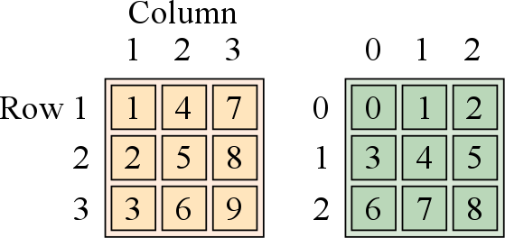

\<caption\>Fig.11.5: 1-based indexing and 0-based indexing in a 3x3 matrix. How to access the middle row, middle column of a grid of 3x3 items stored in a flat 9-element list?

| With 1-based indexing (Matlab/R): you need X(5). i=2 % second row  j=2 % second column % there are 3 rows per column X( (j-1)\*3 + i ) % =X(5)  | With 0-based indexing (Python): you need X[4] i=1 \# second column j=1 \# second row \# there are 3 columns per row X[ 3\*i + j ] \# =X[4]  |
|-------------------------------------------------------------------------------------------------------------------------------------------------|---------------------------------------------------------------------------------------------------------------------------------------------|

\</caption\>

What about going the other way, finding the row and column from the index? For Matlab-style 1-based indexing, the middle item is number 5. To work out the row and column, you need to take row **mod**(5,3) which is 2, and column 1+**floor**((5-1)/3), which is 2 using integer division. So, you would take item X(2,2). (in R, row 5%%3 and column (1+(5-1))%/%3)

To get the middle item using Python’s zero-based indexing (number 4), knowing that there are 3 rows in each column, you use row 4//3, which is 1 (as an integer) indicating the second row, and row 4 % 3, which is 1, indicating the second column (or use **divmod**). So you take item X[1,1].

Zero-based indexing is far simpler in this situation. However, it

Matlab and R use 1-based indexing. While this is intuitive for some, it makes multidimensional indices complicated. If X is 3x3, then to find the index of item i, you need column (i-1)/3+1, and row ((i-1)%3)+1 so that i=4 gives column 2 row 2.

\<caption\>Fig.11.6: Matlab and Python order the dimensions differently when displaying arrays \</caption\>

## 11.3 Interoperability (Advanced topic)

Many scientists switch between languages depending on the need case. For example your workflow might look something like this:

-   Run your experiment in Python, controlling your hardware with external C libraries.
-   Load the datafiles into Matlab for preprocessing and extracting useful parameters.
-   Then transfer those parameters to R for statistical analysis.

The obstacles are numerous: you need to learn several languages, remember the idiosyncrasies of each language, and transfer the data without loss or misinterpretation. Moreover, you may adopt different coding **idioms** – styles of coding that mesh with available syntax – e.g.

| Matlab cell expansion out=**cell**(4,1) [out{:}]=**ttest**(y)  | Python list comprehensions [2\*x **for** x **in** **range**(5)] | R formula manipulation  (y\~x)[[2]] |
|----------------------------------------------------------------|-----------------------------------------------------------------|-------------------------------------|

These language-specific tricks add to the confusion.

Luckily there are libraries that allow loading of CSV, Excel and HDF5 (eg Matlab) data, and all languages allow **ASCII** text export/import.

There are also ways of **calling** one language directly from another. You can place data in a file, and execute a script in another language. For example, you could call R from Matlab:

**csvwrite**( 'data_from_matlab.csv', table_data )

**% Rscript needs to be available on your path**

**system**( [ 'Rscript analyse.R' ])

**% This waits for the R script to finish**

**% (i.e. it’s a "synchronous" or "blocking" call)**

**\# R script file 'analyse.R'**

table_data \<- **read.csv**('data_from_matlab.csv', **header**=FALSE)

**\# fit a model to the data and output the coefficients**

output \<- **data.frame**(**coefficients**(**lm**(tabledata)))

**write.csv**(output, 'data_from_R.csv')

**% R script has now finished; now read coefficients**

stats = **csvread**('data_from_R.csv')

Here, the yellow text all sits in one Matlab script, and the blue text is in an R script.

When coding in multiple languages, it is even more important to document how the data flows, and what the user needs to have installed to run the programs. Typically, this goes in a “Readme” file, or better, in a **manifest**.

# Reference

## Glossary

**Address:** An **integer** representing a **memory location** (usually in **RAM**) where something is stored. Each address points to one **byte**. So, the number of bits in an address (its **width**) determines how much memory can be addressed at once. For example, a 32-bit address uses a 4-byte integer to reach 232= 4GB. This determines a computer’s **architecture**. Addresses are **pointers** to a region of memory.

**API**: application programming interface. This is a set of function declarations – i.e. instructions on how to call the functions – that are often used together. One API could have different implementations – that is, different underlying code might be called in different contexts. A **library** usually “exposes” an API.

**Arguments**: the inputs values you send to a function. The function’s **parameter** variables take on these values, to determine the function’s output.

**Array**: An ordered list of items, often numbers. Items are identified by their index, an **integer** usually starting at 0 or 1. For two-dimensional arrays, items are arranged in a grid, subscripted by two integers. N-dimensional arrays use N subscripts to index into the array. In scientific data, indices may represent a physical dimension like time, or subjects, sessions or conditions. Typically, arrays occupy contiguous memory locations in **RAM**, making it fast to access chunks of data.

**ASCII**: You may know that computers store everything as binary numbers. The **American standard code for information interchange** the classical way to store letters using numbers. It is a **character set**, i.e. it assigns an **integer** to each standard **character**.

| 0-8    | Special conditions                                                               |
|--------|----------------------------------------------------------------------------------|
| 9      | Tab character: move to the next column in a table                                |
| 10     | Newline character, or ‘LF’ for line feed: move to the next line                  |
| 11-31  | Special conditions                                                               |
| 32     | A normal ‘ ‘ space                                                               |
| 33-47  | The symbols that appear above the numbers on your keyboard, like !, ", \$, (, \* |
| 48-57  | The digits 0-9                                                                   |
| 58-64  | More symbols, like =, :, @                                                       |
| 65-90  | Upper case letters A-Z                                                           |
| 97-122 | Lower case letters a-z                                                           |
| 127    | The “delete” character – often sent by your keyboard!                            |

There are several other ways to encode characters, such as **ANSI**, or Unicode which is internationalised, but they all follow the same idea.

**Binary:** The mathematical code that allows the presence or absence of a voltage to hold numbers. Typically, a voltage indicates the **bit**  1, and its absence, 0, which also indicate the logical true and false (**Boolean** values). Binary codes **integers** in base 2.

**Binary file**: A file that contains machine code instructions. They are the output of **compilers**. Binaries are platform-specific, e.g. files built to run on an Apple may not run on a PC. There are two reasons for this. First, compiled code calls other functions, specific to the operating system. Second, there are many different families of machine code, called **architectures**.

**Binary operator**: An **operator** that takes two inputs, like +, \*, and /. They are often written between their operands, called **infix** notation (e.g. 1+1). They can be contrasted with **unary operators** which are functions taking one parameter, like “not” (\~,not,!) or Matlab’s transpose '. Note that the minus sign can be either a binary or a unary operator, i.e. it does subtraction or negation, as in x=-1 (actually the same is true for plus). This has nothing to do with **binary**.

**Bit**: Binary digit. Computers represent all information using voltages, which have only two states. Alone, a bit can represent a **boolean**; in a group they form a **byte**, and represent a number. The voltage is high to represent 1 (true), or low to represent 0 (false).

**Bitmap** or **raster**: A way of storing an image as numbers. Each pixel in the image is “mapped” to some of the **bits** in the store, resulting in an **array** of numbers. For example, it may be an 24-bit format, with each pixel having a **byte** corresponding to the red, green and blue channels. A bitmap has a **resolution** (its x and y size in pixels, and/or the number of dots per inch), and may be stored in **RAM** or as a file on disk.

**Block** (of code): adjacent lines of code that are executed in sequence.

**Boolean**: also known as logical. A variable that has only two values. Most commonly this corresponds to either true or false. Booleans are often used as **flag**s. Inside your computer, they can be coded as **bit**s. They are named after George Boole, great-grandfather of Geoffrey Hinton. Boole discovered the algebra formed by **and**, **or** and **not** operations over the two digits **0** and **1**.

**Byte**: The smallest unit by which a computer represents a number. It is stored as a collection of bits, often 8. In very large datasets, you may see these in data types like uint8, bytearray, ctypes.c_ubyte, or raw. These can be more efficient for certain data types, but it is easy to make mistakes like **overflow** or sign errors.

**Bytecode**: a code similar to machine code where instructions are numbers, and variables are memory addresses.

**Casting**: Some types of variable can be converted (casted) to a different type. Some casts are implicit, for example **promotions**. Other times they have to be explicit, for example if you want to get the number 1 as a text **string** '1', you’d need to convert explicitly with str2num(1) / sprintf('%g',1), str(1), toString(1) / as.character(1) /paste0(1) or sprintf('%g',1). What counts as implicit depends on your language – for example javascript automatically casts 1 to a string in ""+1. Casting can get tricky when using **integer** types.

**Catch**: Errors or exceptions can be caught, which stops the end-user from seeing the problem. When something unexpected happens, the current operation is interrupted, and the computer looks for a catch or except block to deal with it. If none is found, the function terminates, returning to the calling function. The exception then **propagates** up the call **stack**, i.e. the exception is raised in the calling code. Only uncaught exceptions result in a red error message!

**Character**: A character is a single letter, number, or symbol. Characters, or **strings** (a sequence of characters), are distinguished from keywords, names of variables or functions, by the use of single quotes. Examples include A, z, 9, [, the quotation mark itself ', and **whitespace** characters like space , tab , and the newline character. Internally, the computer represents characters in a **character set**.

**Character set**: a standard mapping from numbers to characters, using a code. For example **ASCII** maps each character to a single byte, and Unicode maps each to a variable number of bytes, using encodings. Each possible value is called a **code point**.

**Class** or **Type**: Everything inside a computer is an integer, stored in **bytes**. Programming languages allow you to store things that aren’t just integers, like words, decimals, complex numbers, matrices and tables. Languages maintain a label for each variable that indicates whether to interpret the bytes as something else. This is called the type. You can look up a variable’s type using class(), type(), class(). The type might even be a function, where the bytes represent code. Object-oriented programming allows you to define your own complicated types, usually called classes, which supply code to go with the data.

**Collision**: two variables collide if they have the same name, within the same **namespace**. This may cause hard-to-spot errors.

**Compile**: to convert high-level human-readable code into a more machine-friendly form. For example, a statement a=1 might be compiled into a few numbers, which correspond to **bytecode** or machine code that can be understood by lower levels of the computer.

**Console**: In this usage, it’s a text interface where you type commands at a prompt, followed by enter, and the computer interprets them. Examples include the **operating system** command line (Windows CMD, Linux bash) and the interactive prompt or ‘command window’ for Matlab, Python and R.

**Constant**: something that will not change. For instance, the **literals** ‘A’ and 2 are constants. It might sound like an oxymoron, but Variables are often Constants. A constant variable usually contains a number or a string that is expected to remain the same for your whole script.

**Core**: each central processing unit (CPU) chip has multiple independent cores – in a home computer this could range from 1 to 12. Each core has its own strand of execution, which permits running multiple computations in parallel.

**CPU**: the central processing unit is the part of the computer responsible for interpreting instructions in the currently running software. All instructions are in machine code, a low-level language comprising numbers called byte codes. The CPU is a chip, or part of a chip. It can also store a small amount of data – a dozen or so numbers called registers – that maintain immediately important information, like which instruction it has got to. The CPU fetches its instructions and data from **RAM**, locating them by numbers termed addresses, and sends commands to other chips like disk and video controllers.

**Declaration**: a line of code that gives details about a variable or function, before the creation of the variable or the **definition** of the function. For functions, it usually specifies how to call the function. Typically this will include the inputs to the function, called **parameters**, and the output, called the return value.

**Definition**: The lines of code that tell the computer how to actually run a function. It consists of a header, the function body, and return statements.

**Dependency**: You should always specify what other code or resources your program needs to run, i.e. your dependencies. All code needs other code to run, including an **operating system**, and for science you need an interpreter for your programming language. But you may also need additional **libraries** of code from other people, data files, templates, or image files.

**Design pattern**: A coding style or template to solve particular problem. Covered in section 6.4.

**Double**: a double-precision floating-point value. Usually these are stored in a 64-bit format. They can represent very small numbers (near zero) and also very large numbers (positive or negative) with lower precision.

**Entry point**: the first section of code that should be run, within your program. Often the entry point is the first line of the program. But when you provide a folder full of scripts, it is not always clear how to find the entry point. In some languages, the entry point is called main, init, or may have the same name as your program.

**Exception**: an unexpected situation that your code doesn’t have enough information to deal with. An exception interrupts what you are doing, and asks the calling code, which **catches** the exception.

**Flag**: A **boolean** variable that signifies whether something is or should be the case. Flags can act as switches, or to signal an event or state.

**Float**: a floating point number has a variable precision. For example, numbers in the range 1 to 10 are represented to about 16 decimal places, whereas numbers around 1016 are represented to the nearest 1.

**Forward model**: Also known as a **generative model** or predictive model. This is a way to produce data from some parameters. For example, if I know that adults are 1.5 to 1.7m tall, and their weight is about 22×height2, then I could generate 100 random people. Or if you know where a cannon points, you can generate a cannonball’s trajectory, and its uncertainty. Common generative models include linear or nonlinear mixed models, gaussian processes, Markov models, plant-controller / dynamic models and many artificial neural networks.

**Function**: a self-contained block of code with defined inputs and outputs. see Chapter 7 and commonly confused terms below.

**Global**: a variable is global rather than **local** if it is accessible from any function. Its **scope** is your whole program – and any other code running in the same **interpreter**. Globals are created on the **heap** and therefore persist across function calls. They are forbidden in functional programming and can lead to difficult-to-spot errors. They can often be avoided by passing information correctly.

**GPU (Graphics processing unit)**: A chip that interprets instructions, like a CPU does, but is specialised for large **arrays**. Traditionally these were used to copy, move or combine **bitmap** images efficiently. But the same operations allow large vectors or matrices of numbers to be manipulated very quickly.

**HTML**: Web pages are written in hypertext markup language. HTML files are text files, with an XML-like structure of nested tags such as \<body\>Hello\</body\>.

**IDE**: Integrated development environment. A program that includes a text editor specifically designed for code, as well as running and debugging programs. For scientific computing, IDEs include a console in which you can type commands that are immediately executed.

**Include**: an include is a **source code** file that gets inserted – at compile or run time – into your code. It is a **dependency**, and allows code to be written once but used many times.

**Indirection**: When something needs to be done, you usually call a function. But what if you need to change what actually gets done? You can introduce an extra layer in which you can decide to do one of several options. For example, when you print a value to the console, you are actually writing to a buffer that might be the screen, a file on the disk, or a remote connection. The print function includes a layer of indirection, meaning that the underlying code that gets executed (to fulfil your request to print) might be completely different depending on the user context.

**Hash table**: a way of storing a **map** of key-value pairs that gives a fast lookup time. The keys, which may be text, numbers or other objects, are **hashed** – this simply converts the key object into a number. This hash code is a digest or **checksum** that is “quite likely” to be unique (according to some criterion). This partitions the space of all possible keys into bins or buckets. The key-value pair are kept in the key’s bucket, so they can be found extremely quickly given the key.

**Implementation**: Once you know what you need to do, implementation is writing the code to actually do it. Implementation contrasts with an **interface**, which merely specifies what can be done, and what information transactions can occur. Interfaces need to be implemented.

**Integer**: a whole number, like 0, 1, 99, or -4. They have a fixed **width**, i.e. a fixed number of bits, with no exponent to determine their scale. This means they can easily reach their maximum and minimum values, which can lead to **overflow** errors. They can be unsigned or signed. For example an 8-bit unsigned integer ranges from 0 to 255 (which is 2\^8 – 1, stored as 11111111 in binary). In contrast in an 8-bit signed integer, one of the 8 bits is used up to represent whether the value is positive or negative, so the values range from -128 to +127.

**Interface**: a set of function **declarations** that are used together to operate on similar objects. These functions are the points of contact between your code and your user’s code. For example, there might be an interface for manipulating plot axes. In object-oriented code, abstract class declarations form an interface for objects of that type: they provide a set of functions to manipulate the data in the object.

**Interpreter**: modern scientific languages read code as text, convert it to a low-level code, then run it. Interpreters are usually contrasted with compilers, but in reality most languages do something in between, pre-compiling the predictable parts and interpreting the complex parts, to maximise speed.

**Library**: a set of functions that are often used together, but are not tied to a specific use-case. They often provide an **API** (application programming interface), which is the part of the library that you can see and interact with.

**Linking**: a process where function calls in a user’s code are mapped onto function definitions in a **library**. When you write a+b, the language must work out which version of addition function you are trying to invoke. Is it integer, floating point or complex addition, or in Python do you want list or string concatenation? Inferring the right function might occur at compile time (static linking), or while your program is running (dynamic linking).

**Lint**: a program that reads your code, tries to make sense of it without actually running it, and warns you about anything that looks suspicious. Lint can usually be configured with various thresholds, about how pernickety it will be.

**Literal**: a ‘raw’ number or character string appearing in your code. Literals are really data, not code. Purists suggest you should externalise literals in **constant** variables, which you name semantically.

**Literate programming**: a style where variables and functions have longer names, so that reading the code reads more like English. There is no doubt what this line of code does: wait_for( number_of_seconds + 60\*number_of_minutes ). Literate styles provide an alternative to commenting.

**Local**: a temporary assignment, that has a limited **scope**. Names correspond to variables and functions; these bindings are created by definition and assignment. Those bindings can appear and disappear. Local variables are those visible only in the current scope, and vanish when the current block exits. Typically this happens inside a function.

**Map**: also known as a **lookup table**, **associative array**, or **dictionary**. The map stores **key**s paired with values. You can look up a value by providing a key. The keys must be unique, though the values need not be. An array is an example of a map, where the keys are integers. A common, fast implementation of maps is a hash table.

**Mask**: A pattern of 1’s and 0’s, or Trues and Falses, which are used to say which parts of an array are being operated on. You can “mask out” parts of an array using multiplication by a **boolean**, or by Boolean indexing.

**Metadata**: additional information that needs to be kept together with a dataset. It tells you something *about* the data, and how to interpret it. For example, you might want to keep the date of recording, experiment version number, original filename, or the parameters used to acquire the data.

**Most-significant bit**: We write numbers in “columns of ten” – i.e. hundreds, tens and units. The most-significant digit of the number 456 is 4. It is the most important digit. In binary, the same thing can be done, and for large integers, the most-significant byte is the equivalent idea in base 256. In general we write the MSB first, because it helps us sort values lexically.

**Namespace**: Language interpreters create and maintain **map**s from variable names (which are **strings**) to variable values. For example, the code a=1 creates a key a, linked to a value 1, within the most current map. The names remain bound to the values within a particular context – termed a namespace. Languages have different rules about which namespace is consulted when you use a variable name.

**NaN:** Not-a-Number is a special “number”, that signifies something went wrong in a calculation. It propagates so that calculations involving NaN also result in NaN.

**Open source**: Software is open source when its **source code** is freely available. A language is open source when the code of the **interpreter** or **compiler** other source code is also freely available.

**Operating system (OS)**: The operating system is a computer program that runs all the time in the background. Whenever your computer is on, it acts as a life support system for other programs. It provides functions to put text on the screen, to read files from a disk, and read keypresses from the keyboard. Microsoft Windows, Apple iOS, Linux and Android and are the three commonest operating system types.

**Operator**: Operators are functions that can be written as symbols in an expression. For example the functions plus(a,b), float.__add__(a,b), \`+\`(a,b) can be written as an infix operator a+b.

**Operator precedence**: All languages carry out mathematical operations in a specific order, that is **not** the order they are written in the code. 1+2\*3\^4 == 1 + (2\* (3\^4) ).

**Overflow**: an error condition where there is no space for an operation. For example, a number may get too big for its container. This is rare when you use modern data formats, which can store obscenely big numbers. Another example is overflow of the function-call **stack** (stack overflow), which usually means you have called your function from within itself.

**Parameter**: A variable that you set up early, then use to control some aspect of the code that runs later. In a function, formal parameters are specified as placeholders for inputs, which get replaced with the **arguments** provided when the function is called.

**Parse**: Segment a stream into meaningful components. Code stored in a text file can be parsed into blocks, statements, expressions, terms and ‘atoms’ like variable names or literal constants. A parser is a function that takes a stream (eg. an array of symbols), as input, and spits out a tree or other structured representation of that stream.

**Pass-by-value**: In Matlab and R, when a function is called, a copy of the inputs is created in the new stack frame. When the function returns, these copies are deleted, along with any changes made. To make changes, the function must explicitly return the changed values, and the caller must assign this to overwrite the original variables.

**Pass-by-reference:** In Python, when a function is called with arrays, lists or objects as arguments, a ‘reference’ or pointer to the inputs is placed in the **stack frame**. This means that any changes to that variable, made within the function, will be reflected in the original data, and are visible to the caller. This can be useful for sending information back to the caller, instead of returning a value. However, it can result in unexpected side-effects. Such a function is not “pure”.

**Promotion**: A promotion, or a **broadening** conversion, is a type **cast** that moves a value into a larger space in case it needs to expand. For example, the expression 2\*0.5 converts the **integer** 2 to a **float**ing point number 2.0 before doing the multiplication, so the result is 1.0 rather than an integer type.

**Pseudocode**: A fictional programming language that you make up, when communicating with a human, for the sake of clarity or economy.

**RAM**: Random-access memory is the computer’s short-term storage, that is usually volatile, i.e. destroyed when a computer is switched off. The name contrasts with the old-fashioned ROM (read-only memory) which stores hard-wired instructions that could not be changed after the computer was built. Functionally, it contrasts with information on disk, which remains after a computer is switched off. Computers have much more storage on disk than they have in RAM, so you can only load a tiny amount from the disk into RAM, at one time. The amount of RAM varies a lot from computer to computer, and is shared between all the programs you currently have open. RAM can also be contrasted with other writeable stores, such as hard disks (magnetic media), writeable DVDs (optical media), and solid-state disks (NAND flash, the type used in mobile phones and USB sticks), which are all slower than RAM and are not directly addressed by the **CPU**.

**Refactoring**: Shuffling segments of code around, changing names of variables, or changing the structure of your data, but without changing the algorithm. Usually refactoring aims to improve re-usability and readability (see 7.8 refactoring).

**Referential transparency**: A function is referentially transparent if it has no side-effects, and does nothing other than produce an output value. As a further criterion, its output value should depend solely on its inputs, so that it behaves like a mathematical function.

**Scope**: Variables are created at a point in the code. The region of code where that variable exists is called its scope. Or more precisely, scope is the region of code where the name is bound to a value. If a variable is created inside a function, its scope is limited to that function, because it is created inside a **stack frame**. This provides a neat way of keeping variables organised and tidy.

**Shadowing**: When a name is defined twice, only one definition is seen. The latest or closest definition may overwrite or dominate. This can be avoided by using namespaces (see 7.3).

**Source code**: a program in the form it was originally written in, before **compiling**. It is a human-readable text document.

**Stack**: The function-call stack is a part of the computer’s memory where it keeps track of which functions called the current function. Each stack consists of frames: contexts with all the local variables present at the time each function call occurred (See Ch.7).

**Stack frame**: (see 7.4) a region of memory freshly allocated each time your function is invoked, and deleted once the function completes. It contains the **local** variables created within the function.

**String**: A string is an array of **characters**, i.e. a collection of letters. It could be a word, or a sentence, or a whole book.

**Type**: (see also **class**) All variables stored in memory are assigned a type. They could be **integers**, **float**ing point values, **strings**, or user-defined types. In some languages, the types of objects are called **classes**.

**Unicode**: Unicode is a standard character set that unites various encodings. To do this, it is **variable width**, meaning some characters may take up more bytes than others. The commonest encoding is **UTF-8**, which includes **ASCII** characters, but adds codes for

**Variable width codes**: To encode information into numbers, you need to define a mapping. You can minimise the space that the numbers take up in **RAM** or on disk, by allowing common items to be coded in a single **byte**, whereas rare items need to occupy many bytes.

**White space:** Characters that you can’t see are called white space. Typically the ones used in programming are spaces, tabs and newlines. Along with operators, they divide up tokens (variable names, function names) in your code. In many cases, you can add as much whitespace as you like without changing the meaning of your code: whitespace tends to be **semantically neutral** (except in Python indentation).

**XML**: A standard format for storing complex data in a text file. The data is hierarchically organised within nested ‘tags’. Tags begin with a term in angled brackets, accompanied by parameter-value pairs (e.g. \<channel rate=”10hz”\>), followed by some data, and are terminated by a matching tag preceded by a slash (i.e. \</channel\>).

## Commonly confused terms

What’s the difference between…

-   loops vs. blocks?
    -   **Blocks** are regions of code that are executed together.
    -   **Loops** are **blocks** which are executed repeatedly.
    -   There are two main types of loop: for, which usually implies that the number of iterations is pre-determined, or while, which suggests that the number of iterations depends on the outcome of each iteration, and is thus determined on the fly.
    -   Examples of blocks include these loops, but also the lines that form the body of a function. Lines following an if statement, or switch/select statements can also form blocks.
    -   Some blocks (like the body of a function) have their own **scope**.
-   arrays / indices / subscripts
    -   an array is a block of contiguous memory slots (elements) that can be addressed by integers indicating the position within that block. Memory for arrays must be allocated, and so resizing an array is a bit of a pain.
    -   To address the elements of a 1-dimensional array (i.e. a vector), you can use an **index** – a single integer that linearly indexes from the beginning of the array.
    -   Arrays can be multi-dimensional. In this case, you can use two or more integers to locate an element in the array. These are called **subscripts**. Note that Matlab permits linear indexing into multidimensional arrays – which treats the array as a “flattened” vector.
-   **functions** / scripts / procedures
    -   All these are chunks of code that are executed together.
    -   A function is a unit of code that produces a specific output, called a ‘return value’. It can also take inputs. So the function specifies a mapping from the input to the output. An example would be sin().
    -   Scripts are units of code that do not specify determinate inputs or outputs. An example might be run_whole_analysis(). Crucially, the calculations are done in the namespace where you run the script. It can overwrite, create or accidentally use your variables when it runs.
    -   Procedures are units of code that take input parameters, but are otherwise imperative. They do not return output values. An example would be print() or save().
    -   Many languages do not distinguish clearly between all of these, with procedures and functions often being lumped together as “functions”.
-   expressions / statements
    -   An **expression** is a string of characters in your code that can be understood and converted into a value. For example 3+cos(x).
    -   A **statement** is a string of characters in your code that can be understood and do something. It usually makes up one line of code. Although the expression above could stand alone, it is not much of a statement, as it doesn’t do anything. However, y=3+cos(x) is a statement, as it truly does something: it assigns the value to y. Statements are either assignments or function/procedure calls.
    -   **Assignments** consist of a ‘left-value’ (before the equals) which is for example the name of a variable, and a ‘right-value’ being an expression. Assignments first evaluate the expression, then place the result in the location specified by the left-value. The assignment can also create a binding between a new variable name and its value, by adding a **key** in a **namespace**.
    -   Expressions are made up of **terms**, and are **evaluated** (turned into values) according to operator precedence. This simply means things in brackets are converted first, then multiplications, then additions. A term means one of the things that is added together.
-   evaluating / executing / calling
    -   Statements are executed – they don’t generate a value
    -   Expressions are evaluated (they are usually parts of statements)
    -   Functions or procedures are called.
-   declarations / definitions
    -   A **declaration** is a line of code that lets us know what a variable or function is all about. It doesn’t necessarily create the variable, or tell you the instructions that make up the function.
    -   A **definition** is the point in your code where a variable is actually created, or a function’s body code is specified.
    -   Scientific languages tend not to require declarations. Declarations can be useful, though, because they specify the **interface** to your code, without specifying the implementation. You can see what variables and functions are accessible, without needing to know all the details.
-   throwing and catching errors / exceptions
    -   **Throwing** or raising is the act of terminating the current flow of execution, and signalling that help is needed to deal with an unexpected situation. For example, what happens if a critical file is not found? Who will help?
    -   **Catching** is the faculty of helping out with an unexpected situation. The control flow (i.e. which instruction is currently being executed) jumps from the throw/raise line to a catch block.
    -   **Errors** are usually events that would require your program to end. They are often “fatal”. For example, if the computer runs out of memory, this generates an error. Errors are often completely unexpected, and you would not be expected to handle (catch) them.
    -   **Exceptions** are situations which can potentially be dealt with. For example if your analysis deals with one session at a time, but can’t deal with bad data in one session. You might want to pass control to the level above, which may warn the user and skip to the next session.
-   references / handles
    -   These terms are often used interchangeably.
    -   Technically, a **reference** is an object that is dealt with via its memory address. So if you have a function, a reference to that function is an object that behaves just as if you had used the function by name – but is really acting via a pointer to that function. Under the hood, references are numbers that specify where in memory to look.
    -   A **handle** is any number that can be used in place of an object. It need not be the memory address, and in practice, it is often a serial number constructed as needed.
    -   Handles are used when you call an API that has a persistent state. For example, you might create a screen window, and receive a handle in return. Next time you want to access that window, you call the API but specify the handle.
-   stack frame / **heap**
    -   When the computer starts to execute code inside a function, it creates a new frame on the stack – that is, a clean workspace in which new variables can be created.
    -   However, you might want to return information to the caller. If the stack frame gets deleted after your function returns, how can some variables be transmitted back?
    -   Data for arrays, structures and other objects can be allocated outside the stack frame, in shared memory called the **heap**. The stack frame keeps a reference to this heap data, and can send this reference back to the caller. As long as the reference remains active, the heap data is protected from deletion.
-   polling / hooking
    -   **Polling** is a **design pattern** for checking if something has occurred. Your code contains a long loop, and within the loop, you can periodically check on the status of some ‘state’ variable. Maybe you’re doing a long calculation, and after every iteration you check whether the user has pressed escape.
    -   **Hooking** is where you send a reference to your own function, to an event-processing API. That API can then call your function when an event occurs. For example, you might write add_keypress_hanlder( stop_calculating, “ESC” ). You have ‘hooked’ your function to the escape event. I think it’s a fishing analogy?
-   flags / semaphores
    -   A flag is true or false and signals whether something is the case.
    -   **Semaphore** is a way of signalling when a resource is in use. It is useful when two or more threads need to talk to each other. For example if you are updating data for another program to read, you might make a semaphore nonzero when you start to write the data, and reduce it again when you are finished. Crucially, before you read or write, everyone always checks that the semaphore is zero. So, the semaphore stores an integer count of how many people are using a resource, but it functions as a flag to indicate whether the resource is free.
    -   Semaphores can be used instead of flags, for turning something on and off. Specifically, if a common resource has a feature that can be turned on or off, then the semaphore functions as a counter for how many times the ‘on’ routine has been called without an ‘off’. This is important when functions call other functions. Examples of where semaphores would be useful, are in turning on logging (diary on), recycle on, or hold on. In these cases, two library functions might want the function turned on. I call library 1, which turns it on, and library 1 calls library 2 which turns it on again. Library 2 returns from the call, and turns it off. Control returns to library 1, who expects the option to still be on. Replacing the Boolean with a semaphore would solve this. Unfortunately Matlab does not implement this as semaphore, so instead you need to check the previous state, e.g. with ishold or get(0,’diary’).

## Index

## References

*Code Complete* by Steve McConnell (2004) is a classic but immense volume intended for professional developers. It includes a lot of research and evidence-based practice suggestions.

*Code Craft* by Pete Goodliffe (2007) is a 580-page book, intended for serious software developers. It is essential for coders working as part of a development team, working to specifications set by clients. It’s a really well written book, with examples in C, and emphasis on process and security.

*Good Habits for Great Coding* by Michael Steuben (2018) is example-driven, Python based, and is focused on programmers in AI and algorithms. It is also a great read.

Jo E. Hannay, Tore Dybå, Erik Arisholm, Dag I.K. Sjøberg, The effectiveness of pair programming: A meta-analysis,Information and Software Technology,Volume 51, Issue 7,2009,p1110-1122,ISSN 0950-5849,https://doi.org/10.1016/j.infsof.2009.02.001.

Martin, Robert, The Clean Coder: A code of conduct for professional programmers, Prentice Hall 2011

Martin, Robert, Design principles and design patterns, 2000

Kernighan B and Pike R, The practice of programming (professional computing) (1999)

David Goldberg: What every computer scientist should know about floating point arithmetic

AlTarawneh & Thorne, “A Pilot Study Exploring Spreadsheet Risk in Scientific Research” arXiv 2017

Claus O Wilke – fundamentals of data visualisation. O’Reilly

Martin Fowler / Kent Beck, Refactoring: improving the design of existing code. (1999)

Greg Wilson, Beautiful Code: Leading Programmers Explain How They Think, O’Reilly (2007).

Wessel Badenhorst, Practical Python Design Patterns (2017)

Gamma, Helm, Johnson & Vlissides, Design Patterns: Elements of Reusable Object-Oriented Software. Addison Welsey 1994.

Turing AM, “On computable numbers, with an application to the Entscheidungsproblem”, Proc Lond Math Soc s2-42:1 (1936)

Arturo Casadevall, R. Grant Steen, and Ferric C. Fang, Sources of error in the retracted scientific literature FASEB J. 2014 [10.1096/fj.14-256735](https://dx.doi.org/10.1096%2Ffj.14-256735)

Phillips, Dusty, Python 3 object oriented programming (2010) ISBN 1849511268

Kernighan, Brian, & Plaugher J, “Elements of programming style”, 1974.

*Reade, Chris; Elements of Functional Programming, p. 10; Addison-Wesley, 1989*

Graff & Wyk Secure coding, O’Reilly 2003;

Howard and LeBlanc Writing secure code Microsoft 2004

Harris & Wolpert The main sequence of saccades optimise speed-accuracy trade-off, Biological cybernetics 2006

David Whitney, Dennis M.Levi, Visual crowding: a fundamental limit on conscious perception and object recognition, Trends in Cognitive Sciences Volume 15, Issue 4, April 2011, Pages 160-168 <https://doi.org/10.1016/j.tics.2011.02.005>

van Rossum G, Warsaw B, Coghlan N, Python Enhancement Proposal 8 (2001)

Buchner and Baumgartner, Text-background polarity affects performance irrespective of ambient illumination and colour contrast, Ergonomics 2007

Wickham H, Advanced R, Second edition, ISBN-13: 978-0815384571 (2019)

Johnson, Richard, The Elements of MATLAB Style, ISBN 9780511842290 (2011)

The Promise of Space, Arthur C. Clarke, 1968, p. 225

Damian Conway, Perl best practices (O’Reilly 2005)

Quine WVO, From a logical point of view (Cambridge Mass 1953) p.21

Wickham, Hadley, “Tidy Data”, J Stat Software [10.18637/jss.v059.i10](http://dx.doi.org/10.18637/jss.v059.i10) (2013)

Pawel Czarnul, Parallel programming for modern high-performance computing systems, Chapman & Hall 2018

Van de Pol, Volman, Beishuizen, Scaffolding in teacher-student interaction: a decade of research, Educational psychology review 2010

Huffman D., A method for the construction of minimum-redundancy codes, Proc IRE 40:9:1098, (1952)

Riquelme & Gjorgjieva, “Towards readable code in neuroscience”, Nature Reviews Neuroscience, (2021)

Cristina Lopes, “Exercises in programming style” (2020) ISBN 0367360209

Wilson GW., Landau RH & McConnell S., “What Should Computer Scientists Teach to Physical Scientists and Engineers?", IEEE Computational Science and Engineering 1996

Greg Miller, A Scientist's Nightmare: Software Problem Leads to Five Retractions, Science 22 Dec 314, Issue 5807, pp. 1856-1857 (2006) DOI: 10.1126/science.314.5807.1856

Kevlin Henney, “97 Things Every Programmer Should Know”, (February 2010) O'Reilly Media, Inc. ISBN: 9780596809485

Perez Riverol Y, Gatto L, Wang R, Sachsenberg…, Ten Simple Rules for Taking Advantage of Git and GitHub, Plos Comp Biol (2016) <https://doi.org/10.1371/journal.pcbi.1004947>

## About the author

Sanjay Manohar has 35 years of coding experience in C, Java, Python, Bash, Matlab, Javascript, and Basic. By career, he is an Associate Professor in Neuroscience and a Consultant Neurologist at the University of Oxford. He is a fellow of the Software Sustainability Institute, an RCUK-funded body aiming to improve software in academia. Sanjay has taught courses in Good Coding Practices for 7 years, at UCL and Oxford. He is a passionate teacher, an Associate Fellow of the Higher Education Academy, and a Member of the Academy of Medical Educators.
